# HisatorNotebook 実装詳細 (1) 決済・サブスクリプション・AI クレジット

## 対象ファイル

| ファイル | 役割 |
|---|---|
| `lib/services/billing_service.dart` | アプリ側の課金抽象 |
| `lib/providers/mind_map_provider.dart` | プラン解決・クレジット・代行呼び出し |
| `worker/billing-worker.js` | Cloudflare Worker (決済の正) |
| `worker/wrangler.toml` | KV / Durable Object の結び付け |

## 大前提

- アプリは「支払われたかどうか」を**自分で判断しない**。クライアント判定にすると、
  決済ページから戻っただけで Pro になれてしまう。
- 判定の正は必ず **Stripe → Worker(KV) → アプリ** の順で流れる。
- 本物の API キー (Stripe secret / Gemini / OpenAI / Anthropic) は
  **Worker のシークレットにだけ**置く。アプリには絶対に埋めない。

---

## 【1】プラットフォームによる決済経路の分岐

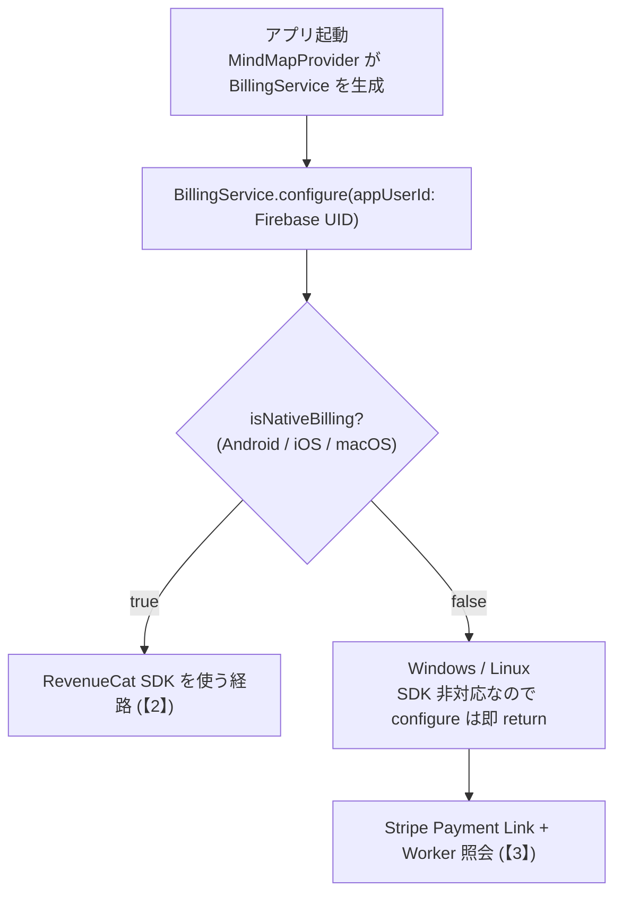

> ※ release ビルドで `apiKeyMobile` が `test_` で始まる場合は configure を中止する。
> RevenueCat の Test Store キーは release で使えず、SDK が「Wrong API Key」ダイアログを
> 出してアプリを落とすため。

---

## 【2】Android の購入フロー (RevenueCat SDK)

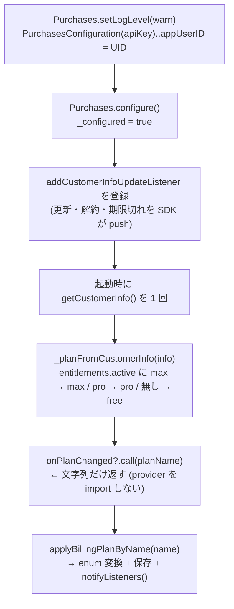

### 購入ボタンを押した時

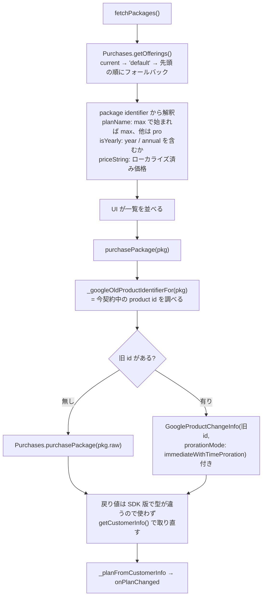

> 乗り換え (Pro 月額 → Max 月額) で旧 id を渡さないと、Play が「別サブスクの新規購入」
> 扱いにして切替ダイアログに進めない。

ユーザーがキャンセルした場合は `PlatformException.code == purchaseCancelledError` を
`BillingCancelledException` に変換して投げる (UI 側は握りつぶして静かに閉じるだけでよい)。

**復元**: `restore()` → `Purchases.restorePurchases()` → `_planFromCustomerInfo` → `onPlanChanged`

---

## 【3】Windows / Linux の購入フロー (Stripe Payment Link)

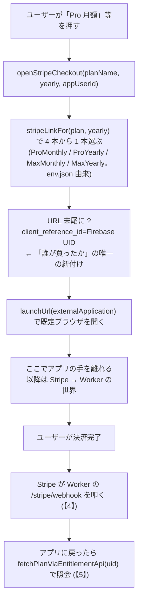

> ※ 画面に出す金額は `BillingService` の定数
> (`proMonthlyUsd` / `proYearlyPerMonthUsd` / `maxMonthlyUsd` / `maxYearlyPerMonthUsd`)。
> **Stripe 側で価格を変えたらここも必ず直す** (画面と決済ページの数字がずれる)。
> 年額は「1 か月あたり」の額。`yearlyTotalUsd()` が 12 倍、
> `yearlyDiscountPercent()` が割引率 (四捨五入) を出す。

---

## 【4】Stripe Webhook の受け口 (Worker `/stripe/webhook`)

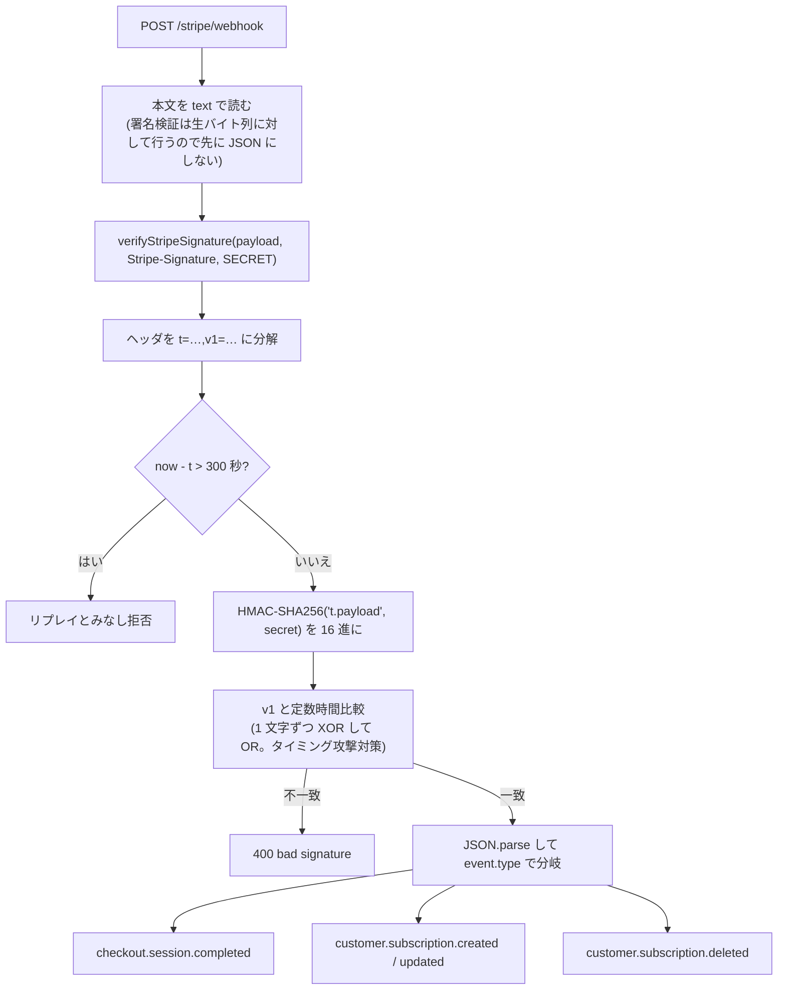

### checkout.session.completed

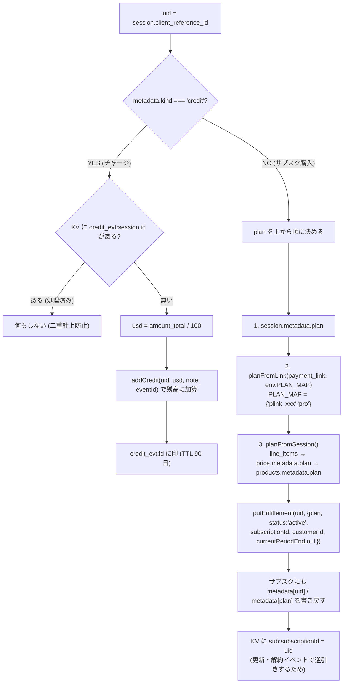

### customer.subscription.created / updated / deleted

| イベント | 処理 |
|---|---|
| created / updated | `uid = sub.metadata.uid` (無ければ KV の `sub:<id>`) → status が `active`/`trialing`/`past_due` なら有効 → `putEntitlement(uid, {plan: 有効なら metadata.plan (既定 pro) / 無効なら 'free', status, subscriptionId, customerId, currentPeriodEnd: subPeriodEnd(sub)})` |
| deleted | 同じく uid を引き、`plan:'free'` / `status:'canceled'` を書く |

> - 例外が出ても catch してログするだけ。**必ず 200 `{received:true}` を返す**
>   (200 を返さないと Stripe が延々と再送してくる)。
> - `subPeriodEnd(sub)` は `current_period_end` を ① sub 直下 → ② `items.data[].current_period_end`
>   の順に探す (Stripe が API 更新で items の下へ移したため両対応)。
>   ここが取れないと期限切れ判定が働かず、支払いが止まっても権利が残る。

---

## 【5】アプリがプランを知る (Worker `/entitlement`)

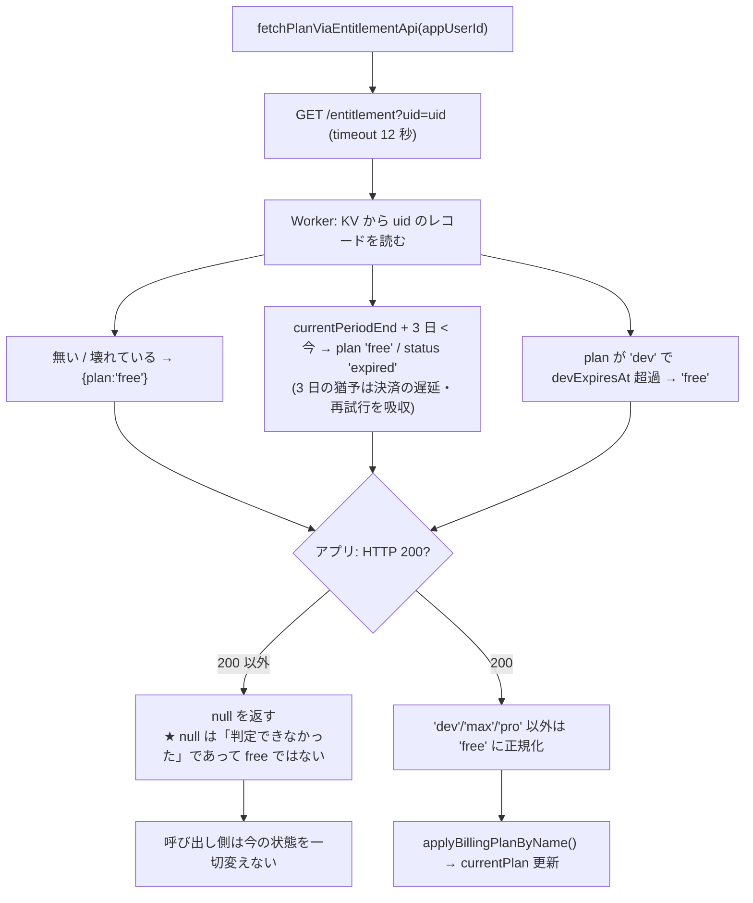

> ★ 圏外やサーバー障害を free と解釈すると、通信に失敗しただけで有料ユーザーが
> 解約扱いになる。だから `null` と `free` を厳密に区別する。

> ※ 旧経路として RevenueCat REST `/v1/subscribers/{id}` を読む `fetchPlanViaRest()` も残る
> (public key で読める)。`entitlements[key].expires_date` を今と比べて有効判定し、max > pro の順。
> `pollPlanAfterWebPurchase()` は 5 秒間隔で最大 6 回叩き、決済 → 反映のタイムラグを吸収する。

---

## 【6】アプリの中で契約を見る・解約する

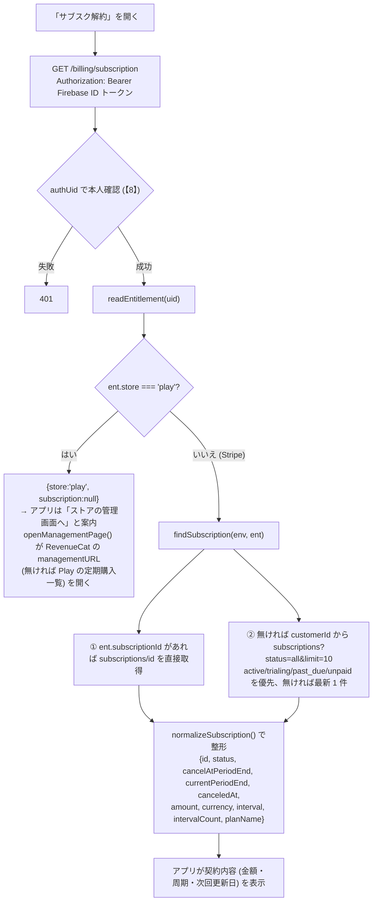

### 解約ボタン

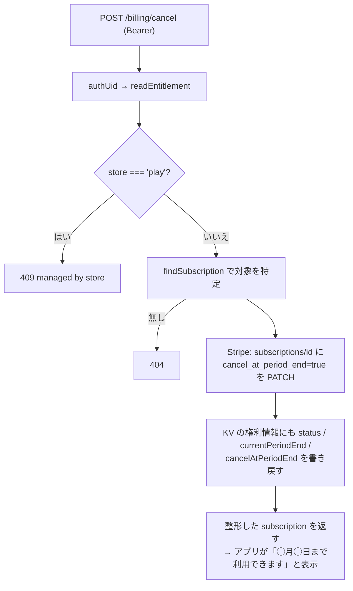

> ★ **即時解約にはしない**。支払い済みの期間は使えた方が親切で、返金の問い合わせも減る。
> ※ `/billing/resume` は同じ関数を `cancel=false` で呼び、解約予約を取り消す。

---

## 【7】前払い AI クレジット (チャージ)

**なぜ前払いか**: 後払いだとカード拒否・チャージバックの回収リスクをこちらが負う。
先に預かれば取りっぱぐれない。

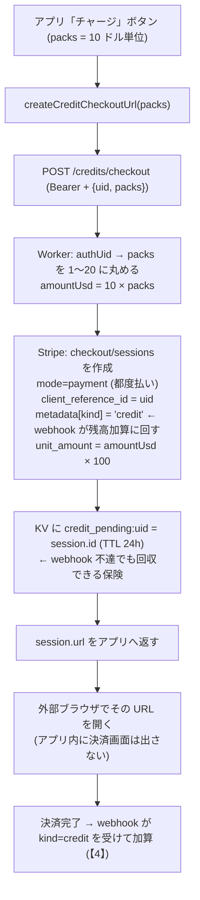

### webhook が来なかった場合の保険

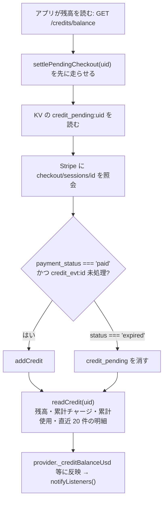

---

## 【8】本人確認 (Firebase ID トークンの検証)

以前は本文の uid をそのまま信じていたため、**uid を知る者なら誰でも他人の残高を使えた**。
今は必ずトークンから uid を取り出す。

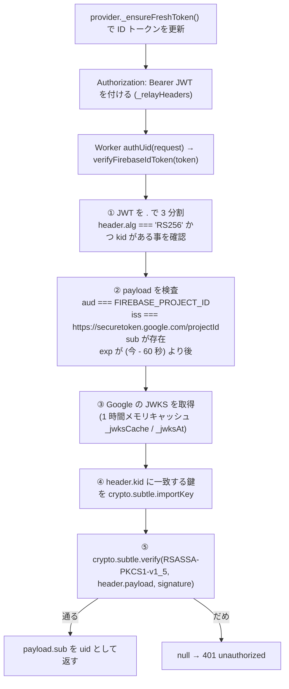

> ★ これにより、アプリを改造して他人の uid を送っても通らない。

---

## 【9】AI 代行実行と課金 (Worker `/ai/generate`)

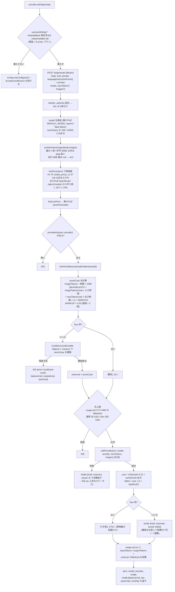

> ★ **先に確保するのが肝**。同時に何本来ても Durable Object の中で順番に処理されるので、
> 残高以上には絶対に使えない (以前は事前チェックのみで、同時リクエストが全部素通りし得た)。
> ★ 返答言語の指定を prompt の先頭に付ける。代行経路だけこれが抜けていたため、
> 日本語設定でも英語で返ってきていた (既定経路なのでほぼ全員が該当)。

### アプリ側のエラー処理

| ステータス | 処理 |
|---|---|
| 402 | 残高を反映して `t('credit.insufficient')` を投げる (画面がチャージを促す) |
| 429 | `t('relay.capReached')` |
| 413 | `t('ai.imageTooLarge')` |
| 404 | `_relayAvailable = false` にして以後この経路を使わない |
| 200 | credit / monthly / usage を取り込み、`recordAppKeyUsage` でローカルの累計トークン表示にも足す |
