# HisatorNotebook 実装詳細 (3) 主要機能の処理の流れ

決済 / AI クレジットは **(1)**、MCP は **(2)** を参照。このファイルはそれ以外の主要機能を扱う。

## 主な置き場所

| ファイル | 役割 |
|---|---|
| `lib/main.dart` | 起動・サブ窓・オーバーレイ・外部窓 |
| `lib/providers/mind_map_provider.dart` | 全状態 (文書ツリー・同期・設定) |
| `lib/screens/mind_map_screen.dart` | ほぼ全 UI (god state + 約 190 の私有クラス) |
| `lib/widgets/node_widget.dart` | ノード 1 個の描画 |
| `lib/widgets/connection_painter.dart` | 接続線の描画とヒットテスト |

---

## 【1】アプリの起動

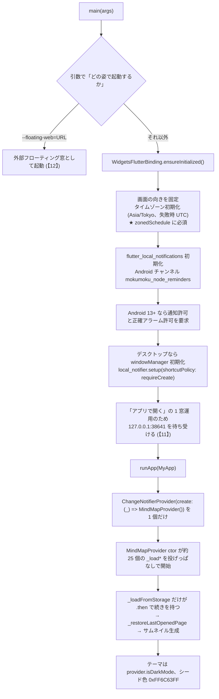

---

## 【2】文書ツリーの構造と保存

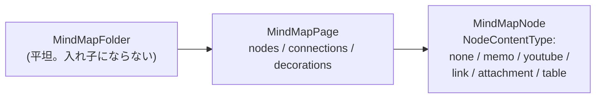

### 保存の流れ

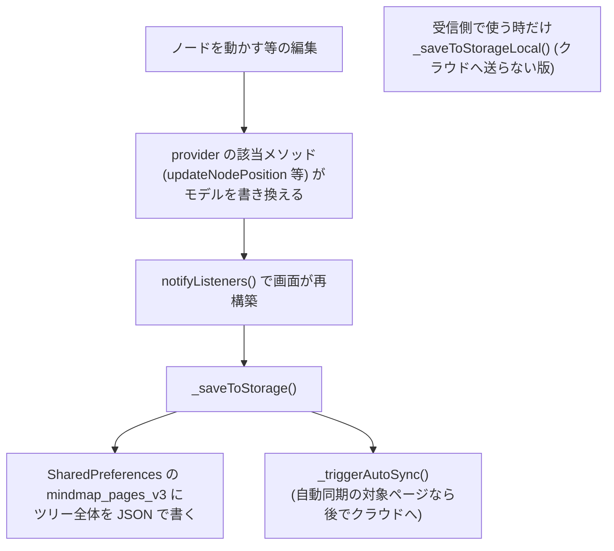

### 読み込み

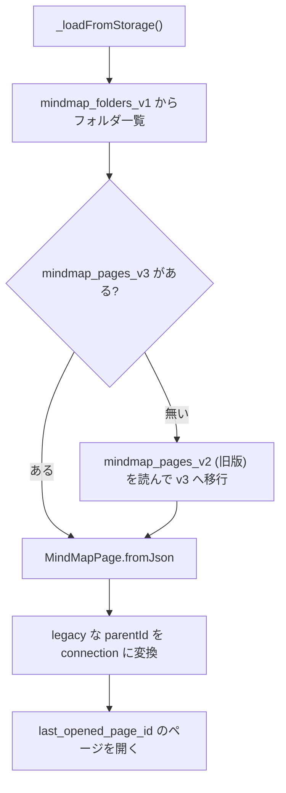

> ★ JSON の直列化はすべて**手書き** (`json_serializable` は宣言だけで `.g.dart` は無い)。
> 読み込みは防御的 (`as num?` / `?? 既定値` / 添字の範囲チェック)。**後方互換を必ず保つこと**。

---

## 【3】ノードを作る・つなぐ

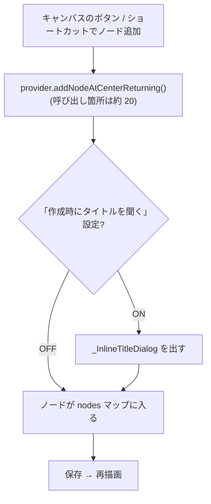

> ★ 画面側に `_addNode` のようなメソッドは無い。

### 接続線の作り方 (ここが独特)

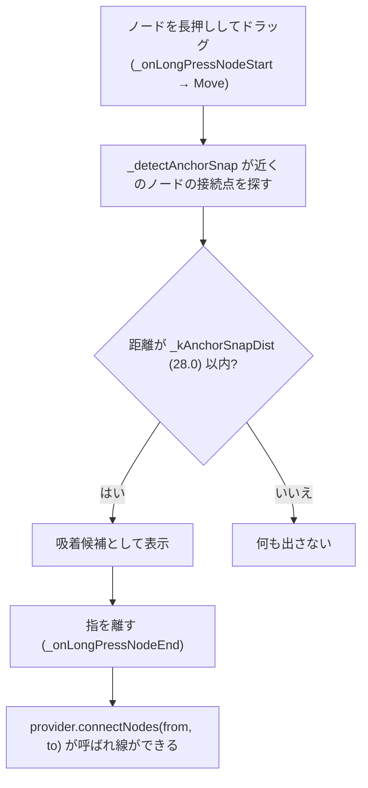

> ★ 「線を引く」ジェスチャーは**無い**。落とした時の吸着で暗黙に繋がる。

### 接続線の選択

`キャンバスをタップ → _onConnectionTap → ConnectionPainter.findConnection(Offset)`
(3 次ベジェ曲線に対して 14px 以内のヒットテスト) → 当たれば `_ConnectionActionOverlay`

### 描画の z 順 (Stack)

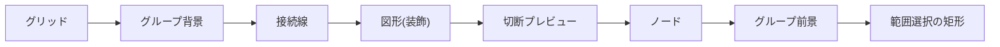

接続線はノードと同じ層 (レイヤー 3 相当) で描くので、レイヤー 1〜3 の図形より手前、
4〜5 の図形より奥になる。

---

## 【4】ノードの描画と当たり判定 (`visualHeight` の同期)

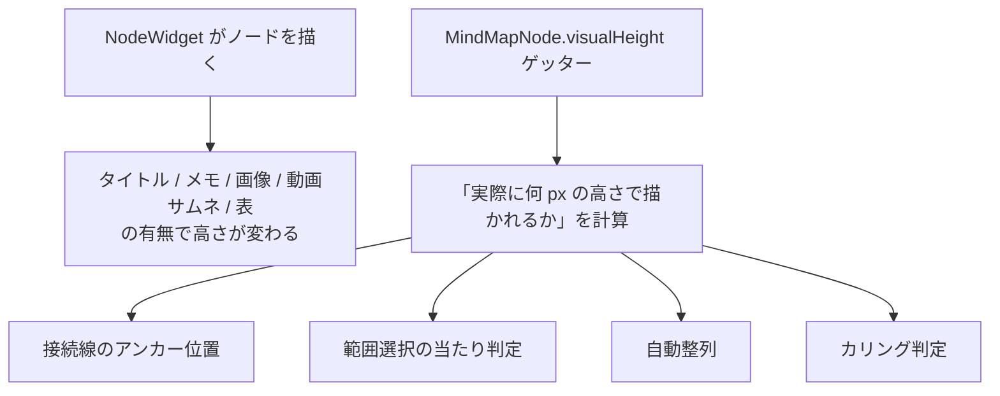

> ★ `node_widget.dart` の描画ロジックと `visualHeight` を**必ず同時に直すこと**。
> ずれるとノードの当たり判定や接続線の根元が「見た目」とずれる。
> `attachmentAspectRatio` (画像の元アスペクト比) もこの計算に入る。

---

## 【5】キャンバスの描画とカリング (大量ノード対策)

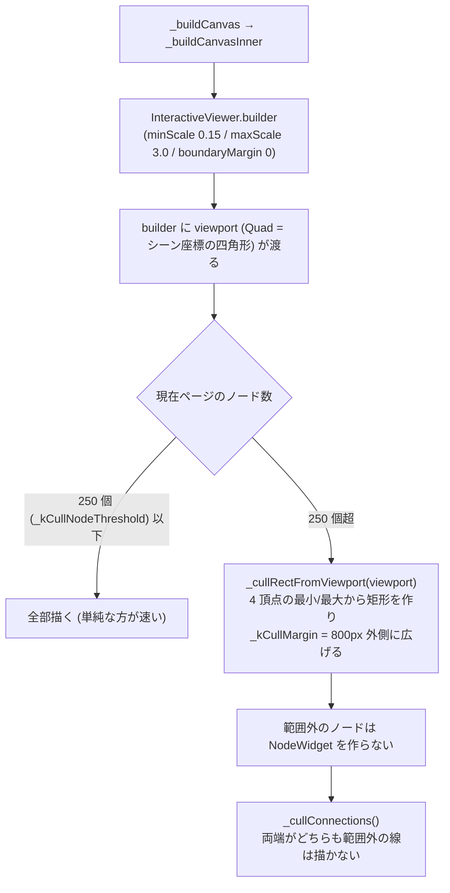

> ★ 操作中 (ドラッグ・範囲選択など) は例外扱いで間引かない。
> 800px の余白は、スクロールした瞬間に空白が見えないようにするため。

### 変形の監視

`_onTransformChanged` → 軸ロック (Ctrl+K = 水平 / Ctrl+L = 垂直) と倍率ロックを強制
→ `_scalePercent` (画面に出す倍率表示) を同期。

`_pauseViewer` ゲッターが true の間は InteractiveViewer のパン/ズームを止める
(ノード・範囲・図形のドラッグ中、分割パネルのホバー中)。

---

## 【6】格納ノード (Ctrl+G)

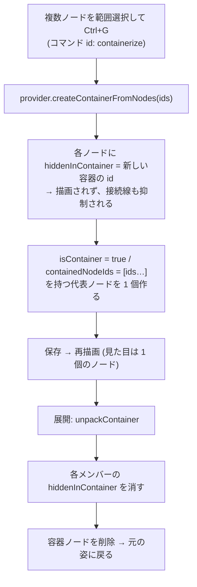

---

## 【7】サブマップ (リンクページ) とナビゲーション履歴

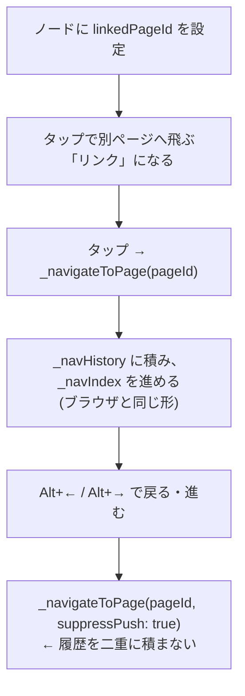

---

## 【8】クラウド同期 (Firestore REST API)

`cloud_firestore` プラグインは使わず、`package:http` で REST を直接叩く。
グループ = 8 文字の共有コード (gid)。認証は匿名 (Identity Toolkit)。

### アップロード

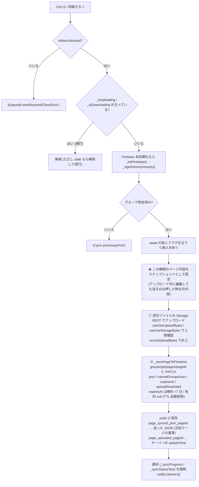

### ダウンロード (3-way マージ)

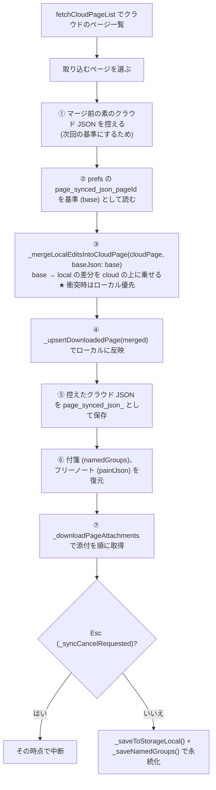

> ★ アクセス制御はすべてクライアント側の Dart にしかない。本番では
> Firestore Security Rules に同じ規則を書く必要がある (リポジトリに `.rules` は無い)。

---

## 【9】通知・リマインダー

provider には通知プラグインのコードが **1 行も無い**。
スケジュールは `main.dart` (初期化) と `mind_map_screen.dart` (発行) が持つ。

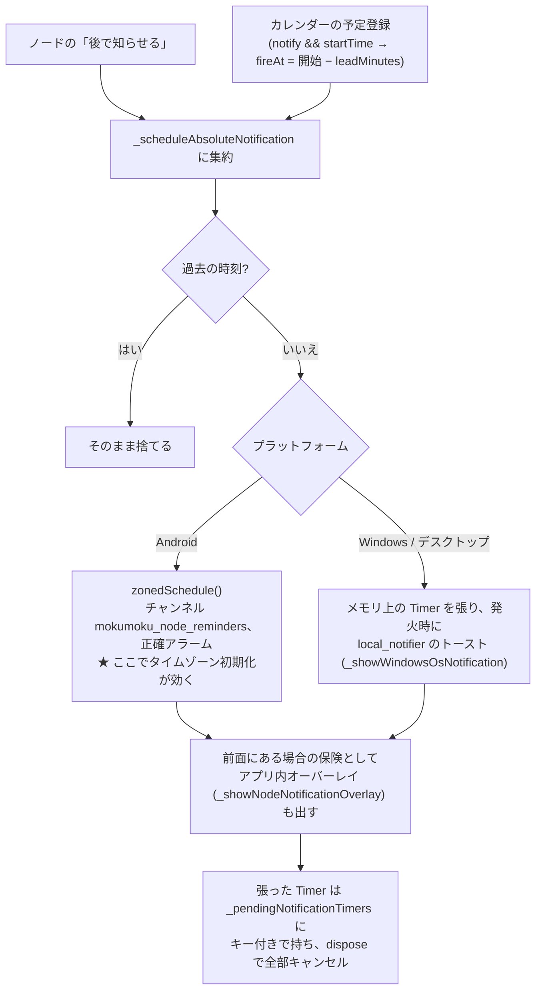

> ★ 起動時にリマインダーを張り直す処理は**無い**。永続性は「Android の OS アラーム」と
> 「カレンダーに残る予定」が担う。

別系統として `_eventNotifyTimer` が 30 秒ごとに `_checkEventNotifications` を回し、
前面にいる間だけ SnackBar でカレンダー予定を知らせる。

---

## 【10】キーボードショートカット

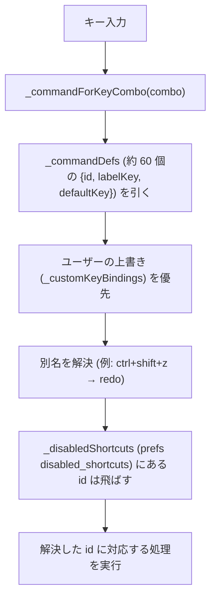

矢印キーだけは HardwareKeyboard のハンドラ `_handleMainGlobalArrowKey` を通る
(initState で登録、dispose で解除)。Esc によるキャンセル (同期中止・一括動画ダウンロード中止) もここ。

**固定/予約の組み合わせ**: Ctrl+K = 水平ロック / Ctrl+L = 垂直ロック /
Ctrl+1〜9 = ショートカットフォルダ内のマップ切替 / Ctrl+Shift+Z = redo の別名

---

## 【11】「アプリで開く」の 1 窓運用

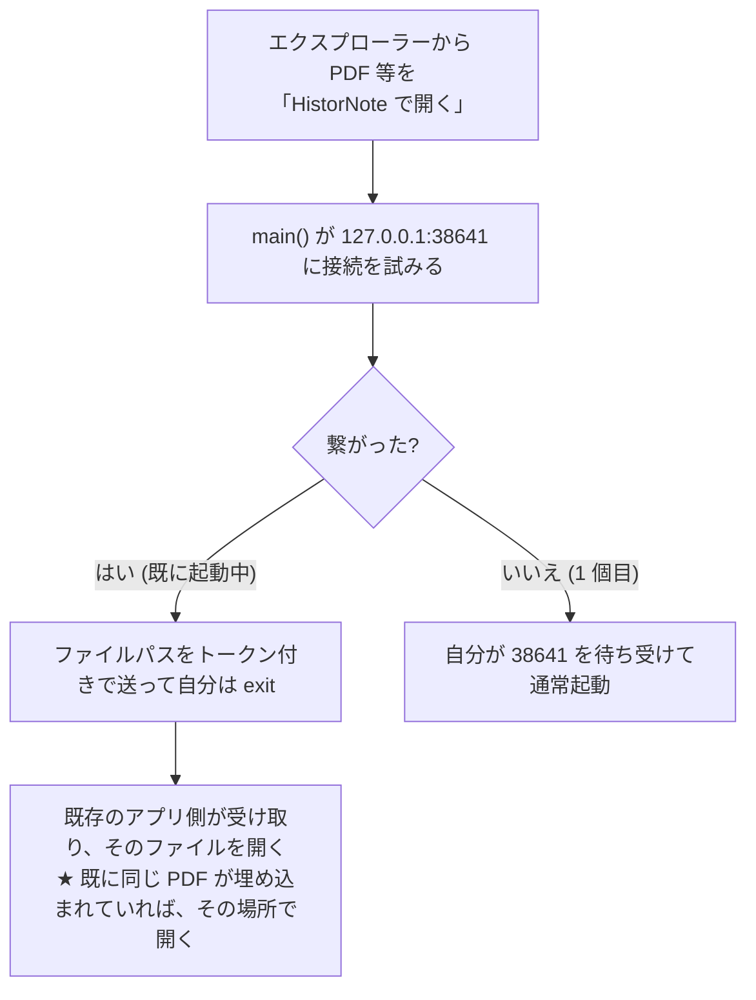

> ※ 動作設定の `openWithNewInstance` を ON にすると、毎回新しいプロセスを立てる従来の挙動に戻せる。

---

## 【12】フローティング窓 (メモ / AI / 電卓 / 計算機)

> ★ **大前提**: `desktop_multi_window` の「サブ窓」には `webview_windows` (WebView2) を
> 登録できない。登録するとサブ窓を閉じた後、本体でも WebView が作れなくなる。
> したがってサブ窓では WebView を新設しない。

### メモ窓 (サブ窓 = desktop_multi_window)

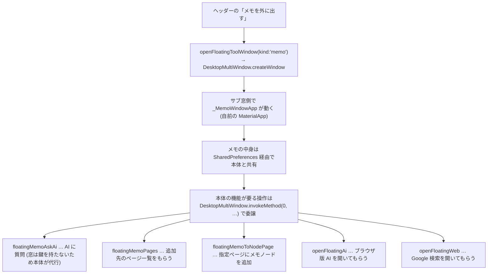

> ※ サブ窓の `State.context` は自作 MaterialApp の外にあるので、
> `showDialog` / `ScaffoldMessenger` は `navigatorKey` 経由で呼ぶ。

### AI の外部窓 (別プロセス)

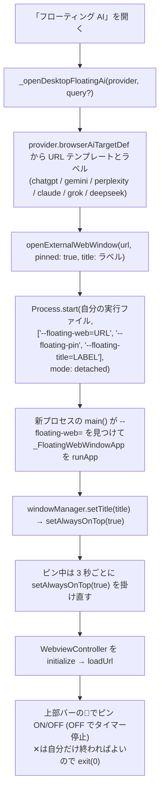

> ★ サブ窓ではなく**もう 1 プロセス**起動する。OS から見て普通の窓なので、
> アプリの枠の外へ自由に動かせる。WebView の保存先は実行ファイル基準で共有されるので、
> 本体でログイン済みならその状態のまま開く。
> ★ Windows は他アプリをクリックした時などに TOPMOST が外れるため、3 秒ごとに掛け直して
> 「ディアクティブでも前面に出たまま」にする。

> ※ 外部窓が開けない環境 (モバイル等) では、従来どおりアプリ内の浮遊パネル
> (`_FloatingAiSwitcherPanel`) に落ちる。

### メモ窓の AI をブラウザ版で開く

メモ窓の AI 画面には 2 通りある:

1. **窓の中の AI** … 鍵 (代行サーバー / 自分のキー) を叩く軽い画面
   (サブ窓に WebView を載せられないため)
2. **ブラウザ版で開く** … `_openAiFor(text)` → `invokeMethod(0, 'openFloatingAi', text)`
   → 本体が `_openDesktopFloatingAi` を実行して外部窓が立ち上がる

> ※ Android のオーバーレイ (FloatingMemoOverlay) でも同じボタンがあり、そちらは prefs の
> `browser_ai_target` を読んで `launchUrl(externalApplication)` で既定ブラウザを開く。

---

## 【12-B】フローティング AI 窓の中身 (別プロセス側)

窓は別プロセスなので provider を持てない。設定は **prefs を本体と共有**し、
本体の機能が要る時は **127.0.0.1:38641 の受け口**に頼む。

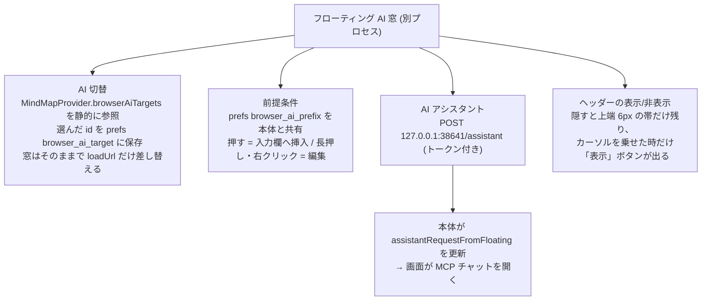

- 前提条件の挿入は、本体の AI 欄と同じ JS
  (contenteditable → textarea の順に一番大きい入力欄を探して差し込む)。
- 窓のダイアログは自作 MaterialApp の外にあるので、`showDialog` は
  `_navKeyFloating` (navigatorKey) 経由で呼ぶ。
- ✕ は自分だけ終わればよいので `exit(0)`。

## 【12-C】レイヤー (ページ毎の作業レイヤー)

図形 (`MapDecoration`) は `layer` を 1〜5 で持ち、既定は 3。**4 以上はノードより
手前**に描かれる (描画順は【3】の z 順を参照)。

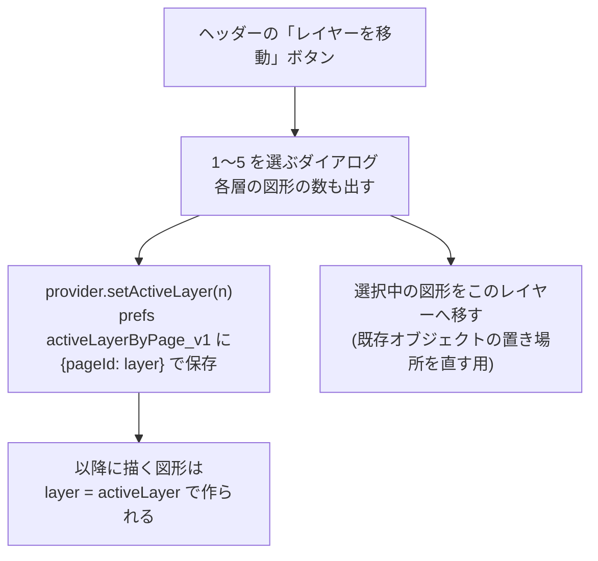

- 作業レイヤーは**ページ毎**に覚える (別のページへ移ると、そのページの層に戻る)。
- 図形を選んだ時のツールバーにも層の変更ボタンは残っているが、通常はヘッダーの
  「レイヤーを移動」で層を選んでから描く。

## 【13】ページの種類 (pageType)

| pageType | 内容 |
|---|---|
| `normal` | 通常のマインドマップ |
| `bookshelf` | ギャラリー (2 次元のセル格子。prefs `shelfCells_v1`) |
| `paint` | フリーノート (お絵かき + 文字。文書もここで書く) |
| `document` | 便箋型のメモ帳 (罫線 30px ピッチ + Quill エディタ) |
| `videoEditor` | 動画編集タイムライン (ffmpeg) |
| `aiStudio` | AI スライド生成 |
| `markdown` | Markdown / Mermaid のプレビュー付きエディタ |

> ★ ガントチャートとメンバー予定表は「ページ」ではなくヘッダーボタンの**ツール**
> (`Dialog.fullscreen` を `_openToolDialog` で開く。固定 id は `global_gantt` / `global_schedule`)。
> ★ `paint` / `document` / `videoEditor` の中身は prefs に保存されていて、ページ JSON には載らない。
> したがってクラウド同期に乗るのは `paint` だけ (`paintJson` フィールドとして実装済み)。他 2 つは未対応。

---

## 【14】多言語対応 (i18n)

ARB / gen_l10n は使わない。自前の巨大な `const Map`。

```mermaid
flowchart TD
    A["UI に文字を出す"] --> B["provider.t('some.key')"]
    B --> C["_translations['some.key'] を引く"]
    C --> D["言語の解決順<br/>_appLanguage → 'en' → 'ja' → キーそのもの"]
    D --> E["30 言語対応 / 完全翻訳は 9 言語<br/>残り 21 は BETA 扱いで英語が出る<br/>(生のキーは絶対に出ない)"]
```

> ★ 既定言語は `'en'`。ja より en が先。
> ★ サブ窓とオーバーレイは provider を持てないので、`main.dart` 内の `FloatL10n.t()` という
> 別のテーブルを使う。

---

## 【15】PDF ビューアとページ固定メモ

```mermaid
flowchart TD
    A["PDF を開く"] --> B{"プラットフォーム"}
    B -->|デスクトップ| C["_InAppViewerDialog"]
    B -->|モバイル| D["_InAppViewerPage"]
    C --> E["syncfusion_flutter_pdfviewer で表示"]
    D --> E
    E --> F["ページが変わると onPageChanged<br/>→ そのページに紐づくメモを出す"]
    F --> G["メモは MindMapNode.pdfMemos として保存<br/>pdfMemoFolders で名前付きフォルダに分類"]
    G --> H["マーカーは prefs pdfHighlights に<br/>{ページ, 行ごとの矩形, 色} で保存"]
```

> ★ 機能ごとに**双子クラス**がある。片方だけ直すと環境で挙動がずれる。
> ★ pdfx から乗り換えた (Windows で白紙になったのと、`onPageChanged` / `jumpToPage` が
> PDF メモに必要だったため)。
> ★ 重い同期処理 (`PdfDocument` / `PdfTextExtractor`) は `compute` で別 isolate に逃がしてある。
> 開いた瞬間の固まりは Syncfusion 内部の解析なので、こちら側では取り切れない。

---

## 【16】集中ロック (フォーカスロック)

```mermaid
flowchart TD
    A["設定でロック時間 / 曜日を登録 (FocusLockSchedule)<br/>startMin / endMin は 0 時からの分 (start > end は日をまたぐ)<br/>days は 1=月〜7=日 (空なら毎日)"] --> B["prefs focusLockSchedules に JSON で保存"]
    B --> C["_checkFocusLockSchedule が 30 秒ごとに<br/>現在時刻を確認 (Android のみ)"]
    C --> D["時間帯に入ったら _FocusLockOverlay を全面に出す"]
    D --> E["終了時刻に完了通知を予約<br/>(_scheduleCompletionNotification、ノードと同じチャンネルを再利用)"]
```

> ★ ロック画面の AI / 転送はダイアログではなく Stack の中のパネル + 浮遊窓
> (singletonKey。前面に出し直す処理が必須)。

---

## 【17】ページ消失に対する備え

```mermaid
flowchart TD
    A["予防: 編集のたびに page_backups/ フォルダへ自動退避"] --> B["復旧: ⋮メニューの復元 UI から選ぶ"]
    B --> C["クラウド由来の消失は prefs の page_synced_json_* から拾える"]
    C --> D["★ その際は tombstone (削除済みの印) を消さないと復活しない"]
```

---

## 【18】Google アカウントでの共有

```mermaid
flowchart TD
    A["ループバック OAuth でログイン"] --> B["Firebase の uid が端末をまたいで固定される"]
    B --> C["同じ uid = 同じ…"]
    C --> D["プラン (権利情報)"]
    C --> E["AI クレジット残高"]
    C --> F["使用量"]
    C --> G["Stripe の契約 (アプリ内から解約できる)"]
```

> ※ かつてあった「ユーザー名の設定」「ライセンス引き継ぎ」は廃止。

---

## 【18-B】テキストエディタ (.txt / .md / ソースコード)

```mermaid
flowchart TD
    A["テキスト系ファイルを開く"] --> B["_TextEditorDialog (デスクトップ) /<br/>フルスクリーンルート (モバイル)"]
    B --> C["本文は 1 行 = 1 ウィジェットのリスト<br/>中央揃えが既定 (prefs textEditorCenterAlign)"]
    C --> D["行をクリック → TextPainter で文字位置を求め<br/>その位置にカーソルを置いて即編集"]
    D --> E["★ デスクトップの入力欄はフォーカス時に全選択になるので、<br/>フォーカスの次フレームでカーソルを置き直す"]
    B --> F["左: メモ欄 (PDF ビューアと同じ _PdfMemoPanel)<br/>ノードの pdfMemos に保存。行番号でジャンプ"]
    B --> G["右: ブラウザ版 AI 欄<br/>+ AI編集 (MCP) をオーバーレイで重ねる"]
    B --> H["境界のドラッグで左右パネルの幅を変更"]
```

- **AI編集**は API (代行) を呼ぶので、モデル切替と残りトークン表示を持つ。
  書き換えは `text_file_edit` ツール経由で、Ctrl+Z で戻せる
  (保存するまでファイルには書かれない)。
- Ctrl+Shift+N で新規フリーメモ、Ctrl+S で保存。
- Markdown ファイルではプレビューと**編集×プレビューの左右分割**が使える
  (【18-C】)。

## 【18-C】Markdown プレビュー (Mermaid / 数式 / ハイライト)

```mermaid
flowchart TD
    A["プレビューを開く"] --> B["_markdownPreviewHtml で HTML を組む"]
    B --> C["同梱 JS を app-support/md_preview/ へ書き出す<br/>marked / mermaid / highlight.js / MathJax"]
    C --> D["preview.html を書き出して file:// で開く"]
    D --> E["★ loadStringContent (about:blank) では<br/>外部スクリプトが読めず図が出ないため"]
    B --> F["変換前にフェンスと数式を退避<br/>(marked の強調記法に壊されないように)"]
    F --> G["mermaid ブロック → 図<br/>バッククォート3つ+mermaid / チルダ3つ+mermaid /<br/>言語なしでも flowchart 等で始まれば図として扱う"]
    G --> H["図は枠に入れて<br/>ホイールで拡大縮小 / ドラッグで移動 /<br/>下端ドラッグで表示領域の高さ変更"]
    H --> I["図のボタン: AI に渡す / AIで修正 /<br/>コピー / PNG 保存 / マップへ貼る"]
```

- 図から Flutter への通知は WebView2 の `postMessage` (webMessage) を使う。
- 目次は h1〜h3 から自動生成。コードは highlight.js、数式は MathJax (SVG)。
- **すべて同梱アセット**なのでオフラインでも描画できる。

## 【18-D】AI に渡すアプリの説明書 (AGENTS.md + read_app_doc)

```mermaid
flowchart TD
    A["AI を呼ぶ場面 (MCP チャット / AI編集)"] --> B["assets/ai/AGENTS.md を毎回添える<br/>(データ構造・ページ毎に使うツール・作法・禁止事項)"]
    B --> C["詳細が要る時は AI 自身が<br/>list_app_docs → read_app_doc で取り寄せる"]
    C --> D["assets/ai/docs/*.md<br/>billing / mcp / features / layout / qa"]
```

詳細を毎回渡すとトークンを食い潰すので、**常時渡す要約**と**必要時に読む詳細**の
二段構えにしている (skills と同じ考え方)。利用者が書いた前提 (`mcpPreamble`) は
さらにその手前に置かれ、最優先で守らせる。

## 【19】ビルドと配布

```mermaid
flowchart TD
    A["型チェック (analyzer がこのリポジトリでは壊れているため)"] --> B["dart format -o none FILES … 構文チェック"]
    B --> C["flutter build bundle --no-pub … 型チェック"]
    C --> D["★ 終わったら build/flutter_assets を必ず消す<br/>残すと kernel_blob.bin が Windows の Release 出力に混ざる"]
    D --> E["Windows: flutter build windows --release --dart-define-from-file=env.json"]
    E --> F["★ アプリが起動中だと exe がロックされて LNK1104<br/>先に終了させる"]
    F --> G["Android: flutter build apk --release --dart-define-from-file=env.json"]
    G --> H["releases/タグ/ に zip + APK + SHA256SUMS + release-notes.md"]
    H --> I["gh CLI で GitHub Releases (PG-Darksan/Kamispec) に上げる"]
```

> ★ R8 が ffmpeg_kit (`com.antonkarpenko`) を難読化すると `JNI_OnLoad` が失敗し、
> `GeneratedPluginRegistrant` が `java.lang.Error` で中断して以降のプラグインが全滅する。
> proguard に keep を入れてある。
> ★ `env.json` は API キーの塊。git-ignore されている事を毎回確認し、**絶対にコミットしない**。
