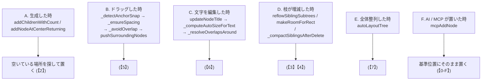
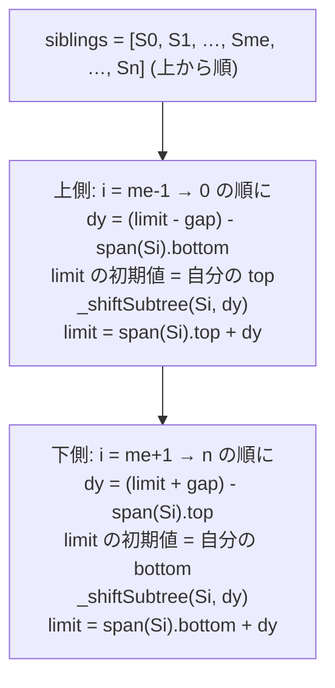
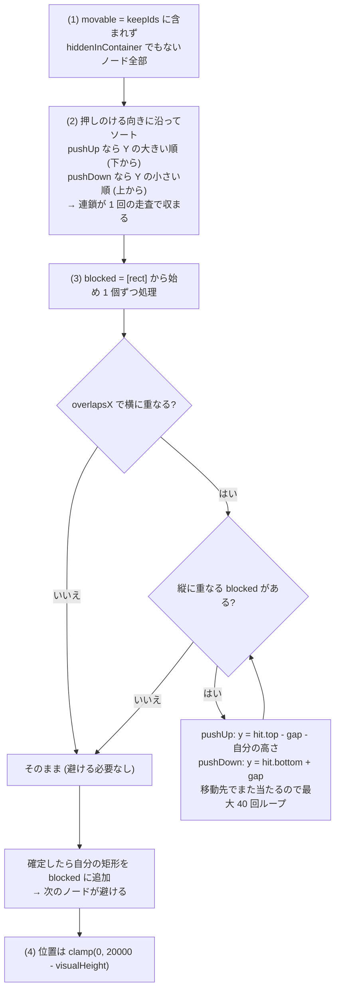
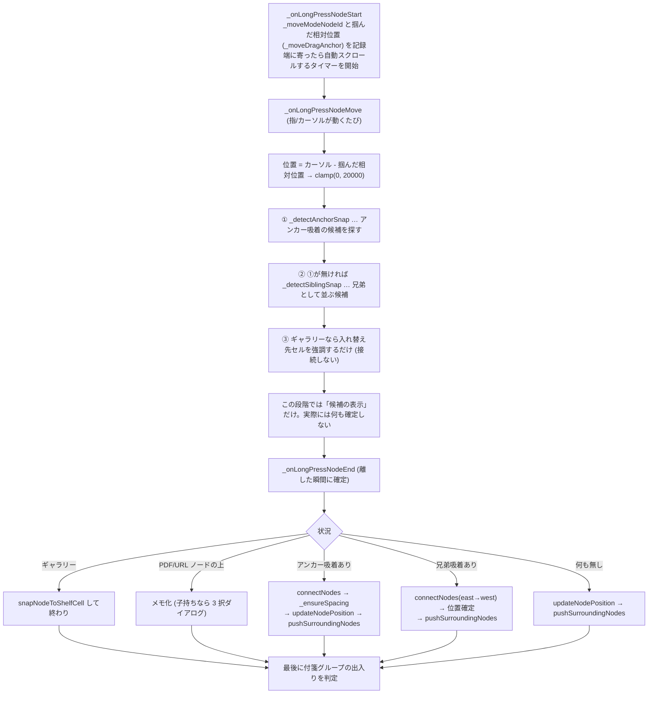

# HisatorNotebook 実装詳細 (4) ノードの配置・押しのけ・自動整列

「親ノードから複数の子を出した時に周りのノードが避ける」処理を中心に、
ノードの位置を動かす全経路をまとめる。

## 対象ファイル

| ファイル | 役割 |
|---|---|
| `lib/providers/mind_map_provider.dart` | 配置・押しのけ・整列の本体 |
| `lib/screens/mind_map_screen.dart` | ドラッグ操作中のスナップと回避 |
| `lib/models/mind_map_node.dart` | `visualHeight` (描画高さの正) |
| `lib/widgets/node_widget.dart` | 実際の描画 (`visualHeight` と対) |

## 大前提 3 つ

1. 位置は「ノードの左上」。描画も当たり判定もすべて左上基準。
2. 座標は 0〜20000 に clamp される。キャンバスは 20000×20000 の正方形。
3. 押しのけは基本「縦 (Y) 方向」。横に逃がすのは埋もれ解消だけ。

---

## 【0】ノードが動く 5 つの経路



A〜D は「局所的に最小限だけ動かす」。E だけが全ノードを並べ直す。

### 【0-F】AI / MCP ツールで作った時 — **重なり回避は一切しない**

`mcpAddNode` は座標を渡されなければ `mcpReferenceFor(pageId)`
(そのページの基準位置。既定 10000,10000) に**そのまま置くだけ**で、
空き場所探しも押しのけも重なり判定も行わない。座標なしで n 個作れば
**n 個が完全に重なる**。

散らすのは `tidy_page` (`mcpTidyPage` → `autoLayoutTree` +
`_alignMiddleChildren` + `_spreadLooseNodes`) を呼んだ時だけ。
アプリ内の AI アシスタントは応答の最後に自動で呼ぶが (`_tidyTouched`、
対象は add_node / add_image_node / add_table_node / connect_nodes を
使ったページのみ)、外部の MCP クライアントは自分で呼ぶ必要がある。
`add_node` の戻り値に `note` が付いていたら、それが合図。

なお `mcpAddTableNode` / `mcpAddFileNode` は挙動が違う:
表は座標省略時に `_spreadLooseNodes` を呼び、ファイルのタイルは
既にあるノードの下へずらして置く。

> ★ 同じ「重なり回避」でも A〜E で使う関数・定数・当たり判定が違う。
> ここを混同すると「直したのに直らない」になる。まず【1】を読むこと。

---

## 【1】当たり判定の大原則 — `height` と `visualHeight` の使い分け

ノードには高さが 2 つある。

| 値 | 意味 |
|---|---|
| `node.height` | タイトル本体の高さ (既定 40〜42px)。**保存される値** |
| `node.visualHeight` | 実際に描かれる高さ。タイトルの折り返し + メモ全文 + 画像/動画サムネイル + 表 を足した値。**保存されない導出値** |

> ※ `caption` (F3 の説明書き) はノードの外に浮かせて描くので `visualHeight` には含まない。

どちらを当たり判定に使うかは、**意図的に**分かれている。

| 処理 | 使う高さ | 理由 |
|---|---|---|
| `pushSurroundingNodes` | `height` | 画像を貼った途端に当たり判定が縦長になり、近づけない (ユーザー報告) |
| `_avoidOverlap` | `height` | 同上 |
| `_ensureSpacing` | `height` | 同上 |
| `_detectSiblingSnap` | `height` | 同上 |
| `subtreeSpan` / `_shiftSubtree` | `visualHeight` | 枝が縦に占める「見た目の面積」を空けたいので画像も含めて計算 |
| `makeRoomForRect` | `visualHeight` | 同上 |
| `_resolveOverlapsAround` | `visualHeight` | 同上 |
| `_separateBuriedNodes(Around)` | `visualHeight` | 同上 |
| `autoLayoutTree` (calcH ほか) | `visualHeight` | 同上 |

結果として仕様はこうなる:

- タイトル本体どうしは**絶対に重ならない**。
- 画像/動画/長いメモの領域は他ノードと**重なり得る** (許容している)。
- ただし「ほぼ完全に埋もれる」(被覆率 55% 超) 場合だけは `visualHeight` 基準で
  強制的に引き離す (【6】の `_separateBuriedNodes`)。

> ★ `visualHeight` を変えたら `node_widget.dart` の描画も必ず合わせる。
> ずれるとノードの当たり判定と接続線のアンカーが見た目からずれる。

---

## 【2】親から複数の子を出す — `addChildrenWithCount`

### 呼ばれる場所

| 入口 | 挙動 |
|---|---|
| 右クリック →「子ノードを追加」(デスクトップ) | `_showAddChildrenDialog` で個数を入力 (1〜30 に clamp。手入力で大量生成して UI を壊さない) |
| 右クリック →「子ノードを追加」(モバイル) | ダイアログを出さず `quickAddChildrenCount` 個を即生成 (既定 5、設定で 1〜30) |
| 複数選択 → `addChildrenToMultipleParents` | 親ごとに `skipUndo: true` で回し、Undo は外側で 1 回だけ積む → Ctrl+Z 一発で全部戻る |

### 処理の流れ

```mermaid
flowchart TD
    S["count <= 0 / 親が居ない → 何もしない"] --> A["(1) 既定値を置く<br/>gap = 16.0 / childW = 160.0 / childH = 42.0<br/>startX = 親.x + 親.width + 80 → clamp(0, 20000 - childW)<br/>parentCenterY = 親.y + 親.visualHeight / 2"]
    A --> B["(2) 既存の子を集める (existingChildren)<br/>connections を全部見て<br/>c.fromId == parentId → 相手は c.toId<br/>c.toId == parentId → 相手は c.fromId (逆向きの手動接続も拾う)<br/>seen で重複除去"]
    B --> C["(3) 列の見本にする<br/>rightSideChildren = n.x >= 親.x + 親.width のもの"]
    C --> D{"rightSideChildren がある?"}
    D -->|はい| E["startX = 一番上の子の x (列の X を継承)<br/>childW / childH = 一番上の子の値<br/>gap = 隣り合う子の間隔の中央値 (0 < g < 400 のみ採用)"]
    D -->|いいえ| F
    E --> F["(4) 既定の Y を決める<br/>totalH = childH * count + gap * (count - 1)<br/>y = parentCenterY - totalH / 2 → clamp"]
    F --> G["(5) 横に重なる既存子だけ抜き出す (overlapColumn)<br/>新規の X 範囲と既存子の X 範囲が触れていれば対象<br/>上下に離れているだけのものは無視"]
    G --> H{"(6) Y が重なる?"}
    H -->|はい| I["overlapColumn の中で一番下の下端 lowestBottom を求め<br/>y = lowestBottom + gap → clamp"]
    H -->|いいえ| J
    I --> J["(7) 生成ループ (i = 0..count-1)<br/>MindMapNode(id: uuid, title: '', position: (startX, y),<br/>color: _childColor(), width: childW, height: childH)<br/>接続 = 親.east → 子.west<br/>y += childH + gap"]
    J --> K["(8) 周りに場所を空ける<br/>addChildrenToParentGroups (親が付箋グループ所属なら子も)<br/>reflowSiblingSubtrees(親) … 親の兄弟を枝ごと押し広げる (【3】)<br/>makeRoomForRect(新規の帯) … 別の列と被る場合の保険 (【4】)"]
    K --> L["_saveToStorage() → notifyListeners() → 画面反映"]
```



> ★ (6) は 1 個ずつずらすのではなく「新規 count 個の塊」ごと下に落とす。
> これで新しい子は必ず縦一列に揃う。

### 数値例

**例 1**: 親 = 位置(400, 300) 幅160 高42、既存の子なし、count = 3

```
startX = 400 + 160 + 80 = 640
totalH = 42*3 + 16*2 = 158
parentCenterY = 300 + 42/2 = 321
y = 321 - 79 = 242
→ 子1 (640, 242) / 子2 (640, 300) / 子3 (640, 358)
```

親の中心 321 が 3 個の塊の中心に来る。

**例 2**: 同じ親に既に子 A(640, 200 高42) B(640, 258 高42) がある状態で 2 個追加

```
rightSideChildren = [A, B] → startX=640, childW/H は A に合わせる
gap = B.y - (A.y + A.visualHeight) = 258 - 242 = 16
totalH = 42*2 + 16 = 100 → y = 321 - 50 = 271
[271, 371] は A[200,242] と重ならないが B[258,300] と重なる
  → lowestBottom = 300 → y = 316
→ 新子1 (640, 316) / 新子2 (640, 374)
```

= 既存の列の一番下に、同じ間隔で積み増される。

### この処理の既知の癖 (直す時は影響範囲に注意)

- `existingChildren` は `isParentChild` を見ない。関連線 (`relationshipType == 'association'`)
  で繋いだ相手も「子」として列の見本・衝突判定に入る。一方 `orderedSiblingIdsOf` (【3】) は
  `isParentChild` だけを見る。**2 つの「子」の定義が違う**。
- `rightSideChildren` の判定は「親の右端以上」なので、孫が親の右に近い位置にあると
  孫を列の見本にしてしまう可能性がある。
- `gap` の中央値は `visualHeight` 基準、`totalH` は `childH` 基準。画像ノードが混じる列では、
  見た目の間隔と計算がずれる。
- (6) は「下」にしか逃がさない。上に大きな空きがあっても使わない。
- `startX` は `clamp(0, 20000 - childW)` なので、右端 20000 付近では子が親に重なる。

---

## 【3】兄弟の枝ごと押し広げる — `reflowSiblingSubtrees`

**目的**: 孫を足したら、親の兄弟たちが「枝ごと」上下に動いて場所を空ける。
折りたたんだら、空いた分だけ詰まる。

### 兄弟の定義 (`orderedSiblingIdsOf`)

- `parentNodeIdsOf(id)` = `isParentChild` の線で自分に入ってくる相手。
  親が居れば その **first** の子一覧 (`orderedChildIdsOf`) が兄弟。
  ★ 親が複数あるノードは、最初の親の兄弟としてしか扱われない。
- 親が居なければ「親を持たないノード同士」を兄弟とみなす (= 根の一覧)。
- 並び順は `_sortIdsTopDown` = 画面の上から下、同じ高さなら左から右。**X ではなく Y が主キー**。

### 枝の縦範囲 (`subtreeSpan`)

```
top    = 自分の y と、見えている子孫の y の最小
bottom = 自分の y + visualHeight と、子孫の下端の最大
```

除外するもの:

- 自分が `collapsed` なら子孫を一切数えない → **畳めばその分詰まる**
- `hiddenNodeIds` (折りたたみ配下) に入っている子孫
- `hiddenInContainer != null` (格納ノードの中身)

### 移動 (`_shiftSubtree`)

自分 + `getDescendants(自分)` を dy だけ縦に平行移動。clamp あり。

> ★ `getDescendants` は `isParentChild` を見ずに**すべての接続**の fromId→toId を辿る。
> 関連線で繋いだ先も「子孫」として一緒に動く。【2】と同じ不一致がここにもある。

### 本体のアルゴリズム



図で言うと:

```
     ┌ S0 の枝 ┐            ┌ S0 の枝 ┐   ← gap だけ空けて押し上げ
     └─────────┘            └─────────┘
     ┌ 自分 ┐      →        ┌ 自分     ┐   ← 子が増えて縦に伸びた
     └──────┘               │          │
     ┌ S2 の枝 ┐            └──────────┘
     └─────────┘            ┌ S2 の枝 ┐   ← gap だけ空けて押し下げ
                             └─────────┘
```

dy は符号を持つので、縮んだ時は逆向きに動いて「詰まる」。
**押し広げと詰めが同じ 1 本のコードで実現されている**。

### 呼ばれる場所

| 呼び出し元 | タイミング |
|---|---|
| `addChildrenWithCount` | 子を作った直後 |
| `toggleNodeCollapsed` | 畳む/開く |
| `_compactSiblingsAfterDelete` | 削除後の詰め直し (親がある場合は「一番上の子」を基準 → 下の兄弟が上へ詰まる。親が無い場合は根の一覧の先頭。ギャラリーは早期 return) |

---

## 【4】矩形のぶん場所を空ける — `makeRoomForRect`

「この矩形を空けたいので、そこに居るノードをどけて」という汎用処理。

```dart
makeRoomForRect(Rect rect, Set<String> keepIds,
                {bool pushUp = false, double gap = 16.0}) → 動かしたか
```



### 使い道

- **`addChildrenWithCount` の最後**: 新規の子 count 個が占める帯を空ける。
  `keepIds = {親, 新規の子}`。`reflowSiblingSubtrees` が「同じ親の兄弟」しか動かさないのに対し、
  こちらは「ページ上の全ノード」が対象。別の枝と被った時の保険。
- **`makeRoomForCaption`**: F3 の説明書きはノードの上に浮かせて描くので、その帯 (上向き) を空ける。
  帯の幅 = `max(120, node.width + 60)`。高さは `captionBandHeight`:

```
perLine = max(6, 帯幅 / 11)      … 全角混じり 1 文字 ≒ 11px
lines   = Σ ceil(各行の文字数 / perLine) を 1〜4 に clamp
高さ    = lines * 16 + 10 + 8
```

> ★ この見積もりは描画側 (`_NodeCaptionPainter`) と揃えること。
> ずれると説明書きが他のノードに被る / 無駄に空きすぎる。

---

## 【5】ドラッグ中とドロップ時の回避 (`mind_map_screen.dart`)

長押し → 移動 → 離す、の 3 段階で別々の関数が働く。



### ① アンカー吸着 `_detectAnchorSnap`

- しきい値 `_kAnchorSnapDist` = **28.0**
- 自分と相手の `anchorPoint` 総当たりで、一番近いペアを採用
- 除外: `hiddenInContainer` (格納中)、`hiddenNodeIds` (折りたたみ配下)
  → 見えないノードへ吸着して「繋いだ途端に消える」バグの対策
- 範囲選択版は `_detectAnchorSnapForRange`

### ② 兄弟吸着 `_detectSiblingSnap`

- `alignThreshold` = **30.0** — 既存の子と X (または Y) がこれだけ近ければ「並んでいる」
- `siblingGap` = **20.0** — スナップ後の隙間
- 提案位置との距離が **60.0** 未満なら吸着
- 当たり判定は `height` (`visualHeight` ではない)【1】
- 折りたたみ / 格納で隠れている親子はスナップ候補に出さない

### ③ 接続時の最低距離 `_ensureSpacing`

`minGap` = **60.0**。ドラッグ側のアンカー方向で押す軸が決まる。

| アンカー | 制約 |
|---|---|
| west | x >= 相手の右端 + 60 |
| east | x <= 相手の左端 - 自分の幅 - 60 |
| north | y >= 相手の下端 + 60 |
| south | y <= 相手の上端 - 自分の高さ - 60 |
| 斜め | X 方向だけ効かせる |

高さは `height` を使う。最後に `_avoidOverlap` を通し、clamp(0, 20000)。

### ④ 重なり回避 `_avoidOverlap`

`pad` = **6.0** (以前は 16)。「微妙に重なる距離までは近づけたい」という要望で縮めた値。

```
for 最大 20 回:
  全ノードと矩形判定 (自分の height と相手の height + pad)
  ぶつかったら y = 相手の下端 + pad へ  ← 下方向にしか逃げない
  格納中 (hiddenInContainer) は無視
```

> ★ 下固定なので、密集地帯にドロップすると新しいノードがどんどん下に流れる。上の空きは使われない。

### ⑤ 置いた後の押しのけ `pushSurroundingNodes`

置かれたノードを起点に、周りを押しのけて連鎖させる BFS。

- `pad` = **2.0** ← 見た目ぴったりまで近づけたいので極小
- `iterations < 200` で打ち切り、`movedIds` で二重移動を防ぐ
- 判定は `height` ベース、X と Y の**両方**が重なった時だけ動かす
- 押す向き: 相手の中心が自分の中心より下 → 下へ (自分の下端 + pad) / 上 → 上へ
- 押されたノードは `_collectDescendants` で**子孫も一緒に**動く
- 動いたノードをキューに入れて連鎖 (押された先でまた押す)

> ★ 上に押す時 `newY < 0` なら 0 に丸める。このとき重なりが残り得る。

---

## 【6】文字を編集してサイズが変わった時

### ノードの自動拡大 `_computeAutoSizeForText`

```
minWidth = 120, maxAutoWidth = 300, minHeight = 40
1 文字の幅の見積もり
    タイトル: フォント * 0.95 (日本語) / 0.55 (英数)
    メモ    : フォント * 1.00 (日本語) / 0.58 (英数)
必要幅 = 最長行の文字数 * 1 文字幅 + 25 (左右 padding 20 + 予備 5)
```

> ★ 広がるだけで縮まない。300px を超える拡大は手動スライダーのみ。

### `updateNodeTitle` の後始末

1. `reflow == true` (= 人が編集した時だけ) → `_resolveOverlapsAround`
   (AI の一括生成では呼ばない。レイアウトを壊さないため)
2. reflow に関わらず → `_separateBuriedNodesAround`

### `_resolveOverlapsAround`

`gap` = 12.0、最大 5 周。編集したノードは動かさず、周りを退避。
重なり量が小さい軸に沿って逃がす (動きを最小にする):

- `inter.height <= inter.width` → 縦に `inter.height` だけ
- それ以外 → 横に `inter.width` だけ

公開版が `resolveNodeOverlaps`。インライン編集の確定後やノード編集シートを閉じた時に呼ばれる。

### 埋もれ解消 `_separateBuriedNodesAround`

`coverFrac` = 0.55、`gap` = 12.0、最大 4 周。
「小さい方の面積の 55% 以上が覆われている」ペアだけを対象にする
→ 意図的な部分重なり (デザイン) は温存し、完全に見えなくなる時だけ最小限ずらす。

全ページ走査版が `_separateBuriedNodes` で、`autoLayoutTree` の最終段 (手順 10) で呼ばれる。

---

## 【7】全体整列 `autoLayoutTree`

ヘッダーの整列ボタンなどから、`referencePos` (= 現在の画面中央 `_currentRefPos`) を中心に呼ばれる。
`_pushUndo` あり。

### 定数

| 値 | 意味 |
|---|---|
| `vGap` = 24.0 | 子ノードどうしの縦の間隔 |
| `vGapSameGroup` = 12.0 | 同じ付箋グループのメンバー間は半分に詰める |
| `hGap` = 48.0 | 親 → 子の横の間隔 |
| `blockMargin` = 80.0 | ツリー (根) どうしの間隔 |
| `groupPadAllowance` = 60.0 | グループを含むツリーの余白上乗せ |
| `twoColKidThreshold` = 8 | これを超える子を 2 列にする条件の一部 |

### 手順

```mermaid
flowchart TD
    A["1. ツリー構造の解析<br/>根 = どの接続の toId にもなっていないノード (無ければ全ノード)<br/>childrenOf を接続から作る (isParentChild は見ない)<br/>子リストを付箋グループ名でソート → 同じグループが隣接"] --> B["2. サブツリーの高さ/幅を再帰計算 (calcH / calcW、メモ化)<br/>葉: visualHeight / width<br/>通常: 子の合計 + 子間ギャップ、幅は node.width + hGap + 最大子幅<br/>2 列展開: 子が 8 個超 かつ 全員が葉 の時だけ<br/>visited により循環参照でも無限再帰しない (42.0 を返して打ち切り)"]
    B --> C["3. 根をグリッドに割り付け<br/>cols = ceil(sqrt(根の数)) → 4 個なら 2 列、9 個なら 3 列<br/>各行はその行の実幅で ref.dx を中心にセンタリング<br/>全体は ref.dy を中心に縦センタリング"]
    C --> D["4. layoutNode で再帰配置<br/>通常: 子は親の右 (x + width + hGap) に縦スタック、親の中心に揃える<br/>2 列展開: col1X = 親の右、col2X = col1X + 最大子幅 + hGap<br/>配置と同時に anchorMode を fourWay に統一<br/>孤立ノードは全体の下に帯状に並べる"]
    D --> E["5. _pushOutOfForeignGroups … 他人のグループ矩形への侵入を解消"]
    E --> F["6. _resolveGroupOverlaps … グループ矩形どうしの重なりを解消<br/>(共通メンバーを持つ組は除外)"]
    F --> G["7. _compactGroupOutliers … グループの外れ値メンバーを引き寄せる<br/>メディアン中心からの距離が max(400, 距離中央値 * 2.5) を超えたら<br/>本体クラスターの真下へ、子孫ごと"]
    G --> H["8. _packGroupMembersIntoGrid … グループ内をなるべく正方形に詰め直す"]
    H --> I["9. _optimizeConnectionAnchors … 接続のアンカー方向を最適化"]
    I --> J["10. _separateBuriedNodes … 完全な埋もれだけ最終解消 (【6】)"]
    J --> K["_saveToStorage → notifyListeners"]
```



---

## 【8】定数一覧 (触る時はここを見る)

| 値 | 意味 | 場所 |
|---|---|---|
| 16.0 | 新規の子どうしの縦間隔 (既定 gap) | provider |
| 80.0 | 親の右端から子までの横距離 | provider |
| 160/42 | 新規の子の既定サイズ | provider |
| 16.0 | `makeRoomForRect` の既定 gap | provider |
| 12.0 | `_resolveOverlapsAround` / 埋もれ解消の gap | provider |
| 0.55 | 埋もれ判定の被覆率 `coverFrac` | provider |
| 2.0 | `pushSurroundingNodes` の pad | provider |
| 200 | `pushSurroundingNodes` の反復上限 | provider |
| 6.0 | `_avoidOverlap` の pad | screen |
| 20 | `_avoidOverlap` の試行回数 | screen |
| 60.0 | `_ensureSpacing` の minGap | screen |
| 28.0 | アンカー吸着距離 `_kAnchorSnapDist` | screen |
| 30.0 | 兄弟判定の平行しきい値 | screen |
| 20.0 | 兄弟スナップの隙間 | screen |
| 60.0 | 兄弟スナップの採用距離 | screen |
| 24/12/48 | autoLayout の vGap / 同グループ / hGap | provider |
| 80.0 | autoLayout の blockMargin | provider |
| 120/300/40 | 自動拡大の最小幅 / 最大幅 / 最小高さ | provider |
| 1〜30 | 子ノード一括生成数の範囲 | screen |
| 20000 | キャンバスの端 (全 clamp 共通) | 全域 |

---

## 【9】この領域を触る時に壊れやすい所

### 「子」の定義が 2 つある

| 系統 | 関数 |
|---|---|
| `isParentChild` だけを見る | `childNodeIdsOf` / `parentNodeIdsOf` / `orderedChildIdsOf` / `orderedSiblingIdsOf` |
| 全接続を見る | `getDescendants` / `getDirectChildIds` / `addChildrenWithCount` の `existingChildren` / `autoLayoutTree` の `childrenOf` |

関連線 (association) を多用したページでは、この 2 つの結果が食い違い「関係ないノードが
一緒に動く」ように見える。直す時はどちらに寄せるか決めてから**両方を揃えること**。
片方だけ変えると別のバグになる。

### その他

- **`height` と `visualHeight` の取り違え**【1】— 押しのけ系に `visualHeight` を入れると
  「画像ノードに近づけない」、枝の範囲計算に `height` を入れると「枝が重なる」。どちらも過去に出た。
- **押しのけの向きが片側固定** — `_avoidOverlap` は下だけ、`addChildrenWithCount` の退避も下だけ。
  「上に空きがあるのに下に伸びる」のは仕様。
- **ページ種別ごとの分岐漏れ** — ギャラリー (`bookshelf`) はセルグリッドの別ロジック。
  `updateNodeTitle` / `_onLongPressNodeEnd` / `_compactSiblingsAfterDelete` はそれぞれ早期 return を持つ。
- **`_pushUndo` の位置** — `skipUndo` は「外側で 1 回だけ積む」ための引数。
  内側でも積むと Ctrl+Z が 1 個ずつ戻る。逆にどちらも積まないと戻せなくなる。
- **分割ペインは currentPage 以外を描く** — `currentPage` 前提の関数 (`hiddenNodeIds` など) を
  ペイン側から呼ぶと別ページの状態を見てしまう。ページ指定版 (`…OnPage`) を使う。
