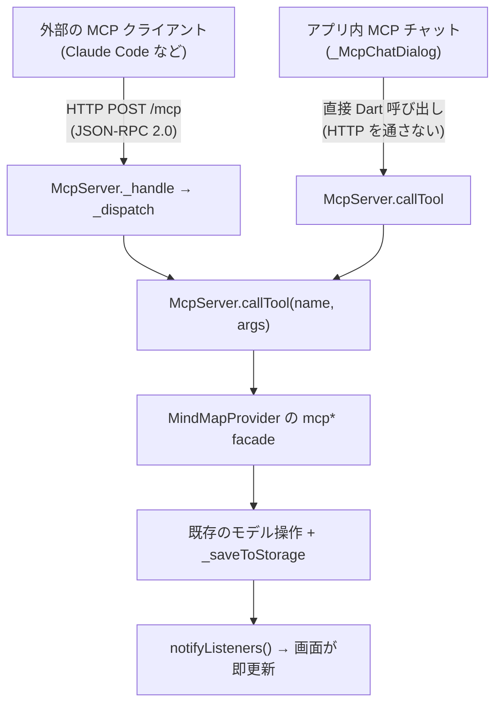
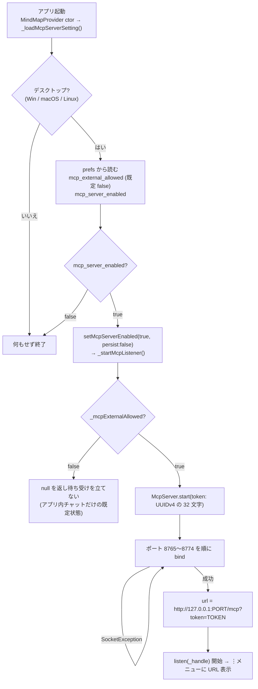
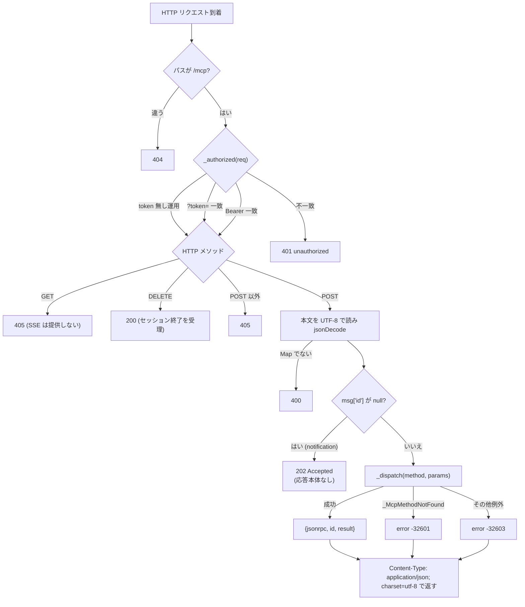
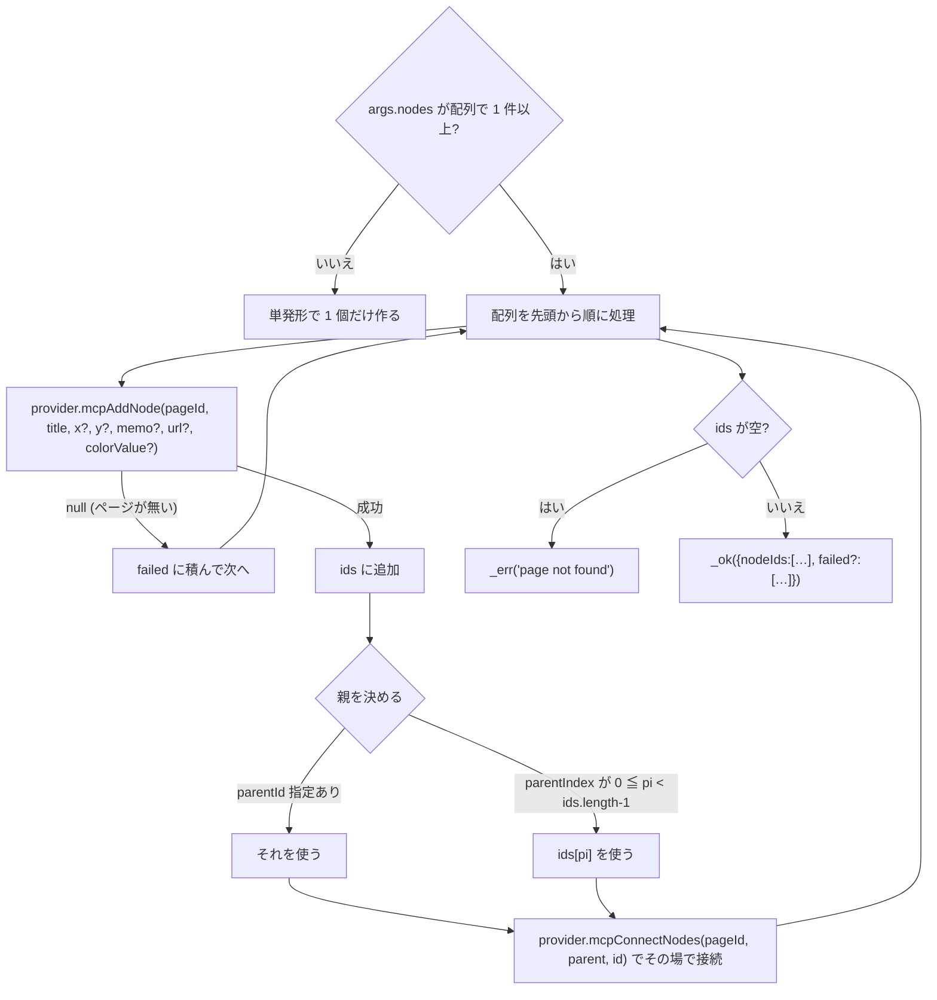
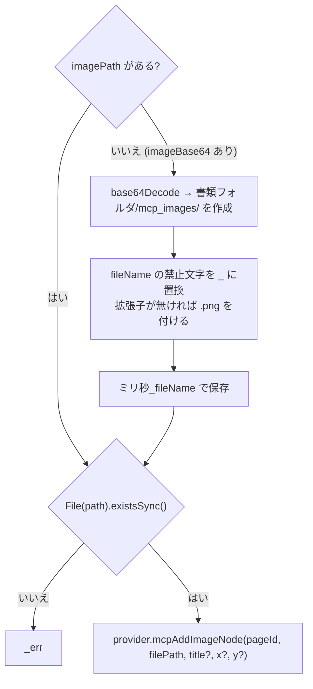
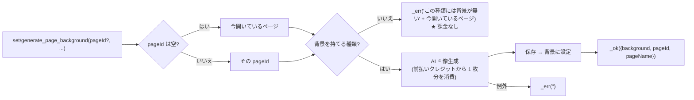
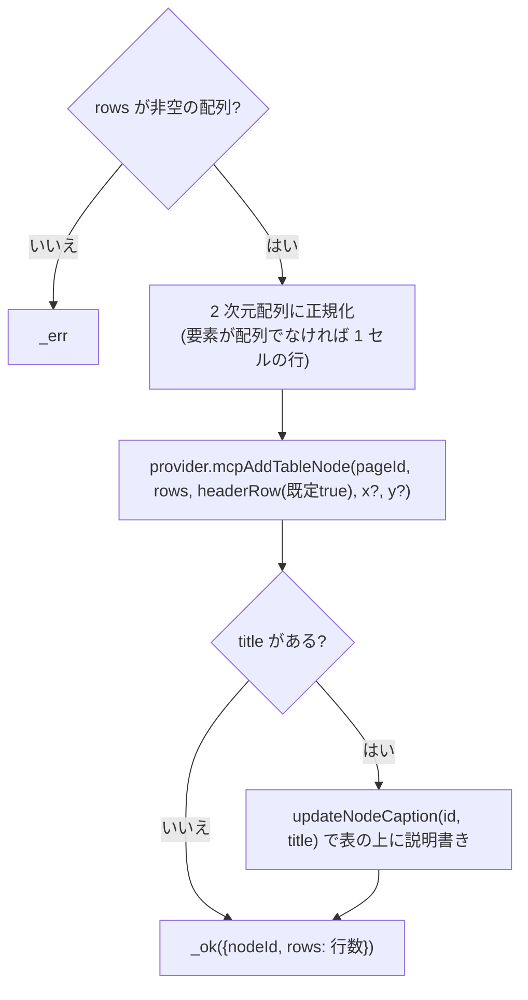
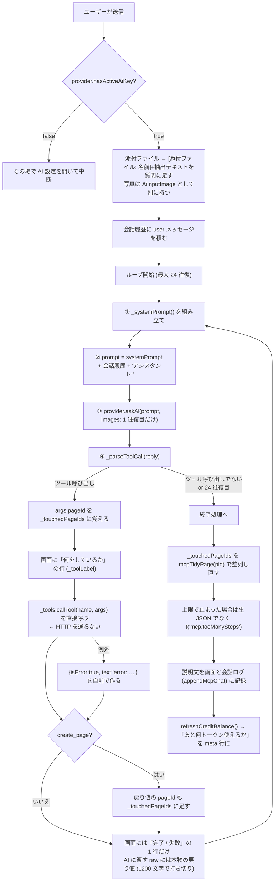
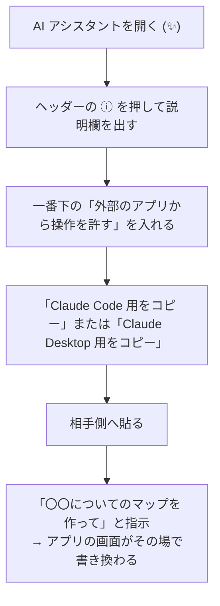

# HisatorNotebook 実装詳細 (2) MCP サーバー / AI エージェント

## 対象ファイル

| ファイル | 役割 |
|---|---|
| `lib/services/mcp_server.dart` | サーバー本体 + ツール定義 + 実行 |
| `lib/providers/mind_map_provider.dart` | 起動/停止管理 + `mcp*` 公開 facade |
| `lib/screens/mind_map_screen.dart` | アプリ内 MCP チャット (`_McpChatDialog`) |

## 何ができるか

Claude Desktop / Claude Code のような外部の MCP クライアント、またはアプリ内蔵の
AI チャットから、ページ・ノード・背景・ファイル・アプリ機能を操作できる。
変更は既存の保存経路 (`_saveToStorage`) に乗るので、起動中の画面に即座に反映され、
そのまま永続化される。

---

## 【1】全体像 — 2 つの入口が同じ実行部を共有する



> ★ アプリ内チャットは HTTP を経由しない。だから MCP サーバーを立てなくても
> (外部公開を許可しなくても) 普通に動く。

---

## 【2】サーバーの起動フロー



登録例:

```bash
claude mcp add --transport http kamispec "<URL>"
```

> - ★ 待ち受けは **127.0.0.1 のみ**。LAN には一切公開しない。
> - ★ 合言葉 (token) は起動のたびに作り直す。前回の URL は再起動後には通らない。

---

## 【3】リクエスト処理 (`McpServer._handle`)



> ※ トランスポートは Streamable HTTP の最小実装。SSE ストリームは持たず、
> 各リクエストに JSON で即応答する。

---

## 【4】`_dispatch` が扱う JSON-RPC メソッド

| メソッド | 戻り値 |
|---|---|
| `initialize` | `{protocolVersion: 相手の版 (既定 '2025-06-18'), capabilities: {tools:{listChanged:false}}, serverInfo: {name:'kamispec-mcp', version:'1.0.0'}}` |
| `ping` | `{}` |
| `tools/list` | `{tools: McpServer.toolDefs}` (static。アプリ内チャットとも共有) |
| `tools/call` | `callTool(params.name, params.arguments)` (【6】) |
| それ以外 | `_McpMethodNotFound` を投げる |

---

## 【5】ツール定義 (`McpServer.toolDefs`) 一覧

`_tool(name, description, properties, required)` で
`{name, description, inputSchema:{type:'object', properties, required}}` を組み立てる。

### 読み取り / ページ

| ツール | 説明 |
|---|---|
| `list_pages` | `{ pages: [...], openFileOnTop?: {...} }`。`pages` は全ページ (id, name, type, ノード数, `isCurrent`, `lastModified`)<br/>★ `isCurrent: true` が利用者の見ているページ。「このページ」は必ずこれ 1 枚<br/>★ `openFileOnTop` があれば、利用者は**そのファイル**(pptx/xlsx/csv/txt/docx)を前面で開いている。どこを直すか明示されない指示はそのファイルのこと。マップを勝手に書き換えず、道具が無ければその画面の AI ボタンを案内する<br/>★ `lastModified` は**最終更新**で作成日ではない (同名ページの「古いほう」は決められない) |
| `read_page` | 1 ページを完全な JSON で (nodes / connections / decorations) |
| `create_page` | 新規ページ。type = `normal` / `bookshelf` / `paint` / `document` / `markdown` / `videoEditor`<br/>戻り値 `{pageId, type}` の `type` が実際に出来た種類 (知らない type は `normal` に倒れる) |
| `delete_page` | ページを完全に削除。最後の 1 枚は消せない<br/>★ 短い間に 2 枚を超えて消そうとすると拒否される (暴走の歯止め。【8】参照)<br/>★ 戻す道具は無い。アプリ側の Ctrl+Z (`undoLastDeletedPage`) で**直前の 1 枚だけ**復元できる |
| `set_page_type` | 中身を残したまま種類を変える (`create_page` と同じ 6 種類)<br/>★ `markdown` ページの本文は `write_markdown` で書く。ファイルとして欲しいと言われた時だけ `create_document_file` の `md` |
| `set_header_buttons` | ヘッダーにボタンを並べる。`replace: true` で総入れ替え<br/>戻り値 `{header, ignored, blocked}`。`ignored` = 存在しない id、`blocked` = 利用者しか使えない機能 (どちらも置かれていない) |
| `clear_chat_history` | AI アシスタントの会話履歴を消す (実行中の依頼は残る)。全消去のみで部分削除は不可 |
| `tidy_page` | マインドマップを自動整列で並べ直す (`mcpTidyPage`)。normal ページ限定・Ctrl+Z で戻せる |

> ★ **戻り値で確かめる道具**: `read_page` は先頭に `nodeCount` / `connectionCount` を返す。
> `add_node` は `nodeIds` / `unlinked` / `note` (重なっているので tidy_page を呼べ)、
> `update_node` は書き換えた `nodeId` と `title`、`connect_nodes` は `fromId` / `toId`、
> `delete_node` は**消した題名**、`set_page_background` は実際に入った値を返す。
> 頼んだ値ではなく、返ってきた値を報告する。

> ★ **題名で指せるが、あいまい一致はしない**: 消す (`delete_node`) と
> 書き換える (`update_node`) は id か**完全一致の題名**のみ (大小文字と空白は無視)。
> 部分一致で近い別ノードを巻き込む事故があったため。線を引く `connect_nodes` だけは
> 従来どおり部分一致も使う。

> ★ **`add_image_node` にだけ一括形が無い**。画像は 1 枚ずつ呼ぶ。

> ★ **動画のタイムラインは追加専用**。置いた後を変える道具は無い。

### マインドマップ (normal)

| ツール | 説明 |
|---|---|
| `add_node` | ノード追加。**バッチ形が推奨**<br/>`nodes: [{title, memo?, url?, color?, parentIndex?, parentId?}]`<br/>`parentIndex` は同じ配列内の先に作ったノードの 0 始まり番号で、同時に接続線も引く → 中心 + 子をまとめて 1 回で作れる。座標は省略推奨 |
| `update_node` | title / memo / 位置の更新 |
| `delete_node` | ノードと接続線を削除 |
| `connect_nodes` | 接続。**バッチ形推奨** `connections: [{fromId, toId, label?}]` |
| `add_image_node` | 画像ノード。`imageBase64`+`fileName` か `imagePath` |
| `add_table_node` | 表ノード。`rows` は 2 次元配列、先頭行が見出し |

### 背景

| ツール | 説明 |
|---|---|
> 資料 (pptx) の 1 枚には `animation` を付けられる (`fadeIn` / `flyInLeft` /
> `wipeLeft` / `zoomIn` / `floatUp` / `wheel` ほか)。見出し → 本文 → 挿し絵の
> 順に、クリックのたびに 1 つずつ出る。**PowerPoint で開いても再生される**。
> 「アニメーション付きで」と言われたら必ず付ける。

| `generate_page_background` | 絵を用意して置く (**推奨**)。`prompt` / `opacityPercent`(既定 70) / `fit`。設定に従い **AI で描き起こす**か **Web から取得**する。結果の `imageSource` / `imageSourceUrl` を**返事に必ず書く** (出典)。描き起こしは画像 1 枚分のクレジットを消費 |
| `set_page_background` | 既存の画像・組み込みテンプレート・解除。`template` = wood / chalkboard / ocean / sakura / fireworks / castle / aurora / nightSky / galaxy / rain / nature / blueprint / midnight / sage / sunset。色調整 `hueDegrees` / `saturationPercent` / `brightnessPercent` も可 |

### マインドマップ以外のページ

| ツール | 説明 |
|---|---|
| `add_gallery_item` | ギャラリー (bookshelf) にタイル追加。`texts` で一括投入 (1 件ずつ呼ばせない) |
| `add_paint_text` | フリーノート (paint) に文字を書く。`texts` で一括。x/y 省略で上から縦に積む |
| `list_paint_tabs` | フリーノートの構成 (バインダーとタブ) を返す。番号はここで確かめる |
| `add_paint_tabs` | タブ (紙) を足す。`names` でまとめて。`binder` 省略で今のバインダー |
| `add_paint_binders` | バインダーを足す (中に空のタブが 1 枚) |
| `select_paint_tab` | 見ているバインダー / タブを切り替える (= 書き込み先が変わる) |
| `rename_paint_item` | バインダー / タブの名前を変える |
| `append_document_text` | ノート (paint / document) の末尾に段落を追記。`texts` で一括<br/>★ `markdown` ページには使えない (`write_markdown` を使う) |
| `write_markdown` | マークダウン (markdown) ページの本文を書く。`text` に**まるごと 1 回**で渡す (見出し・表・```mermaid も描ける)<br/>既定は総入れ替え。`append: true` で末尾に足す。書き終えるとそのページが開いた状態になる |
| `add_video_editor_item` | 動画エディターのタイムラインに 1 項目。`kind` = text / video / image。`startMs` 省略でそのレイヤーの末尾、`durationMs` 既定 4000、`layer` 0 が最背面 |

### ファイル作成

| ツール | 説明 |
|---|---|
| `create_document_file` | 本物の文書ファイルを作って保存し、ページに貼る<br/>`kind` = xlsx / csv → `rows`<br/>docx / txt / md / pdf → `title` + `paragraphs` (pdf は `rows` も可)<br/>pptx → `slides:[{title, bullets:[…]}]`<br/>`pageId` は normal か bookshelf を渡すこと (paint / videoEditor はファイルタイルを持てない)<br/>★ **同じ `pageId` + 同じ `fileName` で呼ぶと上書き**。既にあるファイルの中身を入れ替え、タイルは増やさない (戻り値 `replaced: true`)。作った物を直す時はこれを使う<br/>★ 毎回まるごと書き直すので、渡さなかった中身は消える |

### 開いているテキストファイル

| ツール | 説明 |
|---|---|
| `text_file_status` | アプリのテキストエディタで開いているファイル `{open, fileName, lineCount}`<br/>★ `open: false` の時、ページに貼ってあるファイルはこの系統では触れない。`read_page` → `read_device_file` で読み、`create_document_file` (同じ `pageId` + 同じ `fileName`) で書き直す |
| `text_file_read` | 行番号付きで読む (`startLine` / `endLine` で範囲指定可) |
| `text_file_edit` | `edits` 配列で一括編集。`action` = replace / insert / delete / set_all。行番号は 1 始まり・**呼び出し前**の状態基準 (下から適用されるので前方の番号は崩れない) |

### アプリ機能の起動

| ツール | 説明 |
|---|---|
| `list_app_commands` | 起動できる機能の id + ラベル一覧 |
| `run_app_command` | id を指定して機能を開く (例: flashcards / silentCamera / calendar / qrReader) |
| `set_split_view` | 画面分割の形を決める (`quad` = 2×2 の 4 分割 / `leftRight` / `topBottom` / `off`) |

> ★ **バッチ引数を用意した理由**: 1 件ずつのツールしか無いと AI が途中で取りこぼす
> (4 個頼んで 1 個しか置かれない事故が実際に起きた)。

---

## 【6】`callTool` の実行フロー (代表例)

共通の戻り値:

```dart
_ok(data)  → {content:[{type:'text', text: 文字列 or jsonEncode}], isError:false}
_err(msg)  → {content:[{type:'text', text: msg}],                  isError:true}
```

### add_node (バッチ)



### add_image_node



### 背景の 2 つの道具 — どのページに付けるか

**`pageId` は省ける。省いたら「今開いているページ」** (`list_pages` の
`isCurrent: true`)。「背景を変えて」と言われたらそれが既定で、前の手順で
自分が作ったページの id を使い回してはいけない。

背景を持つページの種類はこれだけ:

| 種類 | 背景 |
| --- | --- |
| `normal` (マップ) / `bookshelf` (ギャラリー) | 壁紙 (`page.backgroundImagePath`) |
| `paint` (フリーノート) / `document` (便箋) | 紙の**いちばん奥のレイヤーの画像要素**として置く (固定の背景ではない = 後から選択ツールで動かせる)。**組み込みテンプレートは不可**、画像だけ。`clear` は紙の背景画像を外す |
| `markdown` / `videoEditor` | **背景そのものが無い** → 道具が断る |

断られた時は、勝手に別のページへ付け替えない。断り文に「利用者が今見て
いるページ」が入っているので、それで良いか**利用者に尋ねる**。

> ★ = ユーザー報告「マークダウンのページを作らせた後、別のマップを開いて
> 『背景画像を変えて』と頼んだら、マークダウンの方の背景を変えてきた。
> そもそもマークダウンに背景は無いので何も起きない」。
> 以前は書き込めてしまい `true` を返していた (見えないだけ)。

### generate_page_background



> ★ 種類の判定は**お金を使う前**に行う。 以前は先に生成していたので、
> 背景の無いページを指すと 1 枚分 (~0.047 USD) を捨てていた。

### add_table_node



### run_app_command

`provider.mcpRunCommand(id)` を呼ぶ。失敗時のメッセージが親切になっている:

- 「id が違う (`list_app_commands` を見よ)」
- 「利用者本人しか始められない機能 (LAN 共有・クラウド同期・アプリロック/集中ロック)
  なので、ユーザーにボタンを押すよう伝えよ」

> ★ 危険な操作を AI に勝手に実行させないための線引き。

### create_document_file (pptx) — 絵と図形

スライドは題名と箇条書きだけでなく、次も持てる。

| 鍵 | 中身 |
| --- | --- |
| `imagePrompt` | **英語**で「どんな絵か」。その場で AI が描いて貼る |
| `imagePos` | `right` (既定) / `left` / `full` (全面の背景) |
| `imageQuery` | Web 検索用の短い**英語** (2〜4 語)。利用者が「Web から取得」に設定している時はこれで写真を探す。必ず付ける |
| `imageShape` | `rect` (既定) / `roundRect` (角丸) / `ellipse` (丸く切り抜く。人物・商品・料理を表紙や中扉に 1 枚だけ丸く入れると映える) |
| `shapes` | 1 枚 3 個まで。`{kind, x, y, w, h, fill, line, lineWidth}`、x/y/w/h はスライドに対する % |

- `kind` は `rect` / `roundRect` / `ellipse` / `line` / `arrow`。
- 絵の入手先は利用者の設定で決まる。AI で描く設定なら 1 枚ごとに前払い
  クレジットを使う (約 0.047 USD) ので、**1 回の呼び出しで最大 4 枚**まで
  描き、それ以降のスライドは絵なしで作られる。Web から取得する設定なら
  費用は掛からず 8 枚まで入る。
- 絵の指示に文字やロゴを描かせない (書き出す時に禁止文が自動で足される)。
- 「おしゃれにして」「カフェっぽく」のように**見た目を頼まれた時**は、
  文字だけの資料を返さない。何枚絵を入れるかを先に伝えてから作る。

pptx エディターの中の AI 欄も同じ事ができる。`deck` の各スライドに
`"image":{"prompt":"…","pos":"right"}` と `"shapes":[…]` を書けばよい。
こちらは変更案を採用した後に、枚数と費用を確かめる窓が出てからまとめて描く。

> ★ = ユーザー報告「おしゃれなカフェのパワポにしてとお願いしても珈琲の画像や
> 図形が挿入されず味気ない」。以前は題名と箇条書き以外を捨てていた。

---

### set_split_view

画面分割の形を決める。`layout` は 4 つだけ:

| layout | 出来る形 |
| --- | --- |
| `quad` | **2×2 の 4 分割** (パソコンのみ。携帯では 2 分割に落ちる) |
| `leftRight` | 左右 2 分割 |
| `topBottom` | 上下 2 分割 |
| `off` | 1 画面に戻す |

- **3 分割は無い**。`_visibleSplitSlots()` は 2 か 4 しか返さない。
- `pageIds` を渡すと 0=左上 1=右上 2=左下 3=右下 の順に入る。
  渡さなかったセルは他のページで自動的に埋まる。
  文書 (`document`) と動画エディター (`videoEditor`) のページは入らず、
  `couldNotPlace` に返る。
- 同じ形をもう一度頼んでも閉じない (ボタンと違ってトグルしない)。
  閉じたい時は `off`。
- **1 つのペインを全画面にする**時も `off`。`cell` にその番号を添えると、
  そのペインに出ていたページを残して 1 画面に戻る (`_closeMapSplitKeeping`)。
  `cell` を省くと、今編集しているペインが残る。
  「右下の画面を全画面にして」はこれ。やり方の説明で済ませない。
- 戻り値の `layout` / `cells` が**実際にそうなった形**。携帯で `quad` を
  頼むと `leftRight` が返り `note` が付くので、そちらを見て答えること。

---

## 【7】アプリ内 MCP チャット (`_McpChatDialog`) のエージェントループ



### `_systemPrompt()` に入るもの

- **アプリの説明書 (AGENTS.md)** — 同梱アセットから読み込む既定の前提知識
  (詳細は `read_app_doc` ツールで必要時だけ取り寄せる)
- `provider.mcpPreamble` (利用者が書き置いた前提) を最優先で先頭に
- 「あなたはマインドマップアプリを操作するアシスタントです」
- ツール定義 = `jsonEncode(McpServer.toolDefs)`
- 現在のページ一覧 = `jsonEncode(provider.mcpListPages())`
- ツールを使う時は説明文を付けず `{"tool":"名前","args":{…}}` だけ返す
- 返答は `provider.languageInstructionForAi()` の言語で、JSON や ID を並べず普通の文章で
- 座標 (x, y) は指定しない (アプリが後で並べる)
- 主題ノードは 1 つだけ、同名を重ねない
- `create_page` の戻り `pageId` をそのまま以降に使う
- 最後の説明文の前に `read_page` で実際の中身を確認し、本当に作られた物だけを説明する
- 作ったノードは必ず `connect_nodes` で親につなぐ (つながっていないノードは「根」扱いでバラバラに並ぶ)
- 比較・一覧・数値は `add_table_node` で表にする
- 背景の指示は `generate_page_background` を既定にする
  (`pageId` を省けば今開いているページ。断られたら利用者に尋ねる)
- 機能を開く指示は `run_app_command`

> ★ 写真を毎回付けると同じ画像の分だけ何度も課金される (画像は入力トークンとして数えられる)。
> ★ 表示を人向けに変えても AI には本物の戻り値を渡さないと、結果が分からず同じ操作を繰り返す。
> ★ AI が決めた座標は当てにならず要素が離れて置かれるため、出来上がりを必ず整列し直す。

---

## 【8】安全のための線引き

- 待ち受けは **127.0.0.1 固定**。LAN・外部からは届かない。
- 外部接続は既定で不許可 (`mcp_external_allowed = false`)。許可を切ると即座に
  `_mcpServer.stop()` で待ち受けを畳む。
- 許可しても合言葉 (32 文字) を知らないと 401。合言葉は起動ごとに再生成。
- `run_app_command` は、利用者本人しか始めてはいけない機能
  (LAN 共有 / クラウド同期 / アプリロック / 集中ロック) を実行できない。
  `set_header_buttons` でも同じ id は置けず、戻り値の `blocked` に入る。
- **ページの消し過ぎを止める歯止め** (`mcpDeletePage`)。90 秒のあいだに
  MCP から消せるのは 2 枚まで。3 枚目からは「頼まれた以上に消している」
  として拒否し、利用者に確認するよう促す。
  = 「このページ消して」の 1 件で一覧を上から順に消していった事故の再発防止。
  説明文 (`isCurrent` / 範囲の指示) だけでは事故を防ぎきれないため、
  実行側にも線を引いてある。
- **AI が消したノードは Ctrl+Z で戻せる**。`mcpDeleteNode` は
  `_pushUndoForPage(pageId, coalesceKey:…)` で履歴を積む
  (`_pushUndo` は `currentPage` を控えるので、裏のページを触る MCP では使えない)。
  まとめ消しは 900ms の合流窓で 1 スナップショットにまとまり、Ctrl+Z 一回で全部戻る。
  = 「『テスト』が入ってるノード消して」で関係ない物まで巻き込んだ時の逃げ道。
- `mcpPageById(pageId)` は `pageId` が空文字の時「今開いているページ」にフォールバックする。
  AI が `create_page` の戻りを取り違えて空を渡し、「作成しました」とだけ言って
  何も起きない事故を防ぐため。

---

## 【9】接続の手順 (利用者向け)

外部のアプリからこのアプリを操作する手順 (デスクトップだけ)。



### 待ち受け方

- `http://127.0.0.1:8765/mcp` (ポートが塞がっている時は 8774 まで順に探す)
- 合言葉は `Authorization: Bearer <合言葉>` で送る (URL の `?token=` でも通るが、
  クエリは履歴やログに残るのでヘッダが推奨)
- 合言葉は**保存される**ので、 アプリを再起動しても URL は変わらない。
  漏れた時は「合言葉を作り直す」で失効させる。

### Claude Code

```
claude mcp add --transport http hisator "http://127.0.0.1:8765/mcp" \
  --header "Authorization: Bearer <合言葉>"
```

### Claude Desktop

設定ファイル (`claude_desktop_config.json`) は stdio が基本なので、
`mcp-remote` で橋渡しする。 画面の「Claude Desktop 用をコピー」が
この形をそのまま出す。

```json
{
  "mcpServers": {
    "hisator": {
      "command": "npx",
      "args": [
        "-y", "mcp-remote", "http://127.0.0.1:8765/mcp",
        "--allow-http",
        "--transport", "http-only",
        "--header", "Authorization: Bearer <合言葉>"
      ]
    }
  }
}
```

### ChatGPT はそのままでは繋がらない

ChatGPT (web / デスクトップ) のコネクタは **OpenAI 側のサーバーが
取りに来る**仕組みなので、 この PC の 127.0.0.1 には届かない。
繋ぐには公開の HTTPS URL (トンネル) が要る = **本当に外へ晓す**ことに
なるので推奨しない。 どうしても使うなら、 コマンド行の Codex CLI なら
stdio の MCP を設定できるので、 上の `mcp-remote` 経由で同じ形になる。

### 外部からは伸ばさない道具

既定では次の 5 つを `tools/list` に出さない (呼んでも断る)。
画面の「パソコンの操作と端末のファイルの読み書きも許す」を入れた時だけ出る。

| 道具 | 何が出来てしまうか |
|---|---|
| `run_automation` | PC そのものを操作 (ブラウザを起動して打つ等) |
| `read_device_file` | 端末の任意のファイルを読む |
| `pick_user_file` | ファイル選択を開かせる |
| `create_document_file` | ディスクへ書き出す (時に上書き) |
| `run_app_command` | アプリのボタンを任意に押せる |

### 安全のための検査

- `Host` が 127.0.0.1 / localhost 以外なら 403 (DNS リバインディング対策)
- `Origin` が付いていたら 403 (ブラウザからの要求 = なりすましの恐れ)
- CORS の許可ヘッダは返さない。 `OPTIONS` も受けない
- 合言葉が無い待ち受けは認めない (昇格を忘れて無防備にならないよう)

**残る危険**: 外部の AI は、 自分が読んだ文章 (Web ページ・資料) に
仕込まれた指示に従ってしまうことがある (プロンプトインジェクション)。
これは仕組みで消しきれないので、 **使わない時は切っておく**のが一番安全。
