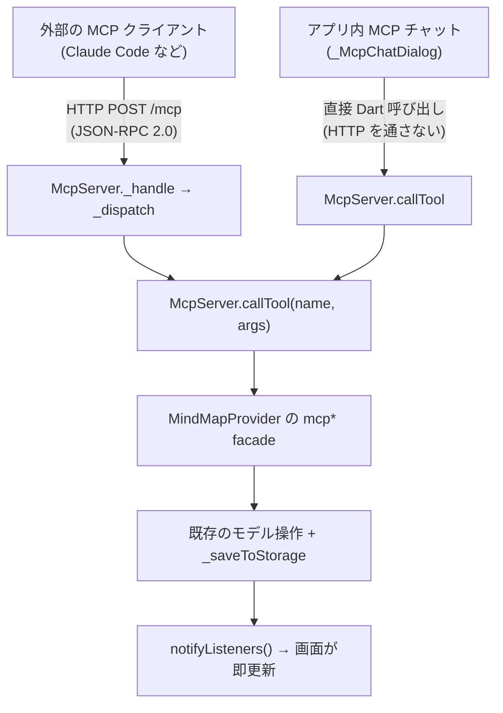
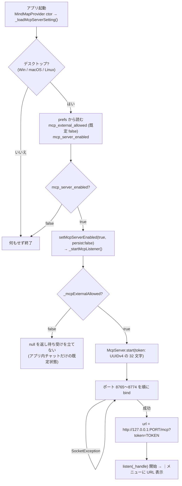
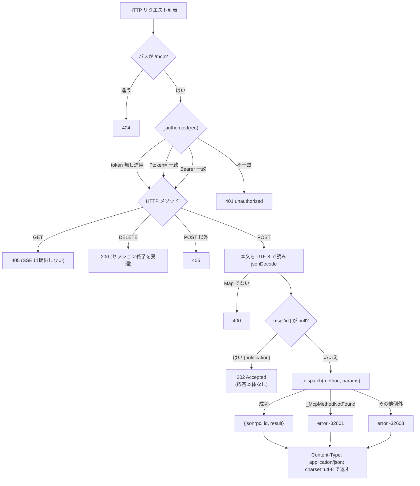
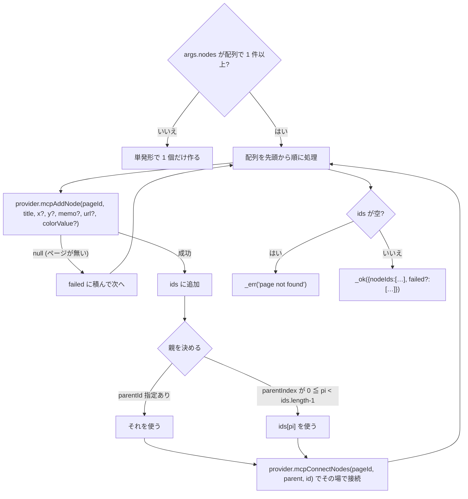
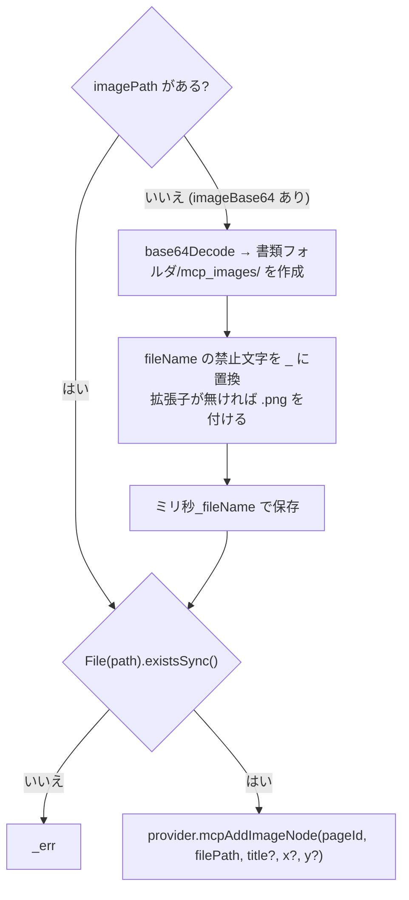
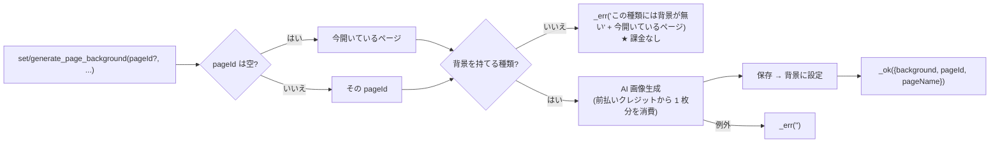
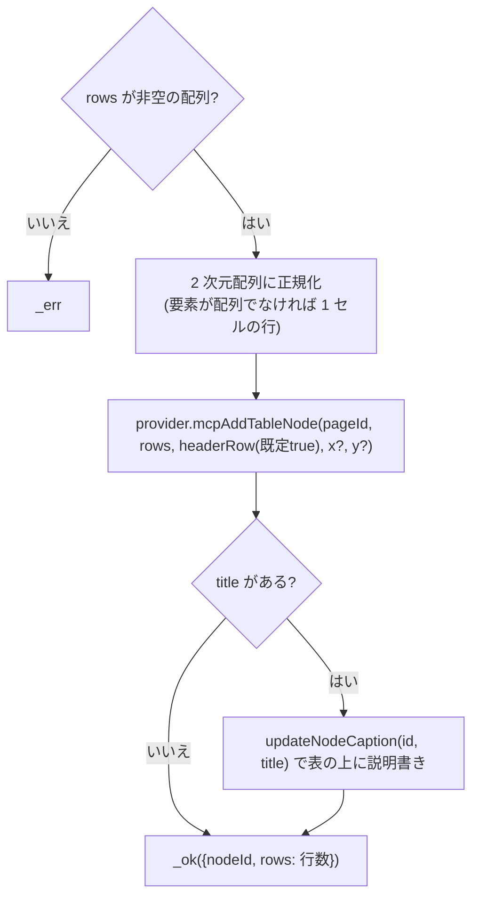
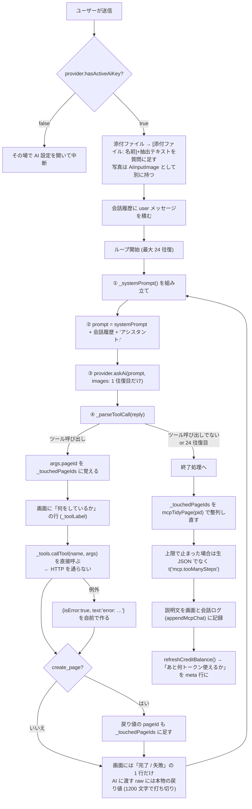
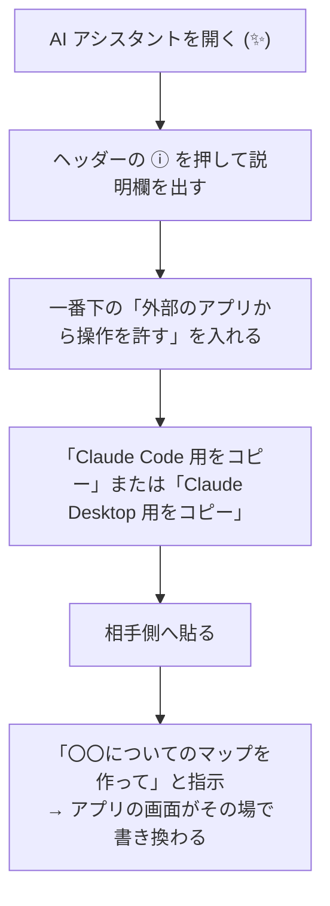

# HisatorNotebook 実装詳細 (2) MCP サーバー / AI エージェント

## 対象ファイル

| ファイル | 役割 |
|---|---|
| `lib/services/mcp_server.dart` | サーバー本体 + ツール定義 + 実行 |
| `lib/providers/mind_map_provider.dart` | 起動/停止管理 + `mcp*` 公開 facade |
| `lib/screens/mind_map_screen.dart` | アプリ内 MCP チャット (`_McpChatDialog`) |

## 何ができるか

Claude Desktop / Claude Code のような外部の MCP クライアント、またはアプリ内蔵の
AI チャットから、ページ・ノード・背景・ファイル・アプリ機能を操作できる。
変更は既存の保存経路 (`_saveToStorage`) に乗るので、起動中の画面に即座に反映され、
そのまま永続化される。

---

## 【1】全体像 — 2 つの入口が同じ実行部を共有する


```mermaid
flowchart TD
    A["外部の MCP クライアント<br/>(Claude Code など)"]
    B["アプリ内 MCP チャット<br/>(_McpChatDialog)"]
    A -->|"HTTP POST /mcp<br/>(JSON-RPC 2.0)"| C["McpServer._handle → _dispatch"]
    B -->|"直接 Dart 呼び出し<br/>(HTTP を通さない)"| D["McpServer.callTool"]
    C --> E["McpServer.callTool(name, args)"]
    D --> E
    E --> F["MindMapProvider の mcp* facade"]
    F --> G["既存のモデル操作 + _saveToStorage"]
    G --> H["notifyListeners() → 画面が即更新"]
```

> ★ アプリ内チャットは HTTP を経由しない。だから MCP サーバーを立てなくても
> (外部公開を許可しなくても) 普通に動く。

---

## 【2】サーバーの起動フロー


```mermaid
flowchart TD
    A["アプリ起動<br/>MindMapProvider ctor → _loadMcpServerSetting()"] --> B{"デスクトップ?<br/>(Win / macOS / Linux)"}
    B -->|いいえ| Z["何もせず終了"]
    B -->|はい| C["prefs から読む<br/>mcp_external_allowed (既定 false)<br/>mcp_server_enabled"]
    C --> D{"mcp_server_enabled?"}
    D -->|false| Z
    D -->|true| E["setMcpServerEnabled(true, persist:false)<br/>→ _startMcpListener()"]
    E --> F{"_mcpExternalAllowed?"}
    F -->|false| G["null を返し待ち受けを立てない<br/>(アプリ内チャットだけの既定状態)"]
    F -->|true| H["McpServer.start(token: UUIDv4 の 32 文字)"]
    H --> I["ポート 8765〜8774 を順に bind"]
    I -->|"SocketException"| I
    I -->|成功| J["url = http://127.0.0.1:PORT/mcp?token=TOKEN"]
    J --> K["listen(_handle) 開始 → ⋮メニューに URL 表示"]
```

登録例:

```bash
claude mcp add --transport http kamispec "<URL>"
```

> - ★ 待ち受けは **127.0.0.1 のみ**。LAN には一切公開しない。
> - ★ 合言葉 (token) は**保存される** (prefs `mcp_token_v1`)。再起動しても URL は変わらない。
>   作り直すのは「合言葉を作り直す」を押した時だけ。

---

## 【3】リクエスト処理 (`McpServer._handle`)


```mermaid
flowchart TD
    A["HTTP リクエスト到着"] --> B{"パスが /mcp?"}
    B -->|違う| B1["404"]
    B -->|はい| C{"_authorized(req)"}
    C -->|"token 無し運用"| D
    C -->|"?token= 一致"| D
    C -->|"Bearer 一致"| D
    C -->|不一致| C1["401 unauthorized"]
    D{"HTTP メソッド"}
    D -->|GET| D1["405 (SSE は提供しない)"]
    D -->|DELETE| D2["200 (セッション終了を受理)"]
    D -->|"POST 以外"| D3["405"]
    D -->|POST| E["本文を UTF-8 で読み jsonDecode"]
    E -->|"Map でない"| E1["400"]
    E --> F{"msg['id'] が null?"}
    F -->|"はい (notification)"| F1["202 Accepted<br/>(応答本体なし)"]
    F -->|いいえ| G["_dispatch(method, params)"]
    G -->|成功| G1["{jsonrpc, id, result}"]
    G -->|"_McpMethodNotFound"| G2["error -32601"]
    G -->|その他例外| G3["error -32603"]
    G1 --> H["Content-Type: application/json; charset=utf-8 で返す"]
    G2 --> H
    G3 --> H
```

> ※ トランスポートは Streamable HTTP の最小実装。SSE ストリームは持たず、
> 各リクエストに JSON で即応答する。

---

## 【4】`_dispatch` が扱う JSON-RPC メソッド

| メソッド | 戻り値 |
|---|---|
| `initialize` | `{protocolVersion: 相手の版 (既定 '2025-06-18'), capabilities: {tools:{listChanged:false}}, serverInfo: {name:'kamispec-mcp', version:'1.0.0'}}` |
| `ping` | `{}` |
| `tools/list` | `{tools: McpServer.toolDefs}` (static。アプリ内チャットとも共有) |
| `tools/call` | `callTool(params.name, params.arguments)` (【6】) |
| それ以外 | `_McpMethodNotFound` を投げる |

---

## 【5】ツール定義 (`McpServer.toolDefs`) 一覧

`_tool(name, description, properties, required)` で
`{name, description, inputSchema:{type:'object', properties, required}}` を組み立てる。

### 読み取り / ページ

| ツール | 説明 |
|---|---|
| `list_pages` | `{ pages: [...], foregroundContext: {...}, openFileOnTop?: {...} }`。`pages` は全ページ (id, name, type, ノード数, `isCurrent`, `lastModified`)<br/>★ **`foregroundContext` が「無指定の指示は何が相手か」の唯一の答え**。`kind:"page"` ならそのページ、`kind:"file"` なら前面のファイル (その `pageId` は裏のマップでしかない)<br/>★ `isCurrent` は「**今のマップ**」でしかない。前面にファイルがあっても true なので、それだけで「見ているページ」と決めない (= 2026-09-25 不具合 1)<br/>★ 先頭は今のマップ。**どこを直すか探すためにこれを呼ばない**。場所が書かれていない指示は開いているページのこと (下ごしらえに pageId とノードの題が載っている)。名指しされた別のページを触る時だけ引く<br/>★ `openFileOnTop` は互換用 (`foregroundContext` と同じ判断から作られる)。道具が無ければその画面の AI ボタンを案内する<br/>★ `lastModified` は**最終更新**で作成日ではない (同名ページの「古いほう」は決められない) |
| `read_page` | 1 ページを完全な JSON で (nodes / connections / decorations)<br/>★ **`pageId` は省ける** → 今開いているページ。場所が書かれていない指示はまずこれで中を見る<br/>★ `attachmentPath` は Windows の正規形で返る (区切りは `\`) |
| `undo_page` | マップページの編集を 1 手戻す。**保存まで待って**から返る<br/>★ `pageId` は省ける → 今開いているページ。戻したら `read_page` は即座に一致する<br/>★ 戻りは `{undone, pageId, nodeCount, connectionCount, canUndoMore}`<br/>★ 履歴が無い / 本文がページ JSON の外にある種別 (paint・document・videoEditor) は `no_history` を返す (画面の Ctrl+Z を案内する) |
| `create_page` | 新規ページ。type = `normal` / `bookshelf` / `paint` / `document` / `markdown` / `videoEditor`<br/>戻り値 `{pageId, type}` の `type` が実際に出来た種類 (知らない type は `normal` に倒れる) |
| `delete_page` | ページを完全に削除。最後の 1 枚は消せない<br/>★ 短い間に 2 枚を超えて消そうとすると拒否される (暴走の歯止め。【8】参照)<br/>★ 戻す道具は無い。アプリ側の Ctrl+Z (`undoLastDeletedPage`) で**直前の 1 枚だけ**復元できる |
| `set_page_type` | 中身を残したまま種類を変える (`create_page` と同じ 6 種類)<br/>★ `markdown` ページの本文は `write_markdown` で書く。ファイルとして欲しいと言われた時だけ `create_document_file` の `md` |
| `set_header_buttons` | ヘッダーにボタンを並べる。`replace: true` で総入れ替え<br/>戻り値 `{header, ignored, blocked}`。`ignored` = この端末に無い id、`blocked` = **今は空** (どちらも置かれていない)。クラウド同期 (`sync`) も置ける |
| `clear_chat_history` | AI アシスタントの会話履歴を消す (実行中の依頼は残る)。全消去のみで部分削除は不可 |
| `tidy_page` | マインドマップを自動整列で並べ直す (`mcpTidyPage`)。normal / ギャラリー (bookshelf) ページ・Ctrl+Z で戻せる<br/>★ 1 つも変わらない時は `tidied:false, unchanged:true` (保存も取り消し履歴も使わない)。**念のための 2 度目**は要らない<br/>★ ギャラリーはタイルの大きさも揃える (= 変化に数える) |

> ★ **戻り値で確かめる道具**: `read_page` は先頭に `nodeCount` / `connectionCount` を返す。
> `add_node` は `nodeIds` / `unlinked` / `note` (座標なしの新ノードを親の右へ並べた報告。tidy_page の催促ではない)、
> `update_node` は `applied` (実際に当てた title / memo / x / y / color / url) と
> `ignored` (渡されなかった項目) を返すので、**確かめるための `read_page` は要らない**。
> `connect_nodes` は `fromId` / `toId`、`delete_node` は `deleted` (題名・互換) と
> `deletedItems` (`id` / `title` / `caption` / `contentType` — 題名が空の表でも追える)、
> `set_page_background` は実際に入った値を返す。
> 頼んだ値ではなく、返ってきた値を報告する。

> ★ **題名で指せるが、あいまい一致はしない**: 消す (`delete_node`) と
> 書き換える (`update_node`) は id か**完全一致の題名**のみ (大小文字と空白は無視)。
> 部分一致で近い別ノードを巻き込む事故があったため。線を引く `connect_nodes` と
> 線を消す `disconnect_nodes` も同じで、完全一致しない指定は `node_not_found` で
> 断られる (`connect_nodes` は惜しい題名を `candidates` に添える) (= 継続検証 232)。

> ★ **完全一致でも題名が複数のノードに当たる時は、1 件目を選ばずに断って候補 id を返す**。
> `delete_node` (1 件ずつでも `nodes` の一括でも) / `update_node` / `connect_nodes` /
> `disconnect_nodes` に加えて、`add_node` の `parentId` と `add_decoration` の
> `aroundNodes` も同じ (= 継続検証 278 / 373〜377 / 381)。
> `code` に `ambiguous_name` が入るのは `disconnect_nodes` と `delete_node` の一括形だけで、
> 他は断り文 (または `failed` / `unlinked` の `reason`) に候補 id が並ぶ。
> `aroundNodes` だけは「1 つでも当たれば囲む」用の複数指定なので、曖昧だった
> **その指定だけ**を落として他は囲み、`aroundAmbiguous` で返す (図形は描かれる)。
> `add_node` の返事には、実際に繋いだ親の id が `linked` (`{index, nodeId, parentId}`)
> で入る。題名で指した時は、返ってきた id を報告する。

> ★ **`add_image_node` にだけ一括形が無い**。画像は 1 枚ずつ呼ぶ。

> ★ **動画のタイムラインは追加専用**。置いた後を変える道具は無い。

### マインドマップ (normal)

| ツール | 説明 |
|---|---|
| `add_node` | ノード追加。**バッチ形が推奨**<br/>`nodes: [{title, memo?, url?, color?, parentIndex?, parentId?}]`<br/>`parentIndex` は同じ配列内の先に作ったノードの 0 始まり番号で、同時に接続線も引く → 中心 + 子をまとめて 1 回で作れる。座標は省略推奨 |
| `update_node` | title / memo / 位置の更新。戻りに `applied` と `ignored` が付く |
| `disconnect_nodes` | 線を外す。外せない時は札で理由が分かれる: `node_not_found` (打ち間違い。`unknown` に該当分) / `not_connected` (両方あるが線が無い = もう切れている。何度呼んでも同じ) (= 2026-09-25 不具合 8) |
| `delete_node` | ノードと接続線を削除。戻りに `deletedItems` (id / title / caption / contentType)<br/>★ 既定で画面の削除と同じく**跡を詰める** (残った兄弟が上へ寄る。孤立ノードを消した時は何も動かない)。位置を保ちたい時だけ `compact: false` |
| `connect_nodes` | 接続。**バッチ形推奨** `connections: [{fromId, toId, label?}]` |
| `add_image_node` | 画像ノード。`imageBase64`+`fileName` か `imagePath`。画像を渡さず `prompt` だけ書くと AI が描いて置く (= `generate_image`)。`pageId` 省略 = 今開いているページ |
| `generate_image` | **AI に絵を描かせてページの上に置く**。`prompt` / `pageId`(省略 = 今開いているページ) / `title`。「〜の絵を描いて」「画像を生成して」はこれ (**背景ではない**)。種類に応じて 画像ノード / タイル / 紙の上の画像 / 本文末尾の `` / タイムラインの画像 として置かれ、どれで置いたかが `placedOn` で返る。絵 1 枚分のクレジットを消費 |
| `add_table_node` | 表ノード。`rows` は 2 次元配列、先頭行が見出し |

### 背景

| ツール | 説明 |
|---|---|
> 資料 (pptx) の 1 枚には `animation` を付けられる (`fadeIn` / `flyInLeft` /
> `wipeLeft` / `zoomIn` / `floatUp` / `wheel` ほか)。見出し → 本文 → 挿し絵の
> 順に、クリックのたびに 1 つずつ出る。**PowerPoint で開いても再生される**。
> 「アニメーション付きで」と言われたら必ず付ける。

| `generate_page_background` | 絵を用意して置く (**推奨**)。`prompt` / `opacityPercent`(既定 70) / `fit`。設定に従い **AI で描き起こす**か **Web から取得**する。結果の `imageSource` / `imageSourceUrl` を**返事に必ず書く** (出典)。描き起こしは画像 1 枚分のクレジットを消費 |
| `set_page_background` | 既存の画像・組み込みテンプレート・解除。`template` = wood / chalkboard / ocean / sakura / fireworks / castle / aurora / nightSky / galaxy / rain / nature / blueprint / midnight / sage / sunset。色調整 `hueDegrees` / `saturationPercent` / `brightnessPercent` も可 |

### マインドマップ以外のページ

| ツール | 説明 |
|---|---|
| `add_gallery_item` | ギャラリー (bookshelf) にタイル追加。`texts` で一括投入 (1 件ずつ呼ばせない) |
| `add_paint_text` | フリーノート (paint) に文字を書く。`texts` で一括 (段落 = 1 要素)。x/y 省略で**用紙幅に折り返し + 既にある物の下から**積む。紙が尽きたら次のタブへ続き、使った紙が戻り値 `sheets` に入る<br/>★ 下書き用のタブを作らず、本文をまとめて 1 回で渡す (自分で x/y を計算しない) |
| `list_paint_tabs` | フリーノートの構成 (バインダーとタブ) を返す。番号はここで確かめる |
| `add_paint_tabs` | タブ (紙) を足す。`names` でまとめて。`binder` 省略で今のバインダー |
| `add_paint_binders` | バインダーを足す (中に空のタブが 1 枚) |
| `select_paint_tab` | 見ているバインダー / タブを切り替える (= 書き込み先が変わる) |
| `rename_paint_item` | バインダー / タブの名前を変える |
| `delete_paint_item` | タブ (紙) 1 枚、または `binder` だけ渡してバインダーごと消す。最後の 1 枚 / 最後のバインダーは消せない<br/>★ 取り消せない。消すのは**利用者に頼まれた物**か、自分が作業用に作ったタブだけ |
| `append_document_text` | ノート (paint / document) の末尾に段落を追記。`texts` で一括<br/>★ `markdown` ページには使えない (`write_markdown` を使う) |
| `write_markdown` | マークダウン (markdown) ページの本文を書く。`text` に**まるごと 1 回**で渡す (見出し・表・```mermaid も描ける)<br/>既定は総入れ替え。`append: true` で末尾に足す。書き終えるとそのページが開いた状態になる<br/>★ マークダウンのページは**タブ**を複数持てる。長い資料は各部分の先頭に `<<<PAGE: タブ名>>>` の行を置くとタブごとに分かれる (1 つ目は今のタブ、残りは後ろへ追加)。1 枚目を目次にして `[タブ名](tab:タブ名)` でリンクする。区切りが無くても長い文書は見出しで自動分割。`split: "single"` で 1 枚に固定、`split: "tabs"` で短い文書も分割、`append` 時は分割しない。返事の `tabs` が書いたタブ数<br/>★ 改行は**本物の改行**で書く (`\n` という 2 文字を書かない)。行頭でしか効かない記法が全部死ぬ |
| `add_video_editor_item` | 動画エディターのタイムラインへ。`kind` = text / video / image。`startMs` 省略でそのレイヤーの末尾 (`texts` の時は**先頭字幕の開始時刻**で、以降は `durationMs` ずつ後ろへ並ぶ = 無視されない)、`durationMs` 既定 4000、`startMs + durationMs` は 24 時間 (86400000 ms) まで (追加も更新も同じ物差し)、`fontSize` は 6〜200 へ丸める (返事に保存後の値と `clamped` が付く)、`layer` 0 が最背面<br/>★ `texts` に並べれば**まとめて 1 回の書き込み**で入る。戻りは `{itemIds, requested, persisted}` で、`persisted` が保存できた数 (3 件渡して 2 件しか残らない不具合を直した = 2026-09-25 不具合 9)<br/>★ 置いた物を動かす・時間を変える・消すのは `update_video_editor_item` (できる。以前「無い」と書いてあったのは誤り) |

### ファイル作成

| ツール | 説明 |
|---|---|
| `create_document_file` | 本物の文書ファイルを作って保存し、ページに貼る<br/>`kind` = xlsx / csv → `rows`<br/>docx / txt / md / pdf → `title` + `paragraphs` (pdf は `rows` も可)<br/>pptx → `slides:[{title, bullets:[…]}]`<br/>`pageId` は normal か bookshelf を渡すこと (paint / videoEditor はファイルタイルを持てない)<br/>★ **同じ `pageId` + 同じ `fileName` で呼ぶと上書き**。既にあるファイルの中身を入れ替え、タイルは増やさない (戻り値 `replaced: true`)。作った物を直す時はこれを使う<br/>★ 毎回まるごと書き直すので、渡さなかった中身は消える<br/>★ `paragraphs` は**原文のまま**書かれる (前後の半角・全角空白は残り、`""` は空行になる)<br/>★ **上書きは取り消せない**。`undo_page` / Ctrl+Z はページのタイルしか戻さないので、ディスクの中身は戻らない。書く直前の版を 7 日だけ控えるので、戻り値 `previousVersionPath` を使う (txt / md / csv なら読み返して同じ `fileName` で書き直せば戻る。xlsx / docx / pptx / pdf は `read_device_file` が抜き出した文字しか返さないので書き直しでは戻らず、道筋をそのまま利用者へ伝える)<br/>★ 戻り値 `nodeId` = ファイルが乗っているタイルの要素 id。`tileCreated: true` の時は**新しいタイルの id** なので、以後はそれで指す |

### 開いているテキストファイル

| ツール | 説明 |
|---|---|
| `text_file_status` | `{textEditorOpen, fileName, lineCount, foregroundFile?}` (`open` は `textEditorOpen` の旧名)<br/>★ `textEditorOpen` は「**テキストエディタ**に入っているか」だけ。画面に何か出ているかは `foregroundFile` (`fileName` / `path` / `editorKind`) を見る。`textEditorOpen:false` + `foregroundFile.editorKind:"pptx"` = PPTX が前面だがこの系統では触れない (= 2026-09-25 不具合 2)<br/>★ ページに貼ってあるファイルは `read_page` → `read_device_file` で読み、`create_document_file` (同じ `pageId` + 同じ `fileName`) で書き直す |
| `text_file_read` | 行番号付きで読む (`startLine` / `endLine` で範囲指定可)<br/>★ 読めない時は札を返す: `unsupported_editor_kind` (前面のファイルがテキストエディタではない → `editorKind` と次の一手が付く) / `no_file_open`。**「TXT を開いて」と利用者に頼ませない** (= 2026-09-25 不具合 3) |
| `text_file_edit` | `edits` 配列で一括編集。`action` = replace / insert / delete / set_all。行番号は 1 始まり・**呼び出し前**の状態基準 (下から適用されるので前方の番号は崩れない) |

### 探す

| ツール | 説明 |
|---|---|
| `search_pages` | ページの中の文字を探す (要素の題名 / メモ / 表のセル / PDF メモ / 本文)。`scope` は `all` (既定) / `folder` (開いているページのフォルダー) / `page` (開いているページ)<br/>★ 戻りの `verdict` は `found` (1 件以上あった) / `absent` (無かった) / `unknown` (探せなかった)。**1 件でも当たれば `found`** なので、`matchCount` と併せてそのまま報告する<br/>★ フリーノートは**全バインダー・全タブ**を探す (当たりの `title` が 冊名 / タブ名)。`hiddenInPageType` が付いた当たりは**今のページ種類では画面に出ない本文** (種類を切り替えれば読める) なので、そのまま「切り替えれば読める」と伝える |
| `search_folder_files` | ページに貼ってあるファイルと連動フォルダーの**ファイルの中身**を探す (txt / md / csv / docx / xlsx / pptx / pdf)。`folderId` を省くと**全フォルダー + フォルダーの外**、渡せばそのフォルダーだけ。無い id は `folder_not_found` で断る (absent にはしない)<br/>★ xlsx は数値セルも本文として探せる。全角/半角・大小・空白の揺れは吸収する。`verdict` は `search_pages` と同じ意味 (`unknown` = 読み切れなかったので「無い」とは言えない) |

### 自動操作 (PC そのものの操作)

| ツール | 説明 |
|---|---|
| `run_automation` | PC の操作 (Chrome を起動して打つ等) を自動操作へ委ねる。**受け付けた所で返る**ので、戻りの `runId` を控える |
| `get_automation_status` | その `runId` の様子を訊く。`state` = `accepted` / `running` / `awaitingUser` (利用者の確認待ち) / `done` / `failed` / `cancelled` / `refused`<br/>★ `finished` が true になるまで数秒おきに訊く。**`run_automation` の返事だけで「やりました」と言わない** |
| `cancel_automation` | その `runId` を止める (画面の「停止」と同じ道)。既に終わっていれば `cancelled: false` が返る |

> ★ **なぜ 3 つに分けたか** (= 動作検証の機能修正案): `run_automation` だけでは
> 「実行中 / 確認待ち / 成功 / 失敗」を呼んだ側から判定できず、画面操作を含む
> 検証を自動化できなかった。OS を触る判断は今までどおり自動操作の 1 箇所に
> 集めたまま、**様子を読む道と止める道**だけを足してある。

### アプリ機能の起動

| ツール | 説明 |
|---|---|
| `list_app_commands` | 起動できる機能の id + ラベル一覧 |
| `run_app_command` | id を指定して機能を開く (例: flashcards / silentCamera / calendar / qrReader)<br/>★ 戻りに `screenId` と `closeable` が付く。**`closeable: true` の時だけ** その `screenId` を `close_app_command` へ渡せる (`false` の時は `cannotClose` / `tracked: false` が付き、閉じられない → 呼ばない)<br/>★ 画面を開かない操作 (undo / redo / zoomIn5 / zoomOut5 / lockScale / lockH / lockV / cutMode / rangeSelect / selectAll / toggleBottomBar) は `launched: true` + `opensScreen: false` だけを返し `screenId` を付けない (= 継続検証 251)。undo / redo は `restored`、拡大率は `scalePercent` が付く。powerMode は選び札が出るので `needsUser` 扱い |
| `close_app_command` | `run_app_command` で開いた画面を閉じる。`id` を省くとここから開けた物を全部閉じて元の表示へ戻す<br/>★ 閉じられるのは**浮遊窓** / **分割ペインに埋めた道具** / **計算機・ストップウォッチ・ポモドーロの浮遊ツール** / **パソコンの外部ツール窓** / **カレンダー表示** / **`run_app_command` が開けた全画面ダイアログ**。閉じられなかった物は `notOpen` に `reason` (`fullScreenDialog` / `notCurrentlyOpen` / `alreadyClosed`) が付く。閉じたと言わない |
| `close_foreground_file` | **前面のファイル閲覧画面**だけを閉じる (xlsx・csv / pptx / docx / テキスト)。引数なし<br/>★ `closed: true` なら閉じた (`pageBehind` に背後のページ)。`closed: false` は**まだ開いている** — `reason` は `unsavedEditsKept` (未保存があり利用者が残した) か `notClosableFromHere` (分割ペインに埋まっている → `set_split_view` で変える)。`closed: true` 以外で「閉じました」と言わない |
| `set_split_view` | 画面分割の形を決める (`quad` = 2×2 の 4 分割 / `leftRight` / `topBottom` / `off`) |

> ★ **バッチ引数を用意した理由**: 1 件ずつのツールしか無いと AI が途中で取りこぼす
> (4 個頼んで 1 個しか置かれない事故が実際に起きた)。

### Jev (判断専用モデル) の入切

| ツール | 説明 |
|---|---|
| `get_jev_settings` | 今の入切を読む (読むだけ)。`stopAll` (非常停止) / `features` (今 実際に効いている値) / `featuresRaw` (停止を外した時に生きる値) / `adBlockCssStage` (Google 検索の広告落とし。Jev は使わない・読むだけ) / `relayReady` / `usage` (回数・金額・最後に使われた版)<br/>★ **停止中は `features` と `featuresRaw` が食い違う**。「全部切です」と答える前に `featuresRaw` を見る |
| `set_jev_settings` | 旗を切り替える。渡した物だけ変わる (`route` / `search` / `book` / `webRank` / `fileFind` / `docQa` / `cardGrade` / `stopAll` / `releaseStop`)<br/>★ 戻りの `changed` / `unchanged` / `userNotice` が**実際に何が変わったか**。頼んだ値ではなくこれを報告する<br/>★ 非常停止は**片道**。`stopAll: true` (止める) はいつでも通るが、`stopAll: false` 単独は断られる — 解除は `releaseStop: true` を明示した時だけ<br/>★ 停止を外すと、前から入っていた旗がそのまま生き返る。その時も `userNotice` に**何が動き出すか**が並ぶ (`stopReleased: true` も付く)<br/>★ 停止中に機能を入れようとしたら、黙って控えずに**断る** (「入れたのに何も起きない」を作らないため)<br/>★ 旗は真偽値で渡す。文字列の `"true"` / `"false"` は受け取り、それ以外の文字列 (`"yes"` など) は**何も変えずに**断る<br/>★ 知らない旗名が 1 つでも混ざっていたら、正しく書けた旗も含めて**要求全体を断る** (未知の名前は応答に並ぶ)。広告落とし (`adBlockCssStage`) は Jev の旗ではないので、ここでは変えられない (Google 検索の画面の中にある) |

> ★ **判断そのものを呼ぶ道具 (`ask_jev` のような物) は置いていない**。Jev は文章を
> 返さないので、choice / score にあたる判断はここを呼んでいる AI 自身が出せる。
> わざわざ利用者の文を外へ出して財布を減らす値打ちが無い。判断を足したい時は、
> 画面側の機能 (`JevTemplates` に質問文を足す) として作る。

---

## 【6】`callTool` の実行フロー (代表例)

共通の戻り値:

```dart
_ok(data)  → {content:[{type:'text', text: 文字列 or jsonEncode}], isError:false}
_err(msg)  → {content:[{type:'text', text: msg}],                  isError:true}
```

### add_node (バッチ)


```mermaid
flowchart TD
    A{"args.nodes が配列で 1 件以上?"} -->|いいえ| S["単発形で 1 個だけ作る"]
    A -->|はい| B["配列を先頭から順に処理"]
    B --> C["provider.mcpAddNode(pageId, title, x?, y?, memo?, url?, colorValue?)"]
    C -->|"null (ページが無い)"| D["failed に積んで次へ"]
    C -->|成功| E["ids に追加"]
    E --> F{"親を決める"}
    F -->|"parentId 指定あり"| G["それを使う"]
    F -->|"parentIndex が 0 ≦ pi < ids.length-1"| H["ids[pi] を使う"]
    G --> I["provider.mcpConnectNodes(pageId, parent, id) でその場で接続"]
    H --> I
    I --> B
    D --> B
    B --> J{"ids が空?"}
    J -->|はい| K["_err('page not found')"]
    J -->|いいえ| L["_ok({nodeIds:[…], failed?:[…]})"]
```

### add_image_node


```mermaid
flowchart TD
    A{"imagePath がある?"} -->|はい| F
    A -->|"いいえ (imageBase64 あり)"| B["base64Decode → 書類フォルダ/mcp_images/ を作成"]
    B --> C["fileName の禁止文字を _ に置換<br/>拡張子が無ければ .png を付ける"]
    C --> D["ミリ秒_fileName で保存"]
    D --> F{"File(path).existsSync()"}
    F -->|いいえ| G["_err"]
    F -->|はい| H["provider.mcpAddImageNode(pageId, filePath, title?, x?, y?)"]
```

### 背景の 2 つの道具 — どのページに付けるか

**`pageId` は省ける。省いたら「今開いているページ」** (`list_pages` の
`isCurrent: true`)。「背景を変えて」と言われたらそれが既定で、前の手順で
自分が作ったページの id を使い回してはいけない。

背景を持つページの種類はこれだけ:

| 種類 | 背景 |
| --- | --- |
| `normal` (マップ) / `bookshelf` (ギャラリー) | 壁紙 (`page.backgroundImagePath`) |
| `paint` (フリーノート) / `document` (便箋) | 紙の**いちばん奥のレイヤーの画像要素**として置く (固定の背景ではない = 後から選択ツールで動かせる)。**組み込みテンプレートは不可**、画像だけ。`clear` は紙の背景画像を外す |
| `markdown` / `videoEditor` | **背景そのものが無い** → 道具が断る |

断られた時は、勝手に別のページへ付け替えない。断り文に「利用者が今見て
いるページ」が入っているので、それで良いか**利用者に尋ねる**。

> ★ = ユーザー報告「マークダウンのページを作らせた後、別のマップを開いて
> 『背景画像を変えて』と頼んだら、マークダウンの方の背景を変えてきた。
> そもそもマークダウンに背景は無いので何も起きない」。
> 以前は書き込めてしまい `true` を返していた (見えないだけ)。

### generate_page_background


```mermaid
flowchart LR
    A["set/generate_page_background(pageId?, ...)"]
    A --> Z{"pageId は空?"}
    Z -->|はい| Y["今開いているページ"]
    Z -->|いいえ| Y2["その pageId"]
    Y --> X{"背景を持てる種類?"}
    Y2 --> X
    X -->|いいえ| W["_err('この種類には背景が無い' + 今開いているページ)<br/>★ 課金なし"]
    X -->|はい| B["AI 画像生成<br/>(前払いクレジットから 1 枚分を消費)"]
    B --> C["保存 → 背景に設定"]
    C --> D["_ok({background, pageId, pageName})"]
    B -->|例外| E["_err('<e>')"]
```

> ★ 種類の判定は**お金を使う前**に行う。 以前は先に生成していたので、
> 背景の無いページを指すと 1 枚分 (~0.047 USD) を捨てていた。

### add_table_node


```mermaid
flowchart TD
    A{"rows が非空の配列?"} -->|いいえ| B["_err"]
    A -->|はい| C["2 次元配列に正規化<br/>(要素が配列でなければ 1 セルの行)"]
    C --> D["provider.mcpAddTableNode(pageId, rows, headerRow(既定true), x?, y?)"]
    D --> E{"title がある?"}
    E -->|はい| F["updateNodeCaption(id, title) で表の上に説明書き"]
    E -->|いいえ| G["_ok({nodeId, rows: 行数})"]
    F --> G
```

### run_app_command

`provider.mcpRunCommand(id)` を呼ぶ。失敗するのは **id が違う時だけ**
(`list_app_commands` を見よ)。

> ★ 止め札 (`_mcpBlockedCommands`) は**今は空**。クラウド同期も含めて
> `list_app_commands` に出る id は全部呼べる。上げ過ぎを止めるのは**上限**の方。
> 詳しくは末尾の「run_app_command の実情」を見よ (以前ここには
> 「利用者本人しか始められないので断れ」と書いてあったが、実装と逆だった
> = 動作検証レポート 2026-09-25 不具合 5)。
>
> ★ **`undo` は run_app_command で呼ばない**。あれは画面のボタンを押すだけで、
> AI 中断・ページ削除復元・カレンダーの取り消しが先に走り、相手も画面の
> ページになり、保存が 350ms 遅れて後の操作へ被さる。代わりに
> **`undo_page`** を使う (ページ指定・保存まで待つ)。

### create_document_file (pptx) — 絵と図形

スライドは題名と箇条書きだけでなく、次も持てる。

| 鍵 | 中身 |
| --- | --- |
| `imagePrompt` | **英語**で「どんな絵か」。その場で AI が描いて貼る |
| `imagePos` | `right` (既定) / `left` / `full` (全面の背景) |
| `imageQuery` | Web 検索用の短い**英語** (2〜4 語)。利用者が「Web から取得」に設定している時はこれで写真を探す。必ず付ける |
| `imageShape` | `rect` (既定) / `roundRect` (角丸) / `ellipse` (丸く切り抜く。人物・商品・料理を表紙や中扉に 1 枚だけ丸く入れると映える) |
| `shapes` | 1 枚 3 個まで。`{kind, x, y, w, h, fill, line, lineWidth}`、x/y/w/h はスライドに対する % |

- `kind` は `rect` / `roundRect` / `ellipse` / `line` / `arrow`。
- 絵の入手先は利用者の設定で決まる。AI で描く設定なら 1 枚ごとに前払い
  クレジットを使う (約 0.047 USD) ので、**1 回の呼び出しで最大 4 枚**まで
  描き、それ以降のスライドは絵なしで作られる。Web から取得する設定なら
  費用は掛からず 8 枚まで入る。
- 絵の指示に文字やロゴを描かせない (書き出す時に禁止文が自動で足される)。
- 「おしゃれにして」「カフェっぽく」のように**見た目を頼まれた時**は、
  文字だけの資料を返さない。何枚絵を入れるかを先に伝えてから作る。

pptx エディターの中の AI 欄も同じ事ができる。`deck` の各スライドに
`"image":{"prompt":"…","pos":"right"}` と `"shapes":[…]` を書けばよい。
こちらは変更案を採用した後に、枚数と費用を確かめる窓が出てからまとめて描く。

> ★ = ユーザー報告「おしゃれなカフェのパワポにしてとお願いしても珈琲の画像や
> 図形が挿入されず味気ない」。以前は題名と箇条書き以外を捨てていた。

---

### set_split_view

画面分割の形を決める。`layout` は 4 つだけ:

| layout | 出来る形 |
| --- | --- |
| `quad` | **2×2 の 4 分割** (パソコンのみ。携帯では 2 分割に落ちる) |
| `leftRight` | 左右 2 分割 |
| `topBottom` | 上下 2 分割 |
| `off` | 1 画面に戻す |

- **3 分割は無い**。`_visibleSplitSlots()` は 2 か 4 しか返さない。
- `pageIds` を渡すと 0=左上 1=右上 2=左下 3=右下 の順に入る。
  **id でも、ページ名でも受ける** (同じ名前のページが 1 枚だけの時)。
  渡さなかったセルは他のページで自動的に埋まる。
  文書 (`document`) / 動画エディター (`videoEditor`) / 自動操作 (`automation`)
  のページは入らず、`couldNotPlace` に返る。
  同じページを 2 つのセルには置けない。
- `couldNotPlace` の各項目には **`reason`** が付く: `notFound` / `ambiguousName` /
  `pageType` / `lockedByPlan` / `duplicateRequest` / `noCell` / `couldNotOpen` /
  `substituted`。**`substituted` は「別のページが置かれた」**という意味なので、
  頼まれたページが開いたと答えてはいけない (= 動作検証の不具合
  「2 枠目に指定したページが黙って別のページとすり替わる」)。
  戻りの `pageIds` が各セルに**実際に出ているページ**、`editorCell` が編集側。
- 同じ形をもう一度頼んでも閉じない (ボタンと違ってトグルしない)。
  閉じたい時は `off`。
- **1 つのペインを全画面にする**時も `off`。`cell` にその番号を添えると、
  そのペインに出ていたページを残して 1 画面に戻る (`_closeMapSplitKeeping`)。
  `cell` を省くと、今編集しているペインが残る。
  「右下の画面を全画面にして」はこれ。やり方の説明で済ませない。
- 戻り値の `layout` / `cells` が**実際にそうなった形**。携帯で `quad` を
  頼むと `leftRight` が返り `note` が付くので、そちらを見て答えること。

---

## 【7】アプリ内 MCP チャット (`_McpChatDialog`) のエージェントループ


```mermaid
flowchart TD
    A["ユーザーが送信"] --> B{"provider.hasActiveAiKey?"}
    B -->|false| B1["その場で AI 設定を開いて中断"]
    B -->|true| C["添付ファイル → [添付ファイル: 名前]+抽出テキストを質問に足す<br/>写真は AiInputImage として別に持つ"]
    C --> D["会話履歴に user メッセージを積む"]
    D --> E["ループ開始 (最大 24 往復)"]
    E --> F["① _systemPrompt() を組み立て"]
    F --> G["② prompt = systemPrompt + 会話履歴 + 'アシスタント:'"]
    G --> H["③ provider.askAi(prompt, images: 1 往復目だけ)"]
    H --> I["④ _parseToolCall(reply)"]
    I -->|"ツール呼び出しでない<br/>or 24 往復目"| Z["終了処理へ"]
    I -->|ツール呼び出し| J["args.pageId を _touchedPageIds に覚える"]
    J --> K["画面に「何をしているか」の行 (_toolLabel)"]
    K --> L["_tools.callTool(name, args) を直接呼ぶ<br/>← HTTP を通らない"]
    L -->|例外| M["{isError:true, text:'error: …'} を自前で作る"]
    L --> N{"create_page?"}
    M --> N
    N -->|はい| O["戻り値の pageId も _touchedPageIds に足す"]
    N -->|いいえ| P
    O --> P["画面には「完了 / 失敗」の 1 行だけ<br/>AI に渡す raw には本物の戻り値 (1200 文字で打ち切り)"]
    P --> F
    Z --> Z1["_touchedPageIds を mcpTidyPage(pid) で整列し直す"]
    Z1 --> Z2["上限で止まった場合は生 JSON でなく t('mcp.tooManySteps')"]
    Z2 --> Z3["説明文を画面と会話ログ (appendMcpChat) に記録"]
    Z3 --> Z4["refreshCreditBalance() → 「あと何トークン使えるか」を meta 行に"]
```

### `_systemPrompt()` に入るもの

- **アプリの説明書 (AGENTS.md)** — 同梱アセットから読み込む既定の前提知識
  (詳細は `read_app_doc` ツールで必要時だけ取り寄せる)
- `provider.mcpPreamble` (利用者が書き置いた前提) を最優先で先頭に
- 「あなたはマインドマップアプリを操作するアシスタントです」
- ツール定義 = `jsonEncode(McpServer.toolDefs)`
- 現在のページ一覧 = `jsonEncode(provider.mcpListPages())`
- ツールを使う時は説明文を付けず `{"tool":"名前","args":{…}}` だけ返す
- 返答は `provider.languageInstructionForAi()` の言語で、JSON や ID を並べず普通の文章で
- 座標 (x, y) は指定しない (アプリが後で並べる)
- 主題ノードは 1 つだけ、同名を重ねない
- `create_page` の戻り `pageId` をそのまま以降に使う
- 最後の説明文の前に `read_page` で実際の中身を確認し、本当に作られた物だけを説明する
- 作ったノードは必ず `connect_nodes` で親につなぐ (つながっていないノードは「根」扱いでバラバラに並ぶ)
- 比較・一覧・数値は `add_table_node` で表にする
- 「絵を描いて」「画像を生成して」は `generate_image` (**背景ではない**)
  (`pageId` を省けば今開いているページ。絵のために新しいページを作らない)
- 「背景」「壁紙」と言われた時だけ `generate_page_background` を既定にする
  (`pageId` を省けば今開いているページ。断られたら利用者に尋ねる)
- 機能を開く指示は `run_app_command`

> ★ 写真を毎回付けると同じ画像の分だけ何度も課金される (画像は入力トークンとして数えられる)。
> ★ 表示を人向けに変えても AI には本物の戻り値を渡さないと、結果が分からず同じ操作を繰り返す。
> ★ AI が決めた座標は当てにならず要素が離れて置かれるため、出来上がりを必ず整列し直す。

---

## 【8】安全のための線引き

- 待ち受けは **127.0.0.1 固定**。LAN・外部からは届かない。
- 外部接続は既定で不許可 (`mcp_external_allowed = false`)。許可を切ると即座に
  `_mcpServer.stop()` で待ち受けを畳む。
- 許可しても合言葉 (32 文字) を知らないと 401。合言葉は保存されるので再起動しても同じ。
  漏れた時は「合言葉を作り直す」で失効させる。
- `run_app_command` の止め札 (`_mcpBlockedCommands`) は **今は空**。
  クラウド同期も含めて、`list_app_commands` に出る id は全部呼べるし
  `set_header_buttons` でも置ける (= ユーザー要望)。代わりに上げ過ぎを
  止めるのは**上限**の方 (`uploadCapBytes` / `devSelfUploadCapBytes`)。
  - ただし `sync` は**窓が開くだけ**。本当に転送するのは `cloud_sync`
    (`action: upload / download / list`)。`needsUser: true` が付いた機能は
    どれも「窓を開いた」止まりなので、「やりました」と答えさせない。
  - アプリロック / 集中ロックは携帯だけの機能。パソコンでは
    `list_app_commands` に出ない (= 置けないのではなく、無い)。
- 外から使う時、`run_app_command` / `cloud_sync` / ファイル系は
  `kPowerfulTools` に入っていて、「パソコンの操作も許す」 を入れるまで
  一覧にも出ない。断られた時は「止められている」ではなく
  「その設定が入っていない」と伝える。
- **ページの消し過ぎを止める歯止め** (`mcpDeletePage`)。90 秒のあいだに
  MCP から消せるのは 2 枚まで。3 枚目からは「頼まれた以上に消している」
  として拒否し、利用者に確認するよう促す。
  = 「このページ消して」の 1 件で一覧を上から順に消していった事故の再発防止。
  説明文 (`isCurrent` / 範囲の指示) だけでは事故を防ぎきれないため、
  実行側にも線を引いてある。
- **AI が消したノードは Ctrl+Z で戻せる**。`mcpDeleteNode` は
  `_pushUndoForPage(pageId, coalesceKey:…)` で履歴を積む
  (`_pushUndo` は `currentPage` を控えるので、裏のページを触る MCP では使えない)。
  まとめ消しは 900ms の合流窓で 1 スナップショットにまとまり、Ctrl+Z 一回で全部戻る。
  = 「『テスト』が入ってるノード消して」で関係ない物まで巻き込んだ時の逃げ道。
- `mcpPageById(pageId)` は `pageId` が空文字の時「今開いているページ」にフォールバックする。
  AI が `create_page` の戻りを取り違えて空を渡し、「作成しました」とだけ言って
  何も起きない事故を防ぐため。

---

## 【9】接続の手順 (利用者向け)

外部のアプリからこのアプリを操作する手順 (デスクトップだけ)。


```mermaid
flowchart TD
    A["AI アシスタントを開く (✨)"] --> B["ヘッダーの ⓘ を押して説明欄を出す"]
    B --> C["一番下の「外部のアプリから操作を許す」を入れる"]
    C --> D["「Claude Code 用をコピー」または「Claude Desktop 用をコピー」"]
    D --> E["相手側へ貼る"]
    E --> F["「〇〇についてのマップを作って」と指示<br/>→ アプリの画面がその場で書き換わる"]
```

### 待ち受け方

- `http://127.0.0.1:8765/mcp` (ポートが塞がっている時は 8774 まで順に探す)
- 合言葉は `Authorization: Bearer <合言葉>` で送る (URL の `?token=` でも通るが、
  クエリは履歴やログに残るのでヘッダが推奨)
- 合言葉は**保存される**ので、 アプリを再起動しても URL は変わらない。
  漏れた時は「合言葉を作り直す」で失効させる。

### Claude Code

```
claude mcp add --transport http hisator "http://127.0.0.1:8765/mcp" \
  --header "Authorization: Bearer <合言葉>"
```

### Claude Desktop

設定ファイル (`claude_desktop_config.json`) は stdio が基本なので、
`mcp-remote` で橋渡しする。 画面の「Claude Desktop 用をコピー」が
この形をそのまま出す。

```json
{
  "mcpServers": {
    "hisator": {
      "command": "npx",
      "args": [
        "-y", "mcp-remote", "http://127.0.0.1:8765/mcp",
        "--allow-http",
        "--transport", "http-only",
        "--header", "Authorization: Bearer <合言葉>"
      ]
    }
  }
}
```

### ChatGPT はそのままでは繋がらない

ChatGPT (web / デスクトップ) のコネクタは **OpenAI 側のサーバーが
取りに来る**仕組みなので、 この PC の 127.0.0.1 には届かない。
繋ぐには公開の HTTPS URL (トンネル) が要る = **本当に外へ晓す**ことに
なるので推奨しない。 どうしても使うなら、 コマンド行の Codex CLI なら
stdio の MCP を設定できるので、 上の `mcp-remote` 経由で同じ形になる。

### 外部からは伸ばさない道具

既定では次の道具を `tools/list` に出さない (呼んでも断る)。
画面の「パソコンの操作と端末のファイルの読み書きも許す」を入れた時だけ出る。

| 道具 | 何が出来てしまうか |
|---|---|
| `run_automation` | PC そのものを操作 (ブラウザを起動して打つ等) |
| `read_device_file` | 端末の任意のファイルを読む |
| `pick_user_file` | ファイル選択を開かせる |
| `create_document_file` | ディスクへ書き出す (時に上書き。上書きは取り消せない) |
| `run_app_command` | アプリのボタンを任意に押せる |
| `text_file_read` / `text_file_edit` / `text_file_status` | 開いているファイルの全文を読む・上書きする |
| `generate_page_background` | 前払いの AI クレジットを使う (お金が減る) |
| `cloud_sync` | 利用者のクラウドの月の枠を使う |
| `get_dev_limits` / `set_dev_limits` | 試験用の上限を読む・書き換える |
| `set_jev_settings` | Jev の入切 (入れると利用者の文の断片が外へ出て、AI クレジットも減る) |

### 開発者モードの時だけの道具

= ユーザー要望「MCP 接続で開発者モードであれば、 ファイルアップロード上限や
API の呼び出し上限を設定してテストできるように」。

開発者の枠は実質無制限なので、 そのままでは「上限に当たって止まる」 場面を
手元で作れない。 自分に上限を掛けて、 利用者に出るのと同じ止まり方を確かめる
ための道具。 **開発者モードの間だけ** `tools/list` に出て、 切っている間は
呼んでも断る。

| 道具 | 何をするか |
|---|---|
| `get_dev_limits` | 今の上限と使った量を読む (読むだけ) |
| `set_dev_limits` | 上限を決める / 使った量を 0 に戻す |

`set_dev_limits` の引数 (渡した物だけ変わる。 **0 = 上限なし**)

| 引数 | 意味 |
|---|---|
| `uploadMb` | 今月これだけしか上げられない (MB) |
| `aiUsd` | AI に使ってよい金額 (米ドル) |
| `aiCalls` | AI を呼んでよい回数 |
| `resetUploadUsage` | 上げた量を 0 に戻す (同じ上限をもう一度試せる) |
| `resetAiUsage` | 使った金額と呼んだ回数を 0 に戻す |

止まる時の文言は、 利用者に出る物とそっくり同じにしてある
(`credit.insufficient`)。 開発者向けの言い回しにすると、 本番で何が出るのかを
確かめられないため。

### Jev の入切を AI に触らせる時の線引き

Jev = 文章を作らない判断専用モデル (`choice` / `score` / `noul` しか返さない)。
生成 AI の前に置く下ごしらえとして使っている。**既定は全部切**で、入切は
**使う画面の中**にある (動作設定に一覧は無い)。設定画面にあるのは非常停止だけ。

入れると利用者の文の断片が外 (代行 Worker → Jev) へ出て、AI クレジットも減る。
そこで AI からの操作には線を引いてある。

| 決め事 | なぜ |
|---|---|
| `set_jev_settings` は `kPowerfulTools` | 外部のプログラムからは「パソコンの操作も許す」を入れるまで一覧にも出ない。読む方 (`get_jev_settings`) は素通し |
| 「全部入れる」のまとめ指定は無い | 旗を 1 つずつ名指しさせる。`all: true` のような近道を置くと事故が大きい |
| 通信が始まる時は `userNotice` を返す | 旗を入れた時と、非常停止を外して前の旗が生き返る時。「利用者に代わって動き出した物」を必ず並べる。黙って入れさせない |
| 非常停止は片道 | 止めるのは自由。解除は `releaseStop: true` を明示した時だけ |
| 停止中の「入れる」は断る | 控えておくと、停止を外した瞬間に通信が始まる罠になる |
| 駄目な指定は何も変えない | 半分だけ当てて「成功」と返さない |

費用は生成 AI と同じ財布 (前払いの AI クレジット)。判断 1 回は入力だけの課金で
$0.0005 未満。Worker 側でも月の上限を生成と同じ枠で数えている
(`/ai/decision`)。判断が取れない時は必ず従来処理へ戻すので、
「Jev が無いと止まる」事は無い。

### 安全のための検査

- `Host` が 127.0.0.1 / localhost 以外なら 403 (DNS リバインディング対策)
- `Origin` が付いていたら 403 (ブラウザからの要求 = なりすましの恐れ)
- CORS の許可ヘッダは返さない。 `OPTIONS` も受けない
- 合言葉が無い待ち受けは認めない (昇格を忘れて無防備にならないよう)

**残る危険**: 外部の AI は、 自分が読んだ文章 (Web ページ・資料) に
仕込まれた指示に従ってしまうことがある (プロンプトインジェクション)。
これは仕組みで消しきれないので、 **使わない時は切っておく**のが一番安全。
