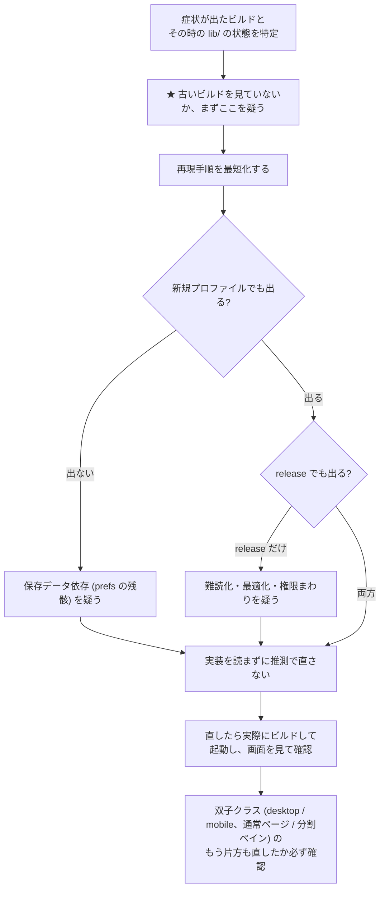

# HisatorNotebook 実装詳細 (5) バグチェックリスト

リリース前、 および大きめの改修の後に通す確認項目。
「過去に実際に出た症状」を根拠に並べてあるので、 上から順に潰せば
同じ地雷を踏み直さずに済む。

## 記号

| 記号 | 意味 |
|---|---|
| `- [ ]` | 確認項目 |
| ▲ | 過去に実際に出た症状 (再発チェックの重点) |
| ネストした箇条書き | 確認手順 / 期待する結果 |

レイアウト・ノード配置まわりの詳しい仕組みは
[実装詳細_04_ノード配置と自動整列.md](実装詳細_04_ノード配置と自動整列.md) を参照。

---

## 【0】チェックの前に — 環境の確認

- [ ] 検証するビルドが、 今の lib/ から作られたものか
  - releases/ の最新ビルド時刻と lib/ の更新時刻を突き合わせる。
  - **▲ 古い exe/APK を触って「直っていない」と判断した事故が複数回ある。**
- [ ] Android 実機は本当に新しい APK が入っているか
  - adb install が Success でも旧版が残ることがある。
    端末側 APK の md5 を照合してから UI を見る。
- [ ] 型チェック / 構文チェックが通るか
  - 構文     : dart format -o none <対象ファイル>
  - 型検査   : flutter build bundle --no-pub
  - **▲ flutter analyze / dart analyze はこの環境でクラッシュすることがある。**
  - **▲ bundle ビルドの kernel_blob.bin が Windows の Release 出力に残る。**
    zip 化する前に flutter_assets を消して本番ビルドをやり直す。
- [ ] ビルドは 1 本ずつ (同時実行しない)
  - **▲ .obj の "Permission denied"、 exe のロック、 WinRT ヘッダ不整合は**
    同時ビルド / アプリ起動中 / Defender が原因。
行き詰まったら flutter clean、 残った dart プロセスを kill。

---

## 【1】起動・初期化

- [ ] 新規インストール状態で起動する (プロファイルを消した状態)
  - 言語選択が出る / 初回案内が出る / 下部ボタンが表示される。
  - **▲ 「読み込み中のまま固まる」「英語から変えられない」「下のボタンが空」**
    のセットは、 保存済みの空配列を尊重してしまう実装と、
画面幅 0 での clamp(最小 > 最大) 例外による再構築ループが原因だった。

- [ ] 既存プロファイルからの更新起動
  - ページ・設定・プラン・AI 残高が引き継がれる。
  - **▲ Windows は %APPDATA%\com.example\<製品名> 単位で保存先が分かれる。**
    製品名 (exe 名) を変えると別データ扱いになる。 改名した時は要確認。
- [ ] 前回開いていたページが復元される (last_opened_page_id)
- [ ] 起動直後に落ちない / 白画面にならない
  - デバッグ実行時の一時的な重さ (JIT) と本物のハングを混同しない。
    CPU 使用率が下がっていくならデバッグ特有の遅さ。

---

## 【2】ノードの配置・押しのけ (詳細は 実装詳細_04)

- [ ] 親から子を N 個生成 → 親の中心に揃って縦一列に並ぶ
  - 右クリック「子ノードを追加」。 デスクトップは個数入力、
    モバイルは設定の個数で即生成。
- [ ] 既に子がある親にさらに追加 → 既存の列の X・幅・間隔を引き継ぎ、
    既存の子の下に積まれる (バラバラの位置に散らない)
- [ ] 子を追加したら、 親の兄弟の枝が上下に動いて場所が空く
- [ ] 折りたたむと、 空いた分だけ下の兄弟が詰まる
- [ ] ノードを削除すると、 残った兄弟が詰まる
- [ ] 画像 / 動画 / 長いメモを入れたノードに、 別のノードを近づけられる
  - **▲ 当たり判定に visualHeight を使うと、 見た目より遥か手前で**
    避けてしまい近づけない。 押しのけ系は height を使うのが正。
- [ ] ノード同士が完全に重なって見えなくなることがない
  - 部分的な重なりは許容 (仕様)。 被覆率 55% 超だけ自動で引き離す。
- [ ] タイトルを長くしてもノードが 300px 超に暴走しない、 かつ
    周りのノードに被って読めなくならない
- [ ] 全体整列 (autoLayoutTree) の後、 付箋グループの枠が交差しない /
    グループ外のノードがグループ枠に食い込まない
- [ ] 折りたたみ中 / 格納 (Ctrl+G) 中のノードが配置候補に出ない
  - **▲ 見えないノードへ接続すると、 繋いだノードごと画面から消える。**
- [ ] 関連線 (association) だけで繋いだ相手が、 子として扱われて
    一緒に動いてしまわないか (【04】の「子の定義が 2 つある」参照)

---

## 【3】編集・Undo・コピー

- [ ] Ctrl+Z が「1 操作 = 1 回」で戻る
  - 複数親への一括子生成は 1 回で全部戻ること。
    文字入力は coalesce されて 1 文字ずつ戻らないこと。
- [ ] ページ間のノード移動で内容が欠けない
  - **▲ copyNodesToPage は richText / tableData / PDF メモ / linkedPageId /**
    格納情報を落とす。 忠実に移すなら moveNodesToPage を使う。
- [ ] 画像の貼り付け (クリップボード / スクリーンショット)
  - **▲ Android のスクリーンショットは一時 URI で読めないことがある。**
    読めない時にファイル選択へ落ちるか確認。
- [ ] 表ノード・リッチテキストノードの高さが描画と一致している
- [ ] インライン編集の確定後に、 周りとの重なりが解消される

---

## 【4】保存・データ保全 (最優先)

- [ ] ページを消しても復旧手段が残っている
  - ⋮ メニューの復元 UI、 page_backups/ の自動退避を確認。
  - **▲ ページ消失は復旧が最も手間な事故。 tombstone を消さないと**
    復元しても再び消える。
- [ ] アプリ強制終了 → 再起動でも直前の編集が残っている
- [ ] prefs にしか保存されない種別のページを把握しているか
  - フリーノート (paint) / 文書 (document) / 動画編集 (videoEditor) の
    中身はページ JSON に乗らない。 エクスポート・同期・バックアップの
対象になっているか、 種別ごとに確認する。

- [ ] エクスポート (.hnmap / HTML) → 別環境でインポートして中身が一致する

---

## 【5】クラウド同期・共有

- [ ] アップロードは「押した時点のスナップショット」になっている
- [ ] ダウンロードは 3-way マージで、 ローカルの編集を消さない
- [ ] 同じグループの 2 端末で交互に編集 → どちらの変更も残る
- [ ] 一括共有 (複数ページ) でページを切り替えた時、 セッションが追従する
- [ ] 未ログイン / 通信断でもアプリが操作可能 (機能低下で済む)
- [ ] 容量・回数の上限チェックを通らない新しいアップロード経路を
    作っていないか (canUse*Bytes / recordUploadBytes を通すこと)
- [ ] Google アカウント連携でプラン・使用量・AI 残高が端末間で一致する

---

## 【6】AI 機能

- [ ] 自前キー無しでも、 代行 (relay) 経由で AI が動く
  - **▲ 「APIキー未設定」と出て無反応になる経路は、 その経路が relay を**
    通っていない。 ファイル要約などは askAi 系を通す。 各プロバイダの
API を直接叩く実装は代行を素通りする。

- [ ] 失敗時のエラーがユーザーに届く
  - **▲ 全画面ビューアの上では SnackBar が裏に隠れて無反応に見える。**
    赤い SnackBar は 4 秒で消えるので見落としやすい。
- [ ] 生成中のキャンセル (Esc) が効き、 中断後に再開できる
- [ ] AI が作ったノードが既存のレイアウトを壊さない
  - 一括生成では押しのけ (reflow) を呼ばない設計。 重なるようなら
    生成後に整列を促す。
- [ ] 使用量・費用の集計が実際の呼び出しと合っている
- [ ] MCP 経由のツールが「複数件まとめて」渡せる
  - **▲ 1 件ずつしか受け取らないツールは、 AI が取りこぼす。**

---

## 【7】課金・プラン

- [ ] 支払い判定がクライアント側で完結していない
  - 決済ページから戻っただけで Pro にならないこと。
- [ ] Android (RevenueCat) / Windows (Stripe + REST 照会) の両方で
    購入・復元・解約反映を確認
- [ ] 解約後の期限まで機能が使え、 期限後に free に落ちる
- [ ] プラン別の制限 (ページ数 / 分割 / 保存容量) が実際に効く
- [ ] サブスク管理画面が開く (アプリ内から管理ページへ遷移できる)
- [ ] release ビルドでテスト用キーを使っていない

---

## 【8】PDF・文書ビューア

- [ ] PDF を開く速度と、 開いた直後の操作不能時間
- [ ] ページ移動 (矢印 / ジャンプ)、 掴んで移動、 リンクのタップ
- [ ] ページに紐づくメモ・ハイライトが再起動後も同じページに付いている
- [ ] PDF 書き出しで日本語が □ (豆腐) にならない
  - assets/fonts の日本語フォントが同梱され、 pubspec で有効か。
- [ ] docx / xlsx / pptx / csv / txt の表示と編集、 保存後の再読込
- [ ] デスクトップ版とモバイル版の「双子クラス」を両方直したか
  - **▲ ビューアは desktop/mobile で別クラス。 片方だけ直る事故が多い。**

---

## 【9】動画・音声

- [ ] YouTube / ローカル mp4 の再生、 速度変更、 位置の記憶
- [ ] PiP から全画面へ戻した時、 再生位置が引き継がれる
- [ ] バックグラウンド再生が画面消灯後も続く
- [ ] 動画編集の書き出しで文字化けしない (同梱フォントを使う)
- [ ] プレビューの表示範囲と書き出し範囲が一致している
- [ ] モバイルでタイムラインのブロックを長押しで移動できる

---

## 【10】Windows 固有

- [ ] × ボタンで即座に閉じる (数秒固まらない)
- [ ] サブ窓 (浮遊窓・外部窓) を閉じても本体が生き残る
  - **▲ 同一プロセスなので、 タイマー停止漏れやロック待ちで本体ごと死ぬ。**
- [ ] サブ窓の中のダイアログ・通知が表示される
  - **▲ サブ窓の State.context は自前 MaterialApp の外にあるため、**
    showDialog / ScaffoldMessenger は navigatorKey 経由で呼ぶ。
- [ ] WebView 上で修飾キー (Ctrl+クリック等) に依存した操作をしていない
  - **▲ WebView がキーを食うので常に false になる。 押すだけのトグルを置く。**
- [ ] 「アプリで開く」で 2 個目のウィンドウが増えない (1 窓運用)
- [ ] 分割ペインで、 currentPage 前提の処理が別ページを見ていない
- [ ] MSIX / 署名の設定を変えた場合、 サイドロードとストア提出の
    どちらを想定した設定になっているか確認

---

## 【11】Android 固有

- [ ] release ビルド (debug ではなく) で全機能を通す
  - **▲ release だけ「初回案内が出ない / YouTube が真っ白 / 設定が読めない」**
    という症状が出たことがある。 難読化でネイティブ登録が失敗し、
それ以降のプラグインが全部未登録になるのが原因。
ネイティブを持つ依存を追加したら proguard の keep を必ず確認する。

- [ ] オーバーレイ窓のサイズ指定が dp か
  - **▲ px を渡すと高 DPI 端末で画面全体を覆う。**
- [ ] アプリアイコンがアダプティブアイコンとして更新されている
  - **▲ ic_launcher.png だけ差し替えても反映されない。 前景 + 背景色を**
    更新し、 図柄は中央の安全域 (108 中 66) に収める。
- [ ] 画面固定 (アプリのピン留め) の案内でビューが縮まない
  - **▲ 例外は出ずに下半分が灰色になり操作不能になる。**
- [ ] WebView の上にダイアログを重ねていない
  - **▲ タッチが効かなくなる。 全画面ルートで開く。**
- [ ] 通知・正確アラームの許可要求と、 実際の時刻に通知が来るか
- [ ] 音声入力 (STT) が動く / マイク許可の導線がある

---

## 【12】UI 全般・多言語

- [ ] ダークテーマとライトテーマの両方で文字が読める
  - **▲ 半透明背景の Chip は暗所で真っ白に飛ぶ。 自前描画か枠線ボタンに。**
- [ ] 新規追加した文言が t('key') を通っていて、 9 言語で英語以上に出る
  - 未翻訳言語で生キー (例: menu.foo) が出ていないこと。
- [ ] 表示文言の表記が統一されている (漢字を無闇に開かない)
- [ ] 画面が狭い時 / 分割時にボタン列が溢れない、 例外を出さない
- [ ] ツールチップを付けたボタンの長押しが死んでいない
  - **▲ Tooltip でくるむと onLongPress が発火しない。 手動トリガーにする。**
- [ ] 下部バーの後ろに不要な帯 (背景色の板) が出ていない
  - 修正の確認は「実際に起動して画面を撮る」。 コード読みだけで
    判断しない。

---

## 【13】ショートカット・入力

- [ ] 既定のショートカットが全部効く (特に Ctrl+G 格納 / Ctrl+Z / Ctrl+1〜9)
- [ ] 変更したキー割り当てが再起動後も残る
- [ ] 個別に無効化したショートカットが復活しない
- [ ] Esc で「実行中の処理」を中断できる (同期 / 一括ダウンロード等)
- [ ] テキスト入力中にショートカットが誤爆しない

---

## 【14】通知・リマインダ

- [ ] 予定を作ると通知が予定時刻の (リード時間) 前に来る
- [ ] 過去の時刻を指定しても例外にならず、 黙って飛ばす
- [ ] アプリを閉じていても Android では通知が来る
  - 起動時の再登録は無いので、 OS のアラームとカレンダー登録が頼り。
- [ ] Windows ではトースト、 Android では通知チャンネル経由で出る
- [ ] 集中ロックの時間帯が来たら自動でロックされ、 抜けたら解除される

---

## 【15】リリース直前の最終確認

- [ ] env.json をコミットしていない (.gitignore が実際に効いているか)
- [ ] バージョン / タグ / 表示名が揃っている
- [ ] Windows Release フォルダに開発用の中間物が混ざっていない
- [ ] releases/ に成果物を置き、 GitHub Releases にも上げたか
  - APK と、 Windows は Release フォルダごと zip。
- [ ] 主要 3 経路をインストール直後の端末で通す
    ① 起動 → ページ作成 → ノード生成 → 保存 → 再起動して残る
② AI で 1 回生成する
③ 同期 (アップロード → 別端末でダウンロード)

---

## 【16】不具合を追う時の進め方

1. 症状が出たビルドと、 その時の lib/ の状態を特定する。
(古いビルドを見ていないか、 まずここを疑う)

2. 再現手順を最短化する。 新規プロファイルでも出るか確認する。
出ないなら保存データ依存 (prefs の残骸) を疑う。

3. debug ではなく release でも出るか確認する。
release だけの症状は難読化・最適化・権限まわりを疑う。

4. 実装を読まずに推測で直さない。
  - **▲ 単位 (dp / px) を推測で決めて 1 リリース無駄にしたことがある。**
5. 直したら、 実際にビルドして起動し、 画面を見て確認する。
6. 双子クラス (desktop / mobile、 通常ページ / 分割ペイン) の
もう片方も直したか、 必ず確認する。

