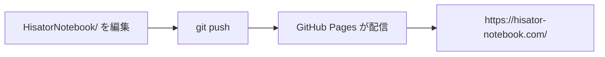
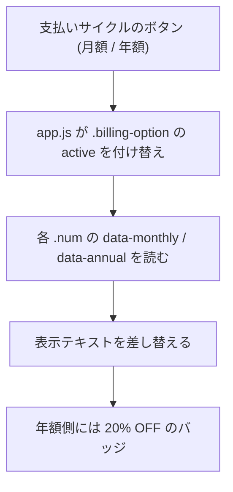
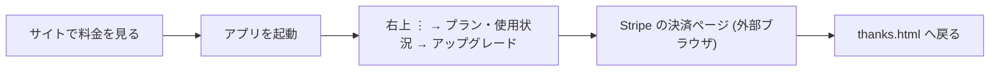

# HisatorNotebook 実装詳細 (6) ホームページ (hisator-notebook.com)

アプリ本体ではなく、**公開サイト**の作りをまとめる。

## 置き場所と公開のしくみ

| 項目 | 内容 |
|---|---|
| ソース | リポジトリ内の `HisatorNotebook/` フォルダー |
| 独自ドメイン | `hisator-notebook.com` (`CNAME` ファイルで指定) |
| ホスティング | GitHub Pages (リポジトリ `PG-Darksan/Kamispec`) |
| 構成 | 素の HTML + CSS + JS。フレームワーク・ビルド工程なし |

`CNAME` に書いたドメインを GitHub Pages が読むので、**フォルダーの中身を
push すればそのまま公開される**。ビルドコマンドは要らない。

## ファイル構成

| ファイル | 役割 |
|---|---|
| `index.html` | トップ。ヒーロー / 特徴 / 料金カード / FAQ |
| `features-windows.html` | Windows 版の機能紹介 |
| `features-android.html` | Android 版の機能紹介 |
| `features.html` | ショートカット一覧 (ノード編集 / グループ化 / 同期 / 画面切替 / その他) |
| `ai.html` | AI 機能の説明 (クレジット制・代行実行) |
| `video.html` | 動画まわりの機能紹介 |
| `platform.html` | 対応プラットフォーム |
| `pricing.html` | 料金プラン詳細 (Free / Pro / Max) |
| `contact.html` | お問い合わせ |
| `thanks.html` | 決済完了後の着地ページ (`?plan=pro&period=monthly` を受ける) |
| `tokutei.html` | 特定商取引法に基づく表記 |
| `styles.css` | 全ページ共通のスタイル (約 4,000 行) |
| `app.js` | ナビ・月額/年額の切替などの共通スクリプト |
| `images/icon.png` | ロゴ / favicon / OGP 画像 |
| `videos/*.mp4` | 機能紹介の動画 9 本 |
| `robots.txt` / `sitemap.xml` | 検索エンジン向け |
| `_preview-brandmark.html` | ロゴ確認用の作業ファイル (公開ページではない) |

## 各ページに入っている SEO / SNS 用のメタ情報

すべてのページが同じ型で持っている。**文言や価格を変えたらここも直す**。

- `<title>` / `<meta name="description">` / `<meta name="keywords">`
- `<link rel="canonical">` (正規 URL)
- Open Graph (`og:title` / `og:description` / `og:url` / `og:image` /
  `og:site_name` / `og:locale`)
- Twitter Card (`twitter:card` / `twitter:title` / `twitter:description` /
  `twitter:image`)
- `hreflang` (現状 `ja` と `x-default` の 2 つ)
- 構造化データ (JSON-LD)
  - `index.html`: `SoftwareApplication` + `offers` (Free / Pro / Max の価格)
  - 各ページ: `Organization` / `BreadcrumbList`
  - `pricing.html`: `FAQPage` (プラン変更・解約・決済手段・クーポン・
    AI のキー・返金・データ保持について)

> ★ 価格を変える時に直す場所は **4 か所**:
> ① `index.html` の JSON-LD `offers`
> ② `index.html` の料金カード (`data-monthly` / `data-annual` / 表示テキスト)
> ③ `pricing.html` の料金カードと `<title>` / description / OGP / Twitter (計 6 か所)
> ④ `tokutei.html` の月額表記
> さらにアプリ側 (`billing_service.dart` と `mind_map_provider.dart`) と
> Stripe のダッシュボードも合わせる。詳しくは **実装詳細_01** を参照。

## 料金カードの月額 / 年額切替

数値を持っているのは HTML の `data-` 属性なので、**JS を触らずに HTML の
data 属性を直すだけで金額を変えられる**。

## 購入導線

サイトからは直接購入させない。**加入はアプリ内**で完結させる。

`thanks.html` は `?plan=…&period=…` を受け取って「ありがとうございます」を
出すだけのページ。権利の付与は Stripe → Worker の webhook が行う
(**実装詳細_01**)。

## 書き換える時の注意

- フレームワークが無いので、**共通部分 (ナビ・フッター) は各 HTML に直接
  書かれている**。1 ページだけ直すとリンクや表記がずれる。
- `styles.css` は全ページ共有。1 ページのために足したスタイルが他へ波及する。
- 言語は日本語のみ。`hreflang` は将来の多言語化を見越して入れてある。
- 動画は `videos/` に直接置いた mp4。追加したらページ側に `<video>` を書く。
