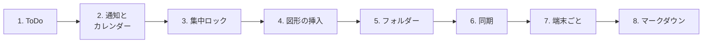

# 動作チェック項目

> 今回入れた物と、そこから壊れやすい所をまとめた確認表です。
> 上から順に押していけば一通り触れます。
> 最終更新: 2026-08-29 (b219)

---

## 見る順番



---

## 1. ToDo (サイドメニュー)

- [ ] サイドメニューを開くと、上のタブが **「ページ一覧 | ToDo」の並び** になっている
      (ToDo が右)
- [ ] タブを押すと、**どちらか一方だけ**が出る (同時には開かない)
- [ ] タブを長押ししてもう一方へ落とすと入れ替わり、次に開いた時も残っている
- [ ] 前の版で登録した ToDo が、文字も済み印もそのまま残っている
- [ ] 文字を打って Enter で追加できる / Shift+Enter で改行できる
- [ ] 追加ボタン (＋) でも追加できる
- [ ] 行を二度押しすると書き直せる
- [ ] チェックを押すと取り消し線が付く
- [ ] 「完了を削除」が済んだ物だけ消す

### 画像

- [ ] 画面をコピーしてから**入力欄で Ctrl+V** → 入力欄の下に小さな絵が出る
- [ ] そのまま追加すると、出来た ToDo にその絵が付く
- [ ] 文字を書かずに絵だけで追加できる (見出しは 📷 になる)
- [ ] 入力欄で **文字を Ctrl+V** した時は、今までどおり文字が貼られる
- [ ] 貼った絵の右上の × で、追加する前に取り消せる
- [ ] 行の絵のボタン → 「クリップボードから貼り付け」でも付く
- [ ] 行の絵のボタン → 「ファイルから選ぶ」でも付く
- [ ] 絵を押すと大きく表示され、もう一度押すと閉じる
- [ ] 絵の右上の × で外せる
- [ ] アプリを閉じて開き直しても絵が残っている
- [ ] **Android**: 画面を撮ってから貼り付けても入る (撮った直後の 1 枚が拾われる)

### 通知

- [ ] 鈴のボタン → 日付 → 時刻 の順に選べる
- [ ] 過ぎた時刻を選ぶと赤い帯で断られる
- [ ] 予約すると行の下に「8/30 09:00」のように出る
- [ ] **カレンダーの同じ日時に予定が入っている**
- [ ] 鈴をもう一度押すと「変える / やめる」が出る
- [ ] 「やめる」でカレンダーの予定も消える
- [ ] 「変える」で予定が **2 つに増えない**
- [ ] 予約した ToDo を消すと、通知もカレンダーの予定も消える
- [ ] 「完了を削除」でまとめて消した分も、通知が残らない
- [ ] **その時刻になったら実際に鳴る** (Windows は右下、Android は通知欄)
- [ ] **アプリを閉じて開き直しても、予約が生きている**
      (Windows は開き直した時に入れ直される)

---

## 2. 通知とカレンダー (元からある所)

- [ ] カレンダーから予定を作って通知を付けると、今までどおり鳴る
- [ ] ToDo の予定とカレンダーの予定が混ざっていない
- [ ] カレンダーで ToDo の予定を消しても、アプリが落ちない

---

## 3. 集中ロック

- [ ] 集中ロックの設定画面 (タスクのやり方) に **「ToDo から選ぶ」** が出る
- [ ] 押すと**未完了の ToDo だけ**が並ぶ
- [ ] 既に同じ名前で登録済みの物は出ない
- [ ] 選んで「追加」すると集中タスクに入り、件数の知らせが出る
- [ ] ToDo が 1 件も無い時は「サイドメニューの ToDo に追加してください」と出る
- [ ] **ロック中の画面**にも「ToDo から選ぶ」が出る
- [ ] ロック中に押した時、**選択画面がロック画面の裏に隠れない**
- [ ] 選んで追加すると、その場でタスク一覧に増える
- [ ] 全部済ませると今までどおり解除できる

---

## 4. 図形の挿入 (マップ)

- [ ] パレットの下にあった長い説明文が消えている
- [ ] △ が他と同じように**中が塗られている**
- [ ] ◆ が**実際に置かれる菱形**と同じ形になっている
- [ ] 「中空」のアイコンが**常に輪郭だけ**になっている
- [ ] 「中空」を ON にすると、**候補のアイコンも全部中空**になる
- [ ] 「中空」を OFF にすると、候補も中が塗られる
- [ ] 描いている最中のプレビューが、**置いた後と同じ塗り**になっている

### 形と大きさを固定

- [ ] パレットに **「形と大きさを固定」** のボタンがある
- [ ] 好きな形で 1 つドラッグして描くと、右の数字が「352×128」のように変わる
- [ ] ボタンを ON にすると「大きさ」のスライダーが薄くなって触れなくなる
- [ ] **ON のままキャンバスを押すと、同じ形・同じ大きさで置ける**
- [ ] 続けて何回押しても、押した所に 1 個ずつ増える
- [ ] **1 回押して 2 個できたりしない**
- [ ] OFF にすると、今までどおり「大きさ」の正方形で置ける
- [ ] OFF でもドラッグすれば好きな大きさで描ける
- [ ] × か Esc でモードを抜けられる

### 図形の編集

- [ ] 置いた図形を選んで「編集」を押すと、**押した場所のそばに**出る
      (画面の真ん中ではない)
- [ ] 種類・色・太さ・中空を変えると、**その場で図形が変わる**
- [ ] 「閉じる」で閉じても、変えた内容が残っている

---

## 5. フォルダー

- [ ] ＋ →「新しいフォルダー」で、**ページ一覧のその位置に入力欄が出る**
      (画面の真ん中にダイアログが出ない)
- [ ] 既定の名前が最初から選ばれていて、打ち始めると置き換わる
- [ ] Enter か、他の場所を押すと確定する
- [ ] 「・・・」→「フォルダー名を変更」でも同じその場編集になる
- [ ] 表記が「テーマ名」ではなく **「フォルダー名」** になっている
- [ ] フォルダーが多い時、新しい行まで自動でスクロールする

---

## 6. 同期まわり (壊していないかの確認)

- [ ] サイドメニューを開いたままページをドラッグして**キャンバスに落とす**と
      分割で開く
- [ ] サイドメニューの**上で放した時**は分割が開かず、並び替え / フォルダー移動になる
- [ ] Ctrl+1〜9 のボタンの**右上の青い丸が消えている**
- [ ] Ctrl+1〜9 のボタンを押すと、今までどおり説明が出る
- [ ] Ctrl+1〜9 でページが切り替わる
- [ ] 自動同期の ON / OFF が今までどおり効く
- [ ] Ctrl+S / Ctrl+R が今までどおり動く

---

## 7. 端末ごと

### Windows

- [ ] 起動できる (真っ黒のまま止まらない)
- [ ] ToDo の通知が右下に出る
- [ ] 画像の貼り付けが効く
- [ ] × で閉じた時に固まらない

### Android

- [ ] 起動できる
- [ ] 最初の案内が出る (出ない = プラグインの登録が壊れている合図)
- [ ] ToDo の通知が通知欄に出る
- [ ] 画面を撮ってから ToDo に貼り付けられる
- [ ] サイドメニューが狭い画面でもはみ出さない
- [ ] 集中ロックが動く

---

## 8. マークダウン (b219)

### スクロールの連動

- [ ] 半々 (編集 | プレビュー) で開くと、**スクロールバーが左の編集欄だけ**になっている
- [ ] 編集欄を動かすと、プレビューも**同じ所**に付いてくる
- [ ] プレビューを動かすと、編集欄も同じ所に付いてくる
- [ ] **図の所でもずれない**（見出しと図を目印に合わせているため）
- [ ] 打っている最中に**プレビューが一番上に戻らない**
- [ ] 打った内容が 0.5 秒くらいで右に出る
- [ ] タブを切り替えても正しく出る
- [ ] 目次を押すとプレビューがその見出しへ飛ぶ

### プレビューからチェックを付ける

- [ ] `- [ ] …` のチェック欄が**プレビュー側で押せる**
- [ ] 押すと左の本文も `- [x]` に変わる
- [ ] 押した時に**図が瞬いたりスクロールが飛んだりしない**
- [ ] もう一度押すと外れる
- [ ] 保存され、開き直しても残っている
- [ ] コードブロックの中に書いた `- [ ]` は数に入っていない (ずれない)

### マップの埋め込み

本文にこう書くと、そのページを実物で描きます。

````
```map
マップ 2
```
````

- [ ] ページ名を書くと、そのマップが出る
- [ ] ページ ID を書いても出る
- [ ] 無い名前を書くと「not found」と出るだけで、他は壊れない
- [ ] **掴んで動かせる**
- [ ] **車輪で拡大縮小できる**（押した所が中心）
- [ ] **子を持つ要素を押すと閉じる**（▾ → ▸ と件数）
- [ ] もう一度押すと開く
- [ ] 右上の ☰ で全部開く
- [ ] 右上の ⟳ で画面に収まる大きさに戻る
- [ ] 右上の □ でそのページに切り替わる
- [ ] リンクの付いた要素の ↗ を押すとブラウザで開く
- [ ] 格納した (Ctrl+G) 中身は出ていない
- [ ] マップを書き換えて開き直すと、埋め込みにも反映される

---

## 要調査: ページの中身が巻き戻る

2026-08-29 の作業中、**マップ 2 のノード 3 件が消えました。**

| 時刻 | 状態 |
|---|---|
| 00:57 | マップ 2 = ノード 3 件・図形 4 個 |
| 01:10 | マップ 2 = ノード 0 件・図形 3 個 に巻き戻る |

消えたのは「ノード 3 件 + 直前に描いた図形 1 個」で、**それ以前からあった
図形 3 個は残っています。** つまり削除ではなく、**古い版への巻き戻り**です。

- 巻き戻る直前に、アプリを `Stop-Process -Force` で強制終了しています。
- `mindmap_pages_v4_coordinated` (複数起動を突き合わせる仕組み) の
  `pageWriteTimes` も 0 件の版に書き換わっていました。
- 自動退避 (`page_backups`) は**ページ数が減った時にしか作られない**ため、
  ノードだけ消えた今回は退避が残っていません。

### 確認したいこと

- [ ] アプリを強制終了 → 起動し直した時、直前の編集が巻き戻らないか
- [ ] 2 つ起動 → 片方を強制終了 → もう片方で編集 → 巻き戻らないか
- [ ] `page_backups` を**ノードが大きく減った時にも**作るべきではないか
- [ ] `pageAncestors` の突き合わせで、新しい版が古い版に負ける道が無いか

---

## 気付いた事

| 日付 | 端末 | 内容 | 直った? |
|---|---|---|---|
|  |  |  |  |
|  |  |  |  |
|  |  |  |  |
