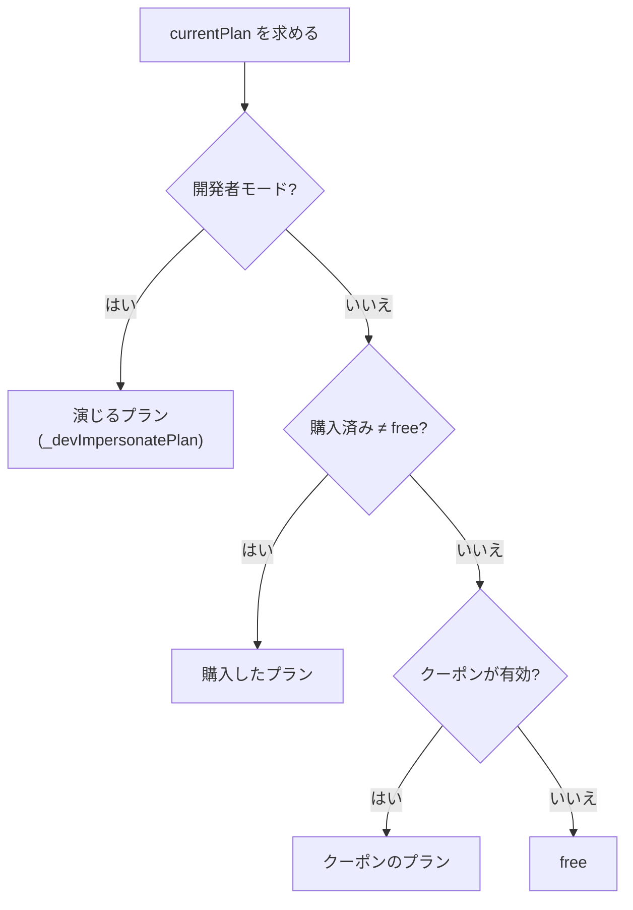
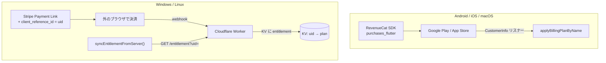
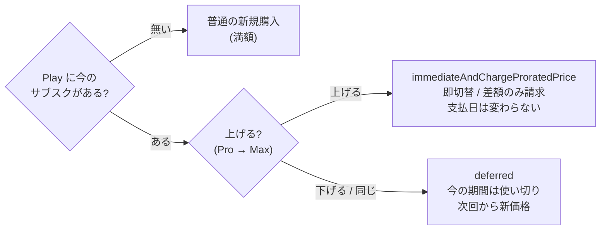
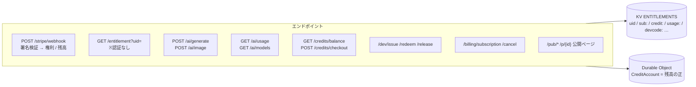
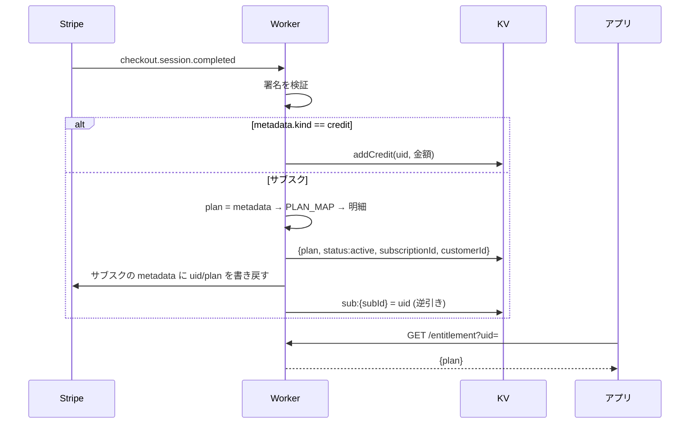
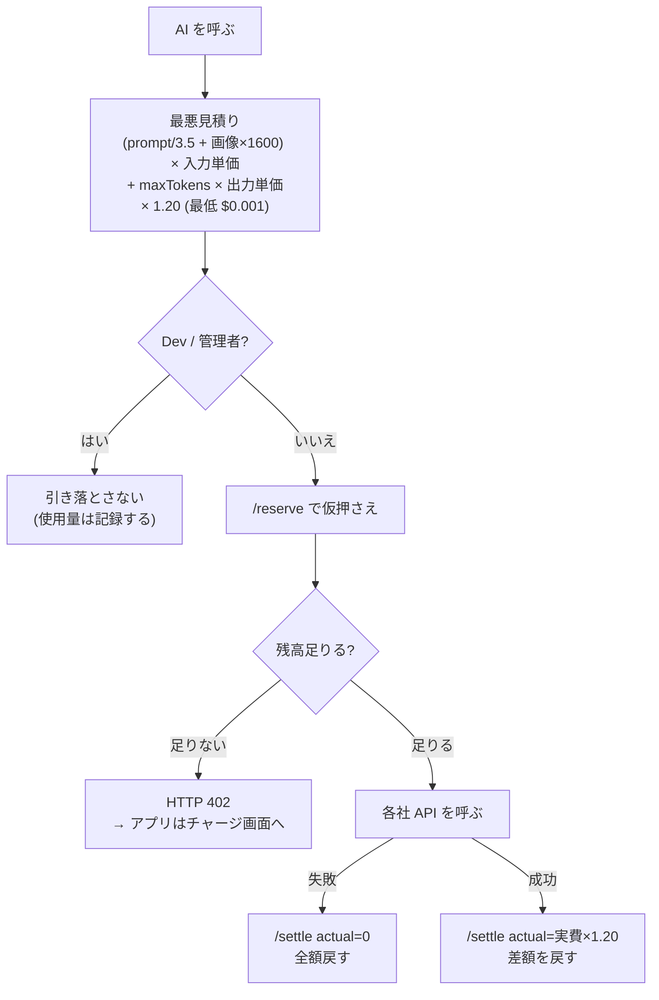
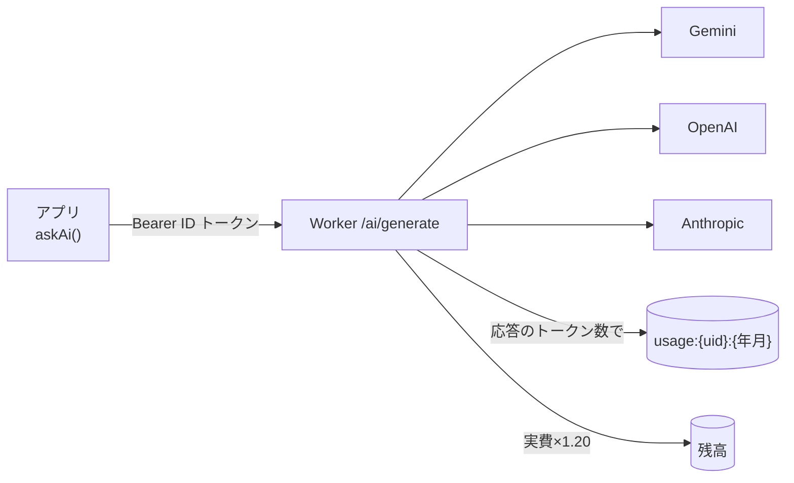
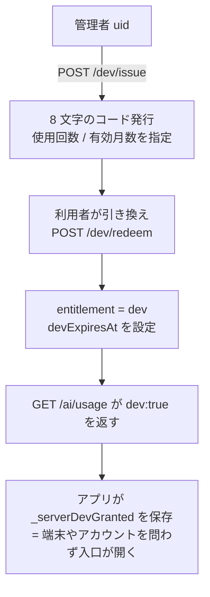
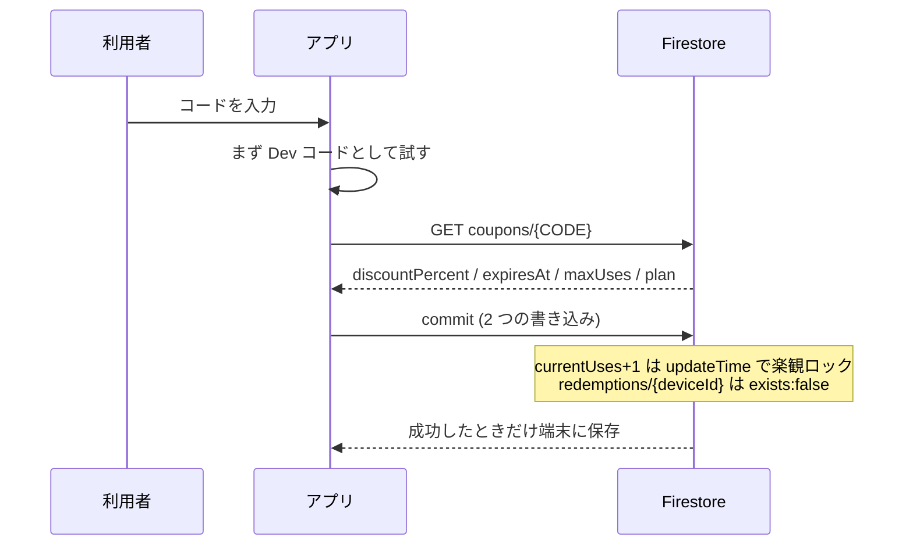

# 決済・サブスクリプション・AI クレジットの仕様

対象コミット: b194 / 2026-08-25 時点のソースを読んで書き起こしたもの。
行番号は `lib/services/billing_service.dart` (以下 **billing**)、
`lib/providers/mind_map_provider.dart` (以下 **provider**)、
`worker/billing-worker.js` (以下 **worker**)。

> **大前提**: アプリは「支払われたか」を自分では決めない。
> 正は必ず **ストア (Stripe / Google Play) → Worker (KV) → アプリ** の順に流れる。
> 本物の鍵 (Stripe secret / Gemini / OpenAI / Anthropic) は **Worker のシークレットにだけ**置く。

---

## 1. プランと解決の順番

`enum SubscriptionPlan { free, pro, max, dev }` (provider:1013)、解決は provider:62884-62890。

| プラン | できること |
|---|---|
| free | 種類ごとに 1 ページまで。スマホは既定の 4 ページのみ。分割は 2 回まで、ロックは 1 回まで |
| pro | ページ無制限・動画ダウンロード・自動化など (`isProUnlocked`) |
| max | + **クラウド同期 / グループ共有 / 共同編集** (`isMaxUnlocked`) |
| dev | Max と同じ + **決済を通さずに AI を使える** (引き換えコードのみ) |

表示価格 (billing:117-120): Pro 月 **$5.99** / 年 **$4.79 相当**、Max 月 **$19.99** / 年 **$15.99 相当** (いずれも年払いで 20% 引き)。

---

## 2. 決済の経路 (端末で分かれる)

### プラン変更のときのお金の扱い (billing:360-396)

- 判定できない時は安全側 (deferred) に倒す (billing:414-427)。
- 購入前の確認ダイアログは、**本当に差額請求になる人にだけ**出す
  (`willChargeProratedDifference` billing:404)。クーポン / Dev / Stripe で Pro の人は
  Play にサブスクが無く満額になるため、案内を出さない。

### 復帰後の取り込み

Stripe で払った後、アプリは **8 / 20 / 40 / 70 / 120 秒**の 5 回、
`syncEntitlementFromServer()` を叩いて反映を待つ (screen:15313-15342)。
`/entitlement` が `null` (＝聞けなかった) を返した時は**状態を触らない**。
`free` が返っても、以前サーバー由来でなければ降格させない (provider:3496-3519)。

---

## 3. Worker (Cloudflare) の窓口

- 認証は **Firebase ID トークンの RS256 検証** (worker:761-801)。
  Google の JWKS を 1 時間キャッシュし、`aud` / `iss` / `exp` を確かめる。
  **本文の uid は意図的に無視**し、トークンの uid だけを使う。
- 例外的に認証が無いのは `/entitlement`・`/ai/models`・`/p/{id}`・`/site/visits`・`/health`。
- Webhook は Stripe の HMAC-SHA256 署名で検証 (許容ずれ 300 秒)。
  中で失敗しても**常に 200 を返す** (Stripe に再送させないため)。

### Webhook が権利を書き換える流れ

解約 (`customer.subscription.deleted`) は `free` + `status:canceled`。
期限切れは **`currentPeriodEnd` + 3 日**の猶予後に free 扱い (worker:706-710)。

---

## 4. AI 前払いクレジット

| 事項 | 値 |
|---|---|
| 1 回のチャージ | **$10** (`CREDIT_PACK_USD`)、1〜20 口 |
| 上乗せ | **+20%** (`MARKUP = 0.20`)。アプリ側の表示も同じ値を持つ |
| 残高わずかの警告 | $1 を切ったら (`CREDIT_LOW_USD`) |
| 画像 1 枚 | 原価 $0.039 → 請求 $0.0468 |
| 残高の正 | Durable Object `CreditAccount` (KV へも書き戻す) |
| 明細 | 直近 200 件まで |

**402 を受けた時のアプリの動き** (provider:65937 / screen:48165):
残高を反映 → 赤い帯 → チャージ画面を開く。
ただし **Dev / 開発者モードの人には決済画面を出さず**、
「Dev として認められなかった」旨だけを伝える。

---

## 5. AI 代行 (relay)

- アプリに各社の鍵は無い (BYOK は廃止。`hasActiveAiKey` は `canUseAiRelay` を返すだけ)。
- 使えるモデルの一覧は `/ai/models`。**実価格が取れたモデルだけ**を出す
  (OpenRouter の価格表を 12 時間キャッシュ)。
- 考える深さ `reasoning` (low / medium / high) は各社の作法へ変換
  (Gemini は thinkingBudget 0 / 8192 / 24576 など)。
- 画像は **4 枚・合計 6 MB** まで。超えると 413。
- 月間上限: 一般 **$50** / Dev **$200**。超えると 429。
- トークン数は**必ず各社の応答から取る** (クライアントの自己申告は使わない)。

---

## 6. Dev 枠 (決済を通さない)

- 課金を飛ばす判定は **`isFreeAiUid` = 管理者 uid **または** 有効な Dev 権利** (worker:1030)。
- `/ai/usage` の `dev` も同じ判定を返す (b193 で一致させた)。
  以前は権利だけを見ていたため、管理者本人の端末がチャージ画面に飛ばされていた。
- アプリ側 `isDevPlan` は**入口を開けるだけ**。実際に引き落とすかはサーバーが決める。
- 開発者モードに入ると管理者は自動で自己発行 → 引き換え、抜けると解放する。

---

## 7. クーポン

- **100% 引きのクーポンだけが機能を開く** (`hasActiveCoupon` provider:62850)。
  部分割引は記録されるが解錠しない。
- 端末 ID ごとに引き換え記録を残し、同じ端末での再入力は期限を延ばさない。
- Google ログインが使える環境ではログインを必須にする (端末を変えた使い回し防止)。

---

## 8. 通信量の上限 (再掲)

| | Free | Pro | Max | Dev |
|---|---|---|---|---|
| 月間アップロード | 0 | 0 | 25 GB | 実質無制限 |
| 月間ダウンロード | 0 | 0 | 100 GB | 実質無制限 |
| 総容量 | 0 | 0 | 100 GB | 実質無制限 |

数えているのは**端末の中だけ**で、サーバー側の強制は無い。詳しくは
[仕様_自動同期.md](仕様_自動同期.md) の 6 章。

---

## 9. 直したほうがよい点 (この調査で見つかったもの)

1. **月間上限 (429) で弾かれた時、仮押さえしたクレジットが戻らない。**
   `/ai/generate` は仮押さえ (worker:2156) の後に上限判定 (worker:2193) で
   `return` してしまい、`/settle` を通らない。画像側も同じ (worker:2298 / 2328)。
   → 利用者の残高がその分だけ失われる。**要修正**。
2. `/entitlement` は**認証が無く uid をクエリで受ける**。uid を知っていれば
   他人のプラン・Stripe の subscriptionId / customerId まで読める (worker:684)。
3. 旧 `spendCredit` 経路は `/settle` に残高確認が無いため、通ると残高が負になり得る
   (今は到達しないはず)。
4. コメントの食い違い: worker:2052 / 1317 は「1 割増し」と書いてあるが、実際は **20%**。
5. 使われていない道: `fetchPlanViaRest` / `pollPlanAfterWebPurchase` / `openWebPurchase`
   (RevenueCat Web Billing 経路) は呼び出し元が無く、鍵も空。
