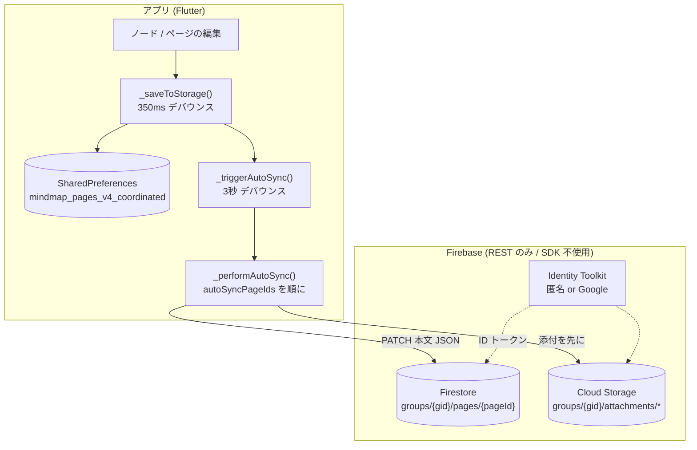
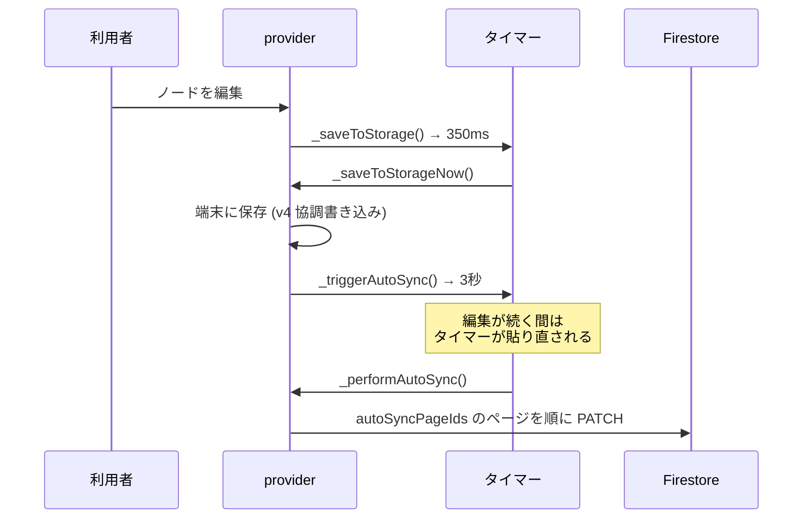
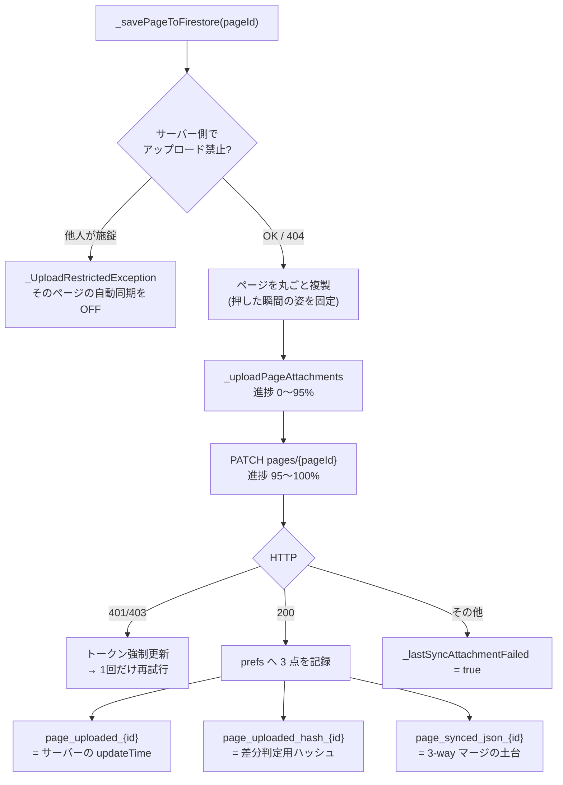
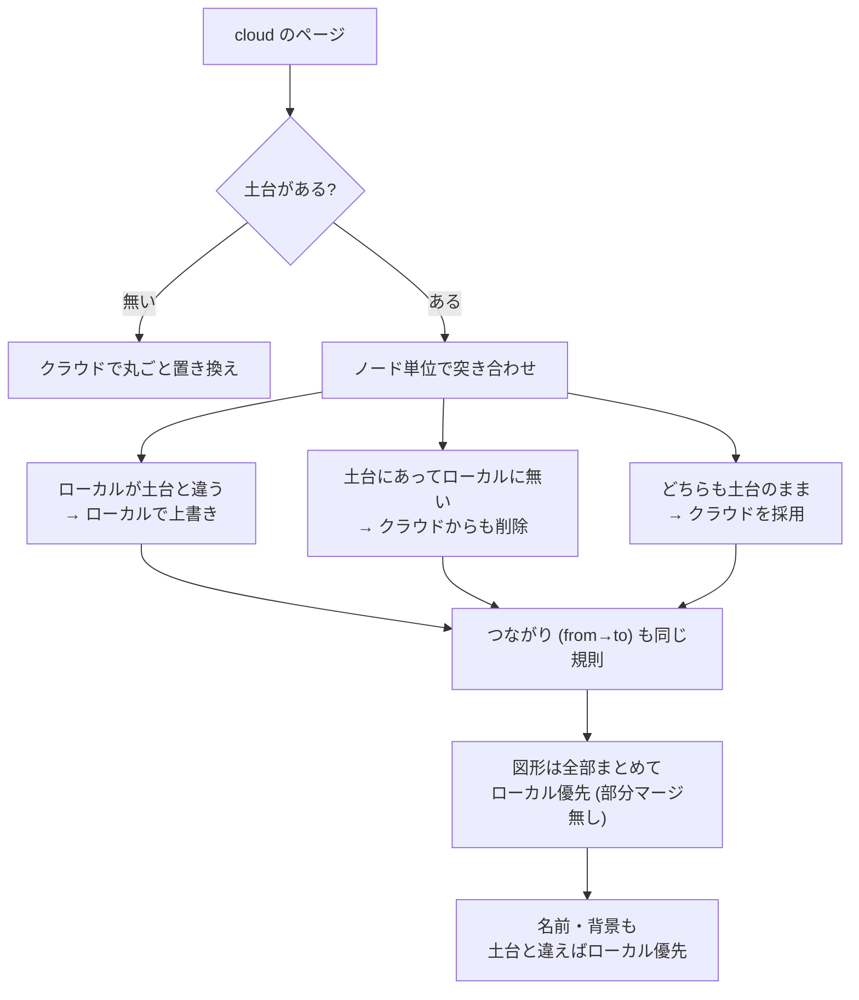
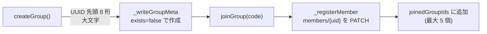
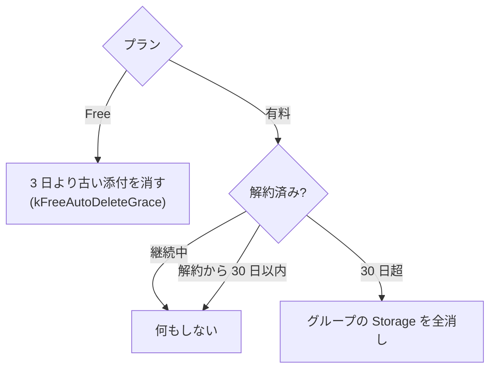

# 自動同期 (クラウド同期) の仕様

対象コミット: b194 / 2026-08-25 時点のソースを読んで書き起こしたもの。
行番号は `lib/providers/mind_map_provider.dart` (以下 **provider**) と
`lib/screens/mind_map_screen.dart` (以下 **screen**) のもの。

> **大前提**: クラウド同期の入口は**すべて Max 限定**。
> `isMaxUnlocked = (currentPlan == max || currentPlan == dev)` (provider:63011)。
> Free / Pro は同期そのものができない。

---

## 1. 全体像

- Firestore も Storage も **REST API を直接叩く**。`cloud_firestore` プラグインは使わない。
- 認証は Identity Toolkit の**匿名サインイン**が土台。Google ログインは同じ uid を
  端末間で共有するための上乗せ (provider:70161)。

---

## 2. いつ上がるか (トリガー)

| 事項 | 値 / 場所 |
|---|---|
| ローカル保存のデバウンス | **350 ms** (`_kSaveDebounce` provider:76051) |
| 自動同期のデバウンス | **3 秒** (provider:3968) |
| 最短でクラウドに届くまで | 約 **3.35 秒** (最後の打鍵から) |
| 対象ページ | `autoSyncPageIds` (prefs `autoSyncPageIds`, provider:3938/3950) |
| 定期ポーリング | **無し** (`_syncTimer` は宣言だけで起動されない) |

**止まる条件** (provider:3964-3966): Max でない / Firebase 無効 / グループ未参加 /
既に送受信中。オフライン中の編集は**溜め込まれない**（送信キューは無い）。
次に編集された時か、Ctrl+S を押した時にまとめて上がる。

**手動**: Ctrl+S = `cloudUpload`(screen:52858)、Ctrl+D = `cloudDownload`(screen:52894)。
どちらも差分判定を通し、変化が無ければ通信しない。

---

## 3. アップロード

### 書き込む中身 (provider:71351-71396)

| フィールド | 内容 |
|---|---|
| `json` | ページ全体の JSON |
| `namedGroupsJson` | 付箋グループ (groups / colors / fontSizes / fontFamilies) |
| `paintJson` | フリーノートのページだけ (中身はページ JSON に乗らないため) |
| `uploadRestricted` / `restrictedByUid` | 施錠フラグ (**クライアント判定のみ**) |
| `expiresAt` | 有料 = `null` (無期限) / 無料 = 7 日後 |

- HTTP は `PATCH …/groups/{gid}/pages/{pageId}?updateMask…`、**30 秒**でタイムアウト。
- 添付は Storage へ `POST …?uploadType=media` (ストリーミング、接続 60 秒)。
  **90 秒進捗ゼロで打ち切る**見張り付き (provider:71844-71864)。
- 送信バイト数とサーバーの `size` が合わなければ失敗扱い (provider:71902)。

---

## 4. ダウンロードと 3-way マージ

土台 (baseline) は **`page_synced_json_{pageId}`**。上げた時と降ろした時に必ず更新する。

**要点**

- 競合したら**常にローカルが勝つ**。時刻の比較も、項目ごとの融合もしない (provider:71500-71516)。
  → 同じノードを他端末で直していた場合、**相手の編集は黙って消える**。
- 土台が無い場合 (初回など) は**クラウドで全置き換え**。
- 降ろした後に土台へ入れるのは「マージ結果」ではなく**素のクラウド JSON** (provider:73193)。
  こうしないと、ローカルにしか無い追加が次回「変更なし」と誤判定される。
- Ctrl+D の単ページ経路 (`autoSyncCurrentPage` provider:72878) は、
  サーバーの `updateTime` が記録より**新しい時だけ**降ろす。

> **tombstone (墓標) について**: この語はクラウド同期ではなく、
> **同じ端末で複数ウィンドウを開いた時の協調保存 (v4)** の仕組み。
> 削除時刻を `deletedPages` に記録し、「編集時刻 ≥ 削除時刻なら生き残る」で解決する
> (provider:75059)。クラウド側に墓標は無く、ローカル削除がクラウドを消すことはない。

---

## 5. グループ (共有の単位)

| 事項 | 値 |
|---|---|
| コード形式 | 8 文字・英数大文字 (実際は UUID 由来なので 0-9A-F) |
| 参加できる数 | **5** (`maxJoinedGroups` provider:70704) |
| 生存確認 | `members/{uid}.lastSeen` (起動・送受信のたびに更新) |
| 無人判定 | **7 日**触られていない member は削除。全員居なくなればグループごと消す |

グループが空になると `pages` / `members` / `calendar` と Storage の中身、
最後にグループ文書そのものを消す (provider:70943-70970)。

---

## 6. 通信量の上限

| | Free | Pro | Max | Dev |
|---|---|---|---|---|
| 月間アップロード | 0 | 0 | **25 GB** | 実質無制限 (1 PB) |
| 月間ダウンロード | 0 | 0 | **100 GB** | 同上 |
| 総容量 | 0 | 0 | **100 GB** | 同上 |

- Free / Pro が 0 なのは、同期自体が Max 限定だから (provider:62693)。
- 数え方は**端末の SharedPreferences のみ**。入れ直せば戻る。サーバー側の強制は無い。
- **Firestore の本文は一切数えていない**。数えるのは Storage の添付だけ。
- 月替わり (`yyyy-MM`) で月間分だけ 0 に戻る。総容量は戻らない。

---

## 7. 保管期間

- 実行は起動時、**24 時間に 1 回**まで (prefs `lastPruneAtMs`)。
- Firestore 側は `expiresAt` の TTL ポリシー任せ (コンソール設定が前提)。
- 一覧取得時にも、期限切れの文書はその場で DELETE する保険がある (provider:73029)。

---

## 8. 共同編集 (別仕組み)

`published/{code}` を短い間隔で読み書きする、グループ同期とは別の仕組み。

| 事項 | 値 |
|---|---|
| 本体の往復 | **1.2 秒**ごと (`_kLiveTick`) |
| 在席の往復 | **3 秒**ごと |
| 相手が消えた判定 | **12 秒**無音 |
| 自動終了 | **3 時間**無操作 |
| データの持ち方 | ノード 1 個 = フィールド 1 個 (`n_{nodeId}`)、`rev` で更新判定 |

編集中のノードは `lockNodeId` で即座に施錠し、他者の上書きを止める。

---

## 9. うまくいかない時

| 状況 | 動き |
|---|---|
| オフライン | 静かに何もしない。溜め込みも再試行キューも無い |
| 401 / 403 | トークンを強制更新して**1 回だけ**やり直す (5 か所) |
| 429 | **未対応**。一般の失敗と同じ扱いで、待ち時間も入れない |
| 送受信フラグの残骸 | **3 分**で無効とみなして解除 (Ctrl+S が永久に効かなくなるのを防ぐ) |
| Esc | ページの切れ目で中断。通信中の 1 本は止まらない |

---

## 10. 直したほうがよい点 (この調査で見つかったもの)

1. `expiresAt` の分岐が `isProUnlocked` (Pro 以上) になっている。他は全部 Max 基準
   なので、ゲートを緩めた時に食い違う (provider:71386)。
2. 無料の保管期間が **3 日 (定数) / 7 日 (expiresAt) / 7 日 (コメント)** と三重に食い違う。
3. 上限のコメントが古い (「free 5MB / pro 5GB」と書いてあるが、実際は 0)。
4. クラウドのマージで**競合が利用者に見えない**。相手の編集が黙って消える。
5. `pageGroupBindings` は保存も参照もされるのに、アップロード先は常に `_syncGroupId`。
6. 施錠 (`uploadRestricted`) はクライアント判定だけ。**セキュリティ規則が無いので回避できる**。
7. 429 に対する待ち時間 (バックオフ) が無い。
