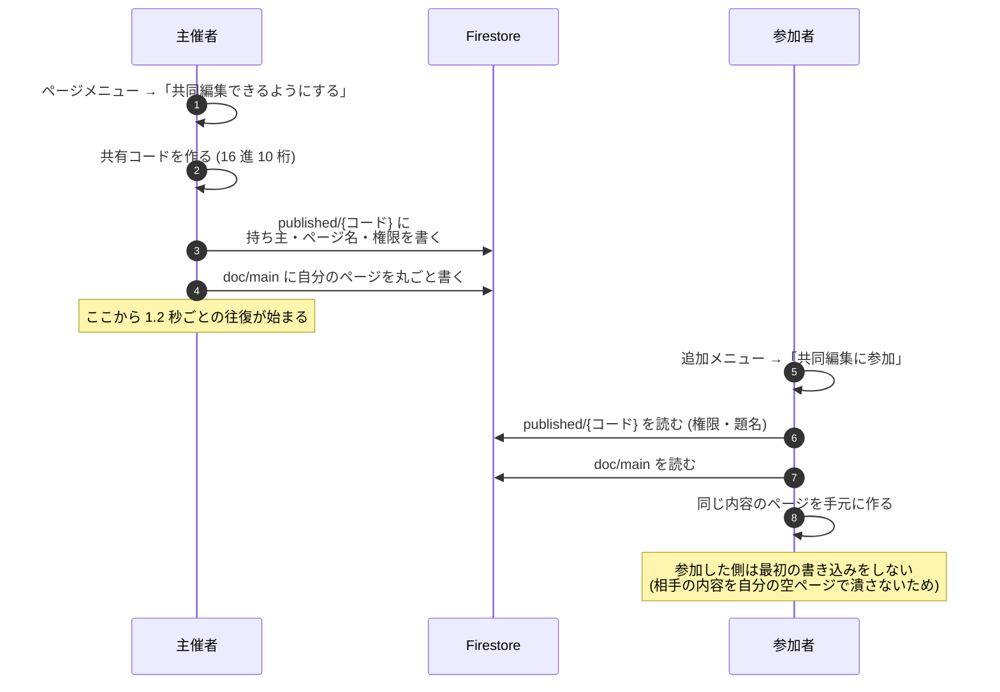
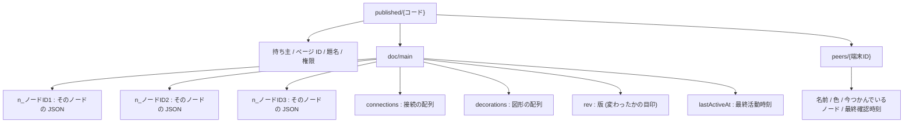
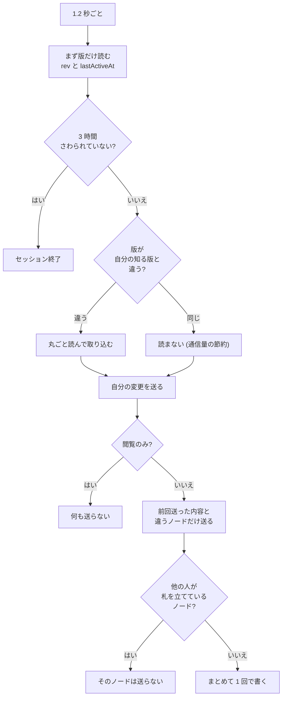
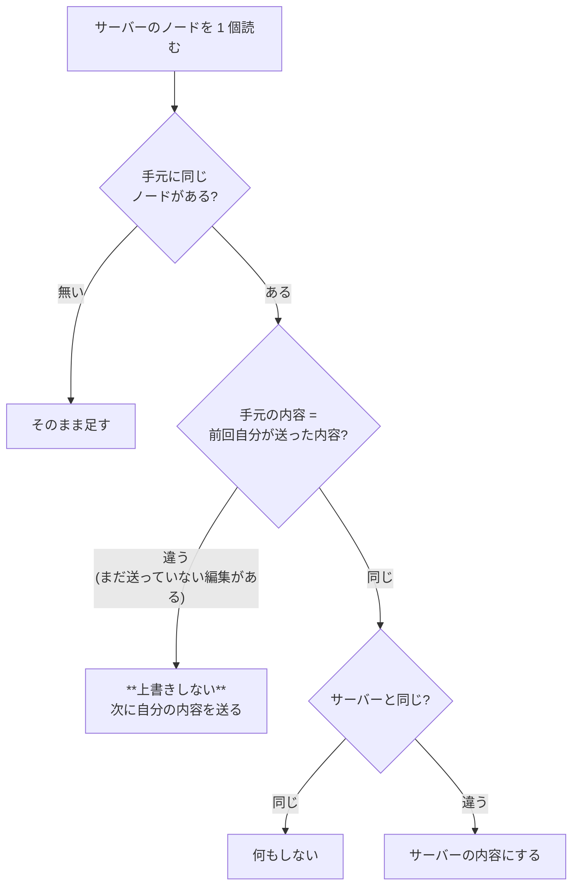
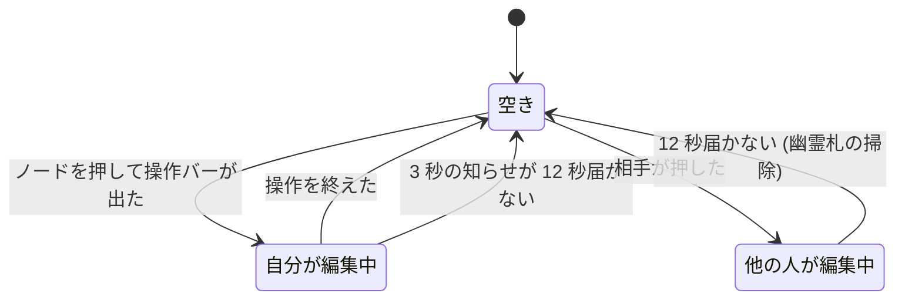

# リアルタイム共同編集の仕組み

> 対象コード: `lib/providers/mind_map_provider.dart` の「リアルタイム共同編集」節
> 最終確認: 2026-08-29 (b218)

---

## 一言でいうと

**WebSocket は使っていません。Firestore を 1.2 秒ごとに見に行っているだけです。**

自動同期とは全く別の仕組みで、置き場所も判定の仕方も違います。

| | 共同編集 | 自動同期 |
|---|---|---|
| 単位 | **ページ 1 枚 = 共有コード 1 個** | グループ 1 個の中に複数ページ |
| 置き場所 | `published/{コード}/doc/main` | `groups/{グループID}/pages/{ページID}` |
| 粒度 | **ノード 1 個 = 欄 1 個** | ページ丸ごと 1 欄 |
| 反映 | **1.2 秒ごとに自動で双方向** | 手動で上げ下げ (対象ページの上げだけ自動) |
| 取り合い | ノードの札 (12 秒で外れる) | ページの鍵 |
| 期限 | 3 時間さわらないと終わり | 無料 7 日 / 有料は無期限 |

---

## 始めるところ



**共有コードは 10 桁**です。ページごとに 1 個で、一度作ったら使い回します。
パスワードの欄は廃止されました。**コードを知っていれば入れます。**

共同編集は**主催者も参加者も Max プラン**が要ります。

---

## Firestore の形



**なぜノードを 1 個ずつ別の欄にするのか**
自分が触ったノードの欄だけを書き換えるためです。ページ全体を書き戻すと、
同じ瞬間に別のノードを触っていた人の変更を巻き戻してしまいます。

---

## 1.2 秒の往復



在席の知らせは別に **3 秒ごと**です (名前・色・今つかんでいるノード)。

**編集してすぐには送りません。** 送るのは 1.2 秒のタイマーの時だけなので、
相手に届くまで最短でも「自分の 1.2 秒 + 相手の 1.2 秒」かかります。

---

## 取り込む時の判断



**まだ送っていない自分の編集があるノードは、相手の内容で潰されません。**
その代わり、次の送信で自分の内容が相手を上書きします。ノード単位の後勝ちで、
文字単位で混ぜ合わせる仕組み (CRDT / OT) ではありません。

接続線と図形は**配列丸ごと**なので、粒度が粗くなります。
手元に未送信の接続の変更があると、相手の接続の変更は丸ごと捨てられます。

---

## 版 (rev) と時計のずれ

版は「今知っている版 + 1」以上になるよう必ず繰り上げます。

```
final rev = now > _liveRev ? now : _liveRev + 1;
```

端末の時計をそのまま使うと、**時計が遅れている人の書き込みが「古い版」と
見なされて誰にも届かなくなる**ためです。

読む側も「版が大きければ読む」ではなく **「版が違えば読む」** にしてあります。
相手の時計が進んでいると自分の版がその未来の値になり、それ以降、相手の
書き込み (より小さい版) を一切読まなくなっていました。

つまり **rev は「新しさ」ではなく「変わったかどうか」の目印**です。

---

## 札 (ノードの取り合い)



- **粒度はノード 1 個。**
- 立てるのは**ノードを押して操作バーが出た瞬間**、外すのは操作を終えた時。
- **12 秒**知らせが来ない札は自動的に外れ、その在席の行もサーバーから消されます。
- 見た目は、そのノードの周りに**その人の色の枠**と名前の札が出ます。

**効き方が 2 通りある点に注意**してください。

| | 止まるか |
|---|---|
| ノードの長押し移動 | ✅ 「◯◯ が編集中です」と出て止まる |
| 名前のその場編集など | ⚠️ **手元では編集できてしまう** |

後者は、送る所で弾かれます。つまり **見た目は打てるのに相手には届かず、
次の受信で元に戻ります。** 閲覧のみの参加者も同じです。

---

## 知っておくこと

1. **画像・PDF・動画は届きません。** ノードの中に入っているのは
   その端末のファイルの場所だけなので、相手の画面では出ません。
2. **ページ名以外のページの設定は同期されません** (背景・ページの種類など)。
   フリーノート / 文書 / 動画編集の中身も対象外です。
3. **アプリを閉じると終わります。** 起動時に自動で復活しません。
   主催者は共有し直し、参加者はコードを入れ直してください。
4. **参加者は 50 人まで。**
5. **同時に生きているのは 1 ページ分だけ**です。まとめて共有した時は
   ページを切り替えると、そのページのコードに自動で張り替わります。
6. **鍵はまだ緩いです。** ログインしていれば (匿名でも) 本文を読み書きできます。
   **見せたくない資料を共同編集に出さないでください。**
7. **1 台での確認は当てになりません。** 同じパソコンで 2 つ起動すると、
   共同編集が全く動いていなくても別の仕組みで内容がそろってしまいます。
   確認は別の端末で行ってください。
