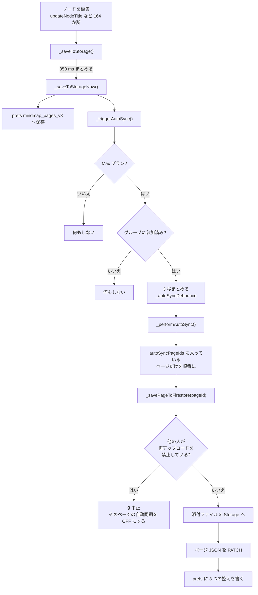
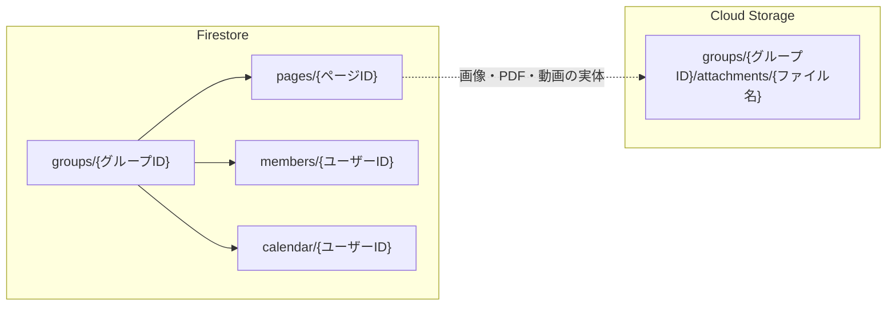
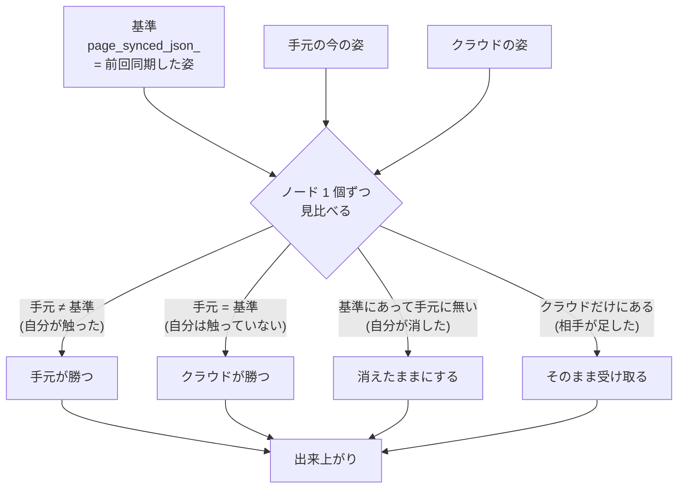

# ページの自動同期の仕組み

> 対象コード: `lib/providers/mind_map_provider.dart`
> 最終確認: 2026-08-29 (b218)

---

## 一言でいうと

**上げるだけ・ページ単位・自分で ON にする・Max プラン限定・3 秒まとめ。**

自動同期は「クラウドへ上げる」しかしません。**降ろす処理は一切入っていません。**
取り込みは必ず手動 (Ctrl+R / Ctrl+D / 同期画面) です。

---

## 全体の流れ

**編集から実際に上がるまで、最短でも 350 ms + 3 秒。**
まとめるタイマーは**ページごとではなく 1 本**なので、どこか 1 か所を触るたびに
リセットされ、止まった時に対象ページを**全部まとめて**上げます。

定期実行のタイマーはありません。編集した時だけ動きます。

---

## どのページが対象になるか

`autoSyncPageIds` (prefs、ページ ID の並び) に入っているページだけです。
**手動でアップロードしても自動的には入りません。** 入れる場所は 3 か所:

| 場所 | 説明 |
|---|---|
| ページ一覧の各行の同期アイコン | いちばん普通の入口 |
| 同期画面の見出しのボタン | 今開いているページを ON / OFF |
| 同期画面のページ一覧の行のアイコン | まとめて設定する時 |

いずれも **Max プラン + グループ参加済み** でないと押せません (灰色のまま)。

外れるのは、自分で OFF にした時か、**他の人がそのページに鍵を掛けていて
アップロードが弾かれた時**です。後者は 3 秒ごとに失敗し続けるのを防ぐため、
自動的に OFF になります。鍵が外れたら自分で入れ直してください。

---

## クラウド側の置き場所

Firestore の REST API を直接叩いています (`cloud_firestore` プラグインは未使用)。

`pages/{ページID}` に入る中身:

| 欄 | 中身 |
|---|---|
| `json` | ページ全体を JSON にしたもの (ノード・接続・図形) |
| `namedGroupsJson` | 付箋 (名前付きグループ) の名前・色・字の大きさ |
| `paintJson` | **フリーノートのページだけ** 中身をここに入れる |
| `uploadRestricted` | 再アップロード禁止の鍵 |
| `restrictedByUid` | 鍵を掛けた人 |
| `expiresAt` | 自動削除の期限 (有料は無期限) |

ページ ID は端末をまたいで同じなので、**同じマップは 2 台から見ても同じ 1 件**です。

---

## 端末側に残る 3 つの控え

| prefs のキー | 中身 | いつ書くか |
|---|---|---|
| `page_uploaded_<ページID>` | **サーバーが返した更新時刻** | 上げた直後 / Ctrl+R で降ろした後 |
| `page_uploaded_hash_<ページID>` | 上げた内容のハッシュ | 上げた直後 |
| `page_synced_json_<ページID>` | **サーバーに載っているはずの内容そのもの** | 上げた直後・降ろした直後 |

`page_uploaded_` に端末の時計ではなく**サーバーの時刻**を入れているのは、
端末の時計が数分ずれているだけで「新しいはずの物が降りてこない」
「古い物で上書きされる」が起きたためです。

`page_synced_json_` が、次に説明する突き合わせの**基準**になります。

---

## 降ろす時の突き合わせ (3 方向マージ)

降ろす時は、クラウドの内容をそのまま被せるのではなく、
**「前回同期した時の姿」を基準に、自分が触った所だけを残します。**

**一行でいうと: 手元が基準と違えば手元が勝つ。同じならクラウドが勝つ。**

粒度は以下のとおりです。

| 対象 | 粒度 |
|---|---|
| ノード | **1 個ずつ** |
| 接続線 | 1 本ずつ (`つなぎ元→つなぎ先` で見分ける) |
| 図形 (装飾) | **全部まとめて** — 1 つでも違えば手元の全部で置き換え |
| ページ名・背景 | 1 項目ずつ |

同期画面の「上書きする」に印を付けると、この突き合わせを飛ばして
**クラウドの内容をそのまま被せます。**

---

## 同期されない物

| 種類 | 同期される? |
|---|---|
| マップ (ノード・接続・図形) | ✅ |
| 付箋 (名前付きグループ) | ✅ |
| PDF のメモ | ✅ (ノードの中に入っているため) |
| フリーノート (お絵かき) | ✅ `paintJson` として。ただし **Ctrl+R では戻りません** |
| ギャラリー | ⚠️ タイルの並びは端末ごと |
| 文書ページ | ❌ **中身は空で届きます** |
| マークダウンページ | ❌ **中身は空で届きます** |
| 動画編集ページ | ❌ **中身は空で届きます** |
| フォルダー分け・並び順・お気に入り | ❌ |
| 設定・キー割り当て | ✅ 同期画面の「上げる / 降ろす」で手動 (b224〜) |
| AI の鍵 | ❌ 端末ごとに入れ直し |
| PDF のマーカー | ❌ |

文書・マークダウン・動画編集の中身は、ページの JSON ではなく
**端末の prefs に別々に入っている**ため、送る仕組みがまだありません。

---

## 期限と容量

| 項目 | 無料 | Pro | Max |
|---|---|---|---|
| ひと月のアップロード | 0 | 0 | 25 GB |
| ひと月のダウンロード | 0 | 0 | 100 GB |
| 置いておける合計 | 0 | 0 | 100 GB |

同期そのものが Max 限定なので、無料 / Pro の数字は 0 にしてあります。

容量を数えているのは **Storage に上げた添付ファイルだけ**です。
ページの JSON 本体 (文字) は何 MB でも容量に数えられません。

解約後の自動削除は、無料が 7 日、有料が 30 日です
(起動時に 1 日 1 回まで確認します)。

---

## 気を付ける所

1. **自動同期は降ろしません。** 2 台で同じページを ON にすると、
   両方が上げ合って**後から上げた方が残ります**。どちらの端末も
   自分では気付けません。手動で降ろすまで分かりません。
2. **ノード単位で後勝ちです。** 同じノードを 2 人が触ると、
   相手の変更は**何も言わずに消えます**。同時に触るなら
   共同編集 (別の仕組み) を使ってください。
3. **まとめるタイマーは 1 本です。** 10 ページを ON にすると、
   1 文字打つたびに 10 ページ全部が順番に上がります。
4. **鍵の判定は端末側だけ**です。ルールで守られているわけではありません。
5. **ページを消してもクラウドからは消えません。** 消すのは同期画面の
   削除だけです。
